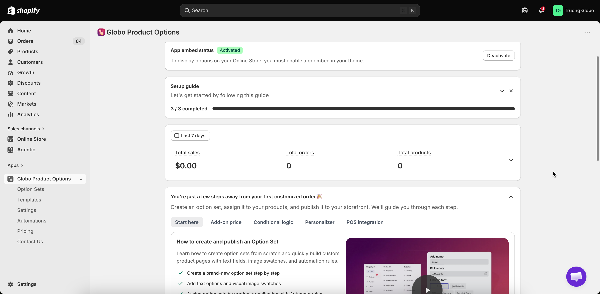

# Globo Product Options, Variant

Shopify limits each product to 2,048 variants. Globo Product Options helps you overcome this limitation by adding unlimited custom product options, such as text fields, file uploads, dropdowns, checkboxes, color swatches, and more.

With flexible product options and personalization features, you can let customers customize products to their preferences, create personalized items, and add extra charges for selected options. You can also assign specific option sets to the products where they are needed.

#### Key Features:

* **Multiple product option types:** Text input, file upload, color swatch, variant image, dropdown, checkbox, and more.
* **Add-on pricing:** Add an additional cost when customers select specific options.
* **Conditional logic:** Show or hide options based on customers' previous selections.
* **CSV import & export:** Import and export product options and variants using CSV files.
* **Product personalization:** Let customers personalize products with text, images, custom fields, and live previews.

<figure><figcaption></figcaption></figure>

## What you can build with it

<table data-view="cards"><thead><tr><th></th><th></th><th data-hidden data-card-target data-type="content-ref"></th></tr></thead><tbody><tr><td><strong>32 option types</strong></td><td>Text, textarea, number, phone, email, date, file upload, colour picker, switch, range slider, dimension, dropdowns, radio, checkbox, buttons, colour and image swatches, font picker, and layout elements.</td><td><a href="option-types/">option-types</a></td></tr><tr><td><strong>Add-on pricing</strong></td><td>Charge extra for a choice in three different ways: a plain price, an existing Shopify product, or a product the app generates for you.</td><td><a href="add-on-pricing/">add-on-pricing</a></td></tr><tr><td><strong>Conditional logic</strong></td><td>Show or hide any option based on what the customer already chose - including based on the Shopify variant they picked.</td><td><a href="conditional-logic/">conditional-logic</a></td></tr><tr><td><strong>Product Personalizer</strong></td><td>Show the customer's own text and images live on the product photo, with fonts, effects, curves, and drag-to-position controls.</td><td><a href="personalizer/">personalizer</a></td></tr><tr><td><strong>Automations</strong></td><td>Email yourself when an order comes in with options, and write the selected options into order notes or order tags.</td><td><a href="automations/">automations</a></td></tr><tr><td><strong>Point of Sale</strong></td><td>Use the same option sets when you take an order in the Shopify POS app.</td><td><a href="pos/">pos</a></td></tr></tbody></table>

## Start here

If you’ve just installed the app, follow these three steps below in order. They’ll guide you through setting up your first product option and getting it displayed on your live product page.



### [Install the app](getting-started/install-the-app.md)

Install the app from the Shopify App Store, approve the required permissions, and choose a plan or start your free trial.



### [Quickstart](getting-started/quickstart.md)

Create your first option set, add an option, and choose which products the option set should apply to.



### [Enable the app embed](getting-started/enable-the-app-embed.md)

Enable the app embed in your active theme so your product options can appear on the storefront. Options won’t be displayed until the app embed is enabled.




**Important:** Two things must be in place before an option can appear on your storefront:

* The **app embed** is enabled on your active theme.
* The option set has a **product rule** that matches the product you’re viewing.

If your options aren’t showing up, check these two settings first. See [Options are not showing up](help/troubleshooting.md) for more troubleshooting steps.


## Find your way around

<table><thead><tr><th width="230">I want to…</th><th>Go to</th></tr></thead><tbody><tr><td>Understand how the app works before I start</td><td><a href="reference/how-it-works.md">How the app works</a></td></tr><tr><td>Build and organise the option form</td><td><a href="option-sets/">Option sets</a></td></tr><tr><td>Know exactly what every setting does</td><td><a href="option-types/shared-settings/">Shared settings</a></td></tr><tr><td>Charge more for certain choices</td><td><a href="add-on-pricing/">Add-on pricing</a></td></tr><tr><td>Make the widget match my theme</td><td><a href="storefront/">Storefront display and design</a></td></tr><tr><td>Translate options for my other storefront languages</td><td><a href="translations/">Translations and languages</a></td></tr><tr><td>Reuse a setup I already built</td><td><a href="templates/">Templates</a></td></tr><tr><td>Compare what each plan includes</td><td><a href="plans/compare-plans.md">Compare plans</a></td></tr></tbody></table>

## Get help

* **Something isn't working** - start with [Options are not showing up](help/troubleshooting.md), then check the other troubleshooting guides if needed.
* **Quick questions** - check the [FAQ](help/faq.md) for answers to common questions.
* **Need to talk to us?** - Contact us through the Live Chat, the Contact Us page in the app, or email [contact@globo.io](mailto:contact@globo.io). See [Contact support](help/contact-support.md) for more details.
