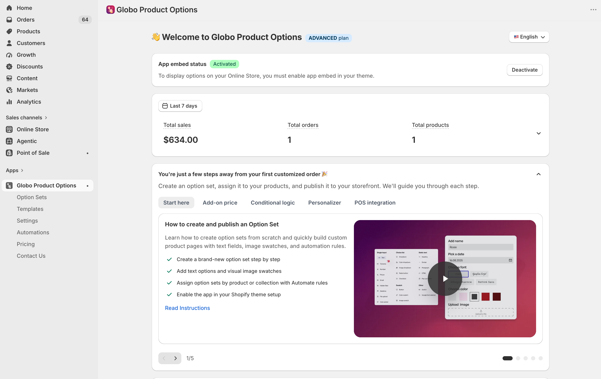

# Globo Product Options, Variant

Shopify limit 2048 variants per product. This app helps you to create infinite custom product options like textbox, file upload, dropdown, etc... It also encourages buyers to personalize their products, which increases sales. Allow shoppers to design their own custom products based on flexible option choices. Apply particular option set to appropriate products. Your customer will be happy to pay a small extra amount for a custom option to have the most satisfied product.

* Text input field, file upload, color swatch, variant image, dropdown, checkbox
* Add-on price - Additional cost when you customer choose a product variants
* Conditional logic: Show/hide relevant options depending on the previously select
* Import & Export product variants by CSV file. Complete product custom tool.
* Powerful product personalization w/ text, images, custom fields & live preview.

<figure><figcaption>
The app dashboard is where you land after opening the app from Shopify admin.
</figcaption></figure>

## What you can build with it

<table data-view="cards"><thead><tr><th></th><th></th><th data-hidden data-card-target data-type="content-ref"></th></tr></thead><tbody><tr><td><strong>32 option types</strong></td><td>Text, textarea, number, phone, email, date, file upload, colour picker, switch, range slider, dimension, dropdowns, radio, checkbox, buttons, colour and image swatches, font picker, and layout elements.</td><td><a href="option-types/">option-types</a></td></tr><tr><td><strong>Add-on pricing</strong></td><td>Charge extra for a choice in three different ways — a plain price, an existing Shopify product, or a product the app generates for you.</td><td><a href="add-on-pricing/">add-on-pricing</a></td></tr><tr><td><strong>Conditional logic</strong></td><td>Show or hide any option based on what the customer already chose — including based on the Shopify variant they picked.</td><td><a href="conditional-logic/">conditional-logic</a></td></tr><tr><td><strong>Product Personalizer</strong></td><td>Show the customer's own text and images live on the product photo, with fonts, effects, curves, and drag-to-position controls.</td><td><a href="personalizer/">personalizer</a></td></tr><tr><td><strong>Automations</strong></td><td>Email yourself when an order comes in with options, and write the selected options into order notes or order tags.</td><td><a href="automations/">automations</a></td></tr><tr><td><strong>Point of Sale</strong></td><td>Use the same option sets when you take an order in the Shopify POS app.</td><td><a href="pos/">pos</a></td></tr></tbody></table>

## Start here

If you have just installed the app, follow these three pages in order. Together they take about 15 minutes and end with a working option on your live product page.



### [Install the app](getting-started/install-the-app.md)

Install from the Shopify App Store, approve the permissions, and pick a plan or start the free trial.



### [Quickstart](getting-started/quickstart.md)

Create your first option set, add one option, and choose which products it applies to.



### [Enable the app embed](getting-started/enable-the-app-embed.md)

Turn the app on in your theme so the options actually render for shoppers. Nothing appears on the storefront until this is done.




Two things must both be true before any option appears on your storefront: the **app embed is enabled** on your active theme, and the option set has a **product rule** that matches the product you are looking at. If options are missing, check those two first — see [Options are not showing up](help/troubleshooting.md).


## Find your way around

<table><thead><tr><th width="230">I want to…</th><th>Go to</th></tr></thead><tbody><tr><td>Understand how the app works before I start</td><td><a href="reference/how-it-works.md">How the app works</a></td></tr><tr><td>Build and organise the option form</td><td><a href="option-sets/">Option sets</a></td></tr><tr><td>Know exactly what every setting does</td><td><a href="option-types/shared-settings/">Shared settings</a></td></tr><tr><td>Charge more for certain choices</td><td><a href="add-on-pricing/">Add-on pricing</a></td></tr><tr><td>Make the widget match my theme</td><td><a href="storefront/">Storefront display and design</a></td></tr><tr><td>Translate options for my other storefront languages</td><td><a href="translations/">Translations and languages</a></td></tr><tr><td>Reuse a setup I already built</td><td><a href="templates/">Templates</a></td></tr><tr><td>Compare what each plan includes</td><td><a href="plans/compare-plans.md">Compare plans</a></td></tr></tbody></table>

## Get help

* **Something is broken** — start with [Options are not showing up](help/troubleshooting.md), then the other troubleshooting pages.
* **Quick questions** — see the [FAQ](help/faq.md).
* **Talk to us** — live chat inside the app, the **Contact Us** page in the app, or email [contact@globo.io](mailto:contact@globo.io). See [Contact support](help/contact-support.md).
