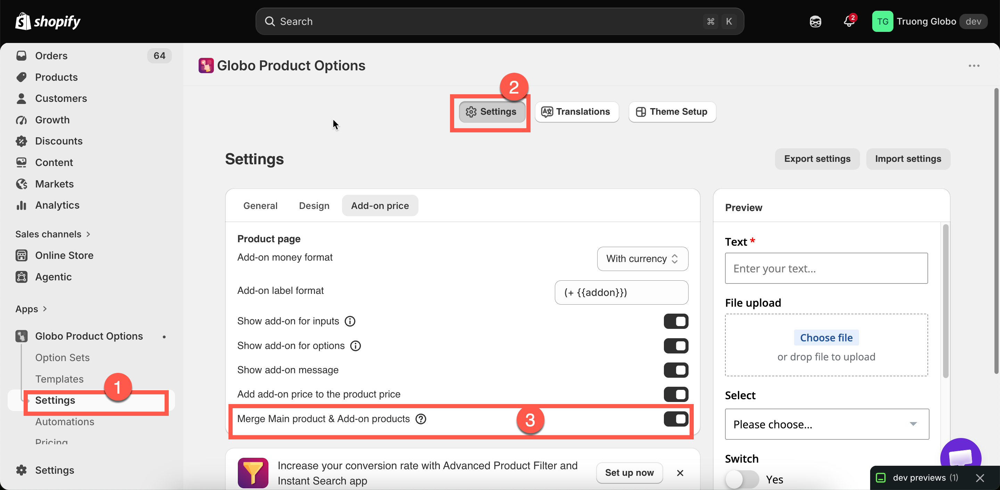

# Merge main product and add-ons

By default, an add-on backed by a product is added as its own cart line, linked to the main item. One bracelet with three add-ons therefore produces four cart lines.

**Merge Main product & Add-on products** displays them as a single item instead. New stores have this setting **on** by default.

## Where the setting is

The setting is under **Settings** > **Settings** > **Add-on price**, labeled **Merge Main product & Add-on products**. It is store-wide and applies to every option set.

<figure><figcaption>
One switch, applied store-wide.
</figcaption></figure>

## What changes

<table><thead><tr><th width="230">In the cart</th><th width="230">Off</th><th>On</th></tr></thead><tbody><tr><td>Lines shown</td><td>The main item plus one line per add-on product</td><td>The main item, with its add-ons presented as part of it</td></tr><tr><td>Price shown</td><td>Each line priced separately</td><td>Combined</td></tr><tr><td>Option details</td><td>Listed under the main item</td><td>Listed under the main item</td></tr></tbody></table>

The setting changes the display only. The add-on products are still real products; their inventory is still reduced, their weight is still included in shipping, and your Shopify reports still record them as sales of those products.

## Which to choose

<table><thead><tr><th width="290">Leave it off when</th><th>Turn it on when</th></tr></thead><tbody><tr><td>Customers benefit from seeing exactly what they are paying for</td><td>The cart looks cluttered with add-on lines</td></tr><tr><td>Add-ons are substantial items in their own right</td><td>Add-ons are small components of one customised thing</td></tr><tr><td>You want each add-on's price visible in the cart</td><td>You want the cart to read as "one personalized product, one price"</td></tr><tr><td>You are troubleshooting a pricing problem</td><td>Your products are heavily configured, with many add-ons per item</td></tr></tbody></table>

For a made-to-order product with six components, merging matches how the customer views the purchase. For a bracelet with a separately sold gift box, separate lines are clearer.

## Related cart settings

Two other settings affect how add-ons appear in the cart. Both are under **Settings** > **Settings** > **General** > **Cart page**.

<table><thead><tr><th width="330">Setting</th><th>What it does</th></tr></thead><tbody><tr><td><strong>Hide quantity box and remove button for add-on products</strong></td><td>Stops customers changing or deleting an add-on line independently of the item it belongs to. On by default, and worth leaving on — a customer who removes the gift box but keeps the "gift wrapped" option creates an order you cannot fulfil as described.</td></tr><tr><td><strong>Show "Edit Options" button in cart</strong></td><td>Lets customers reopen the option form from the cart and change their choices. See <a href="../storefront/cart-page.md">Cart page</a>.</td></tr></tbody></table>

## Notes

* Store-wide, not per option set.
* The setting affects display only. Inventory, weight, tax, and reporting are not affected.
* The setting applies to product-backed add-ons only. An [Add price](add-price-directly.md) charge has no separate cart line to merge.
* Check your cart page after changing this setting, as cart layouts and behavior may vary between themes.
