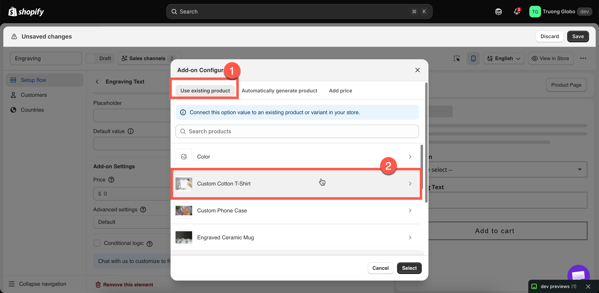

# Use an existing product

The **Use existing product** mode links an option, or one of its values, to a product already in your Shopify catalog. The add-on then uses that product's price, inventory, SKU, and weight.

Use it when the add-on is a product you already sell, such as a gift box, a spare part, or a matching accessory.

## Steps



### Make sure the product exists

Create the product in Shopify first, with the price and variants you want. The app links to an existing product. It does not create one.



### Open the price field

**Price** under **Add-on Settings** for an input type, or the **Price** cell on an option value's row for a selection type.



### Stay on the Use existing product tab

This is the first of the three tabs and the default.



### Find and select the product

Search your catalog by name. The list is paginated, so use the search field rather than scrolling.



### Select the variant

When you select a product, its variants are listed. Select the exact variant you want.

The add-on's price and inventory come from the **variant**, not from the product. For example, a product with `Small` at $3.00 and `Large` at $5.00 produces a different add-on depending on the variant you select.



### Select Select

The dialog closes, and a **Product** column is added to the values table with a link that opens the product in Shopify admin.



### Set how it scales

The **Advanced settings** dropdown on **Advanced Settings** controls how the quantity is calculated. See [Advanced add-on modes](advanced-add-on-modes.md).



<figure><figcaption></figcaption></figure>

<figure><figcaption>
The add-on price and inventory come from the variant you select.
</figcaption></figure>

## What you get

<table><thead><tr><th width="290">Behavior</th><th>Detail</th></tr></thead><tbody><tr><td>The price follows the product</td><td>Change the variant's price in Shopify and the add-on price changes with it. You do not edit it in two places.</td></tr><tr><td>Stock is real</td><td>Selling the add-on draws down that variant's inventory, exactly as a normal sale does.</td></tr><tr><td>Out-of-stock handling works</td><td>The <a href="../option-types/shared-settings/out-of-stock-options.md">Out of stock options</a> setting can hide, blur, or strike through the value when the variant runs out.</td></tr><tr><td>Its own SKU, weight, and tax setting</td><td>Fulfilment and shipping calculations treat it as the real product it is.</td></tr><tr><td>Reported properly</td><td>It appears in your Shopify product reports as sales of that product.</td></tr><tr><td>Works in POS</td><td>Unlike <strong>Add price</strong>.</td></tr><tr><td>Its own cart line</td><td>Linked to the main item. You can merge them visually — see <a href="merge-as-bundle.md">Merge main product and add-ons</a>.</td></tr></tbody></table>

## When to use this mode

<table><thead><tr><th width="330">Use it when</th><th>Use something else when</th></tr></thead><tbody><tr><td>You already sell the item separately</td><td>You do not — use <a href="auto-generate-a-product.md">Automatically generate a product</a></td></tr><tr><td>You want one inventory figure for both routes</td><td>You want the add-on counted separately from direct sales</td></tr><tr><td>The price should stay in step with your catalog</td><td>The add-on price should differ from the shelf price</td></tr><tr><td>The add-on has a real weight and SKU</td><td>It is a service — use <a href="add-price-directly.md">Add price</a></td></tr></tbody></table>


A single inventory count is usually the best option when add-on and standalone gift boxes share the same stock. To track their inventory separately, generate a separate product instead.


## Examples

**A gift box you also sell**

<table><thead><tr><th width="290">Setting</th><th>Value</th></tr></thead><tbody><tr><td>Option</td><td><code>Gift box</code>, a Switch</td></tr><tr><td>Price</td><td><strong>Use existing product</strong> → <em>Gift Box</em> → <em>Medium</em></td></tr><tr><td>Advanced settings</td><td><strong>One time charge</strong> — one box per order</td></tr><tr><td>Out of stock options</td><td>Not applicable on a Switch — but the box's stock still applies</td></tr></tbody></table>

**Pack sizes as separate SKUs**

A [Button](../option-types/selection-types/button.md) option with the values `1 pack`, `3 pack`, and `5 pack`. Each value links to that pack's own product variant, so inventory is tracked per pack size.

**Premium fabrics sold by the meter**

An [Image swatch](../option-types/selection-types/image-swatch.md) where standard fabrics are free and premium fabrics link to your existing fabric products. When a fabric runs out, its swatch is blurred.

**A matching accessory**

A Checkbox labeled `Add the matching case`, linked to the case product, with the **Default** mode so a customer buying two of the main product receives two cases.

## Keeping it working

<table><thead><tr><th width="290">If you do this in Shopify</th><th>Then</th></tr></thead><tbody><tr><td>Change the variant's price</td><td>Nothing to do — the add-on price follows</td></tr><tr><td>Change its stock</td><td>Nothing to do — availability follows</td></tr><tr><td>Delete the product or variant</td><td><strong>The link breaks.</strong> The app tells you the product or variant no longer exists when you next open the dialog. Relink to something else</td></tr><tr><td>Rename the product</td><td>The link holds — it is not by name</td></tr><tr><td>Unpublish it from the Online Store</td><td>It can no longer be purchased through the widget. Keep add-on products published</td></tr></tbody></table>

## Notes

* Link to a **variant**, not only a product. If the product has several variants, you must select one.
* The same product can be used by several options and values. They all share its inventory.
* Duplicating an option set does **not** duplicate the linked product. Both sets link to the same product and use the same inventory. See [Duplicate and delete](../option-sets/duplicate-and-delete.md).
* If the linked product's details are out of date in the app, use **Sync Add-on data** in the builder's more-actions menu.
