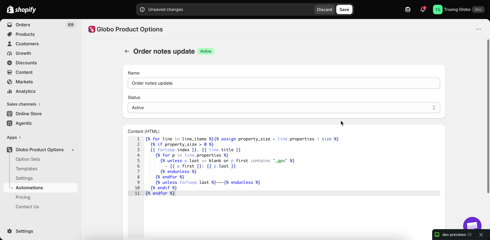

# Update order notes

This workflow writes the selected options into the order's note field in Shopify.

This is the most useful automation for most stores, because **most packing slip, invoice, and notification templates already print the order note**. Writing the options into the note puts them on all your paperwork without editing a template.

You can create one order notes workflow.

## Settings

<table><thead><tr><th width="290">Setting</th><th>What it does</th></tr></thead><tbody><tr><td><strong>Content (HTML)</strong></td><td>The template for what is written into the note. Accepts Liquid variables</td></tr><tr><td><strong>Keep existing order notes</strong></td><td>When on, the app adds a new line below whatever is already in the note instead of replacing it</td></tr></tbody></table>

<figure><figcaption>
One template, and one decision about whether to overwrite.
</figcaption></figure>

## Keep existing order notes


Turn this **on** if anything else writes to your order notes, such as a checkout note field where customers leave delivery instructions, or another app.

With it off, the app replaces the note and the customer's own message is lost.


With it on, the app adds its content on a new line, so both are kept.

## The content template

**Content (HTML)** is a Liquid template. The default template lists each line item and its options, which is what most stores need.

The full variable list is available on the page, and in [Liquid variables reference](liquid-variables-reference.md).

Keep the template compact. A note is displayed in a small area in Shopify admin and printed in a small area on your paperwork, so aim for one line per option.

**Revert to default** restores the original template. It asks you to confirm first.

## Testing

**Test** opens a list of your fifty most recent orders. Select one, and the workflow runs against it so you can see what the note will contain.

Test with an order that has options. An order without options produces an empty result.

## What this gives you

<table><thead><tr><th width="290">Without it</th><th>With it</th></tr></thead><tbody><tr><td>Option details are on the order, but not on your printed paperwork unless you edit templates</td><td>They appear anywhere the order note is printed — usually packing slips, invoices, and emails</td></tr><tr><td>Editing packing slip and email templates means Liquid</td><td>No template editing at all</td></tr><tr><td>Warehouse staff open Shopify admin to read the options</td><td>They read the packing slip</td></tr></tbody></table>

Editing your templates directly gives you more control over where the options appear. See [Show options on orders](../storefront/show-options-on-orders.md).

## Notes

* You can create one order notes workflow per store.
* It runs shortly after the order is created, so the note appears a short time later.
* A workflow set to **Draft** does not run.
* This workflow requires order data access, which you approve once when you first open **Automations**.
* It writes to the order note only. It does not change line items, prices, or anything else on the order.
