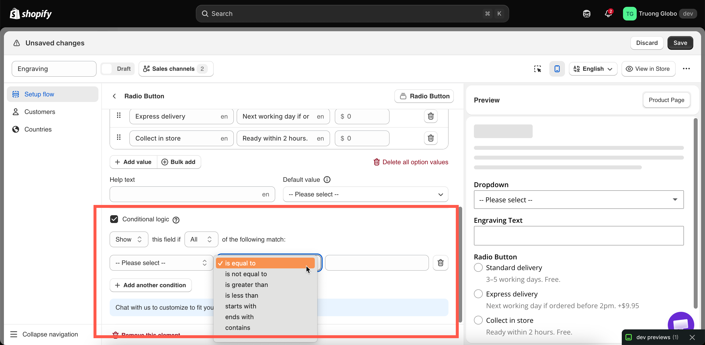

# Overview

Conditional logic turns a long form into a shorter, more relevant experience. Instead of showing every option to every shopper, display each option only when it applies to their selections.

For example:

* Show a gift message field only when the customer selects gift wrapping.
* Show shoe width options only for sizes that are available in different widths.
* Show engraving font options only after the customer enters an engraving message.

## What it can do

<table><thead><tr><th width="290">Capability</th><th>Detail</th></tr></thead><tbody><tr><td>Show or hide any option</td><td>All 32 option types support conditional logic, including the static ones.</td></tr><tr><td>Show or hide a whole group</td><td>A rule on a <a href="../option-types/static-types/section.md">Section</a> applies to everything inside it.</td></tr><tr><td>React to another option</td><td>Any earlier option in the same option set can be the trigger.</td></tr><tr><td>React to the Shopify variant</td><td>Show an option only for a specific variant the customer selected. See <a href="conditions-on-shopify-variants.md">Conditions based on Shopify variants</a>.</td></tr><tr><td>Combine several conditions</td><td>With <strong>All</strong> or <strong>Any</strong> matching.</td></tr><tr><td>Count rather than compare</td><td>Number of characters typed, number of values selected, number of files attached.</td></tr></tbody></table>

## What it cannot do

* It cannot change an option’s price, label, or values. Conditional logic only controls whether an option is shown or hidden.
* It cannot read customer information, country, or cart contents. These are controlled by option-set-level rules - see [Assign to customers](../option-sets/assign-to-customers.md) and [Assign to countries](../option-sets/assign-to-countries.md).
* It cannot use an option that appears later in the form as a condition. Conditions can only reference options that appear earlier in the form.
* It cannot use every option type as a trigger. Twelve option types cannot be used as conditions - see [Build a condition](build-a-condition.md#what-can-be-a-trigger).

## The rule in one sentence

Every rule is presented as a single sentence in the app:

> **Show** this field if **All** of the following match: **Gift wrap** — **contains** — `Yes, wrap it as a gift`

Each rule has four parts: an **action**, a **matching mode**, and one or more **conditions**. Each condition consists of a **source**, an **operator**, and a **value**.

<figure><figcaption>
Every rule is an action, a matching mode, and a list of conditions.
</figcaption></figure>

## Pages in this section

<table data-view="cards"><thead><tr><th></th><th></th><th data-hidden data-card-target data-type="content-ref"></th></tr></thead><tbody><tr><td><strong>Turn on conditional logic</strong></td><td>Where the switch is, and the Show / Hide and All / Any choices.</td><td><a href="turn-it-on.md">turn-it-on.md</a></td></tr><tr><td><strong>Build a condition</strong></td><td>Choosing a source, an operator, and a value — and what can be a trigger.</td><td><a href="build-a-condition.md">build-a-condition.md</a></td></tr><tr><td><strong>Operators reference</strong></td><td>Every operator, grouped by the type of the source option.</td><td><a href="operators-reference.md">operators-reference.md</a></td></tr><tr><td><strong>Conditions based on Shopify variants</strong></td><td>React to the variant the customer picked, and what to check if it does not work.</td><td><a href="conditions-on-shopify-variants.md">conditions-on-shopify-variants.md</a></td></tr><tr><td><strong>Examples and recipes</strong></td><td>Eight complete rules you can copy.</td><td><a href="examples-and-recipes.md">examples-and-recipes.md</a></td></tr><tr><td><strong>Troubleshooting</strong></td><td>When a rule fires at the wrong time, or never.</td><td><a href="troubleshooting.md">troubleshooting.md</a></td></tr></tbody></table>

## Two things to know before you start


**Hidden options are not validated.** If a required option is hidden by a rule, it will not prevent the customer from clicking **Add to cart**. This is intentional—otherwise, a hidden required field could make the product impossible to purchase. However, it also means that an option is only required while it is visible. Be sure to test both branches of every rule.



**Conditions can only reference options that appear above the option you are configuring.** The source dropdown only lists options that appear earlier in the form. If the option you want to use as a condition is not listed, move it above the current option in the builder. See [Build your options](../option-sets/build-options.md).


## Plans

Conditional logic works at two levels, depending on your plan:

<table><thead><tr><th width="230">Level</th><th>What you get</th></tr></thead><tbody><tr><td><strong>Basic</strong></td><td>Rules based on other options in the option set.</td></tr><tr><td><strong>Advanced</strong></td><td>The same, plus conditions based on the <strong>Shopify variant</strong> the customer selected.</td></tr></tbody></table>

On a Basic plan, you can still select **Shopify variant** as a source, but the operator and value fields are locked with an upgrade prompt. See [Compare plans](../plans/compare-plans.md).

## Where to put the rule

If several options should appear or disappear together, apply a single rule to the [Section](../option-types/static-types/section.md) that contains them instead of adding the same rule to each option. This is faster to set up, easier to maintain, and helps keep the logic consistent.
