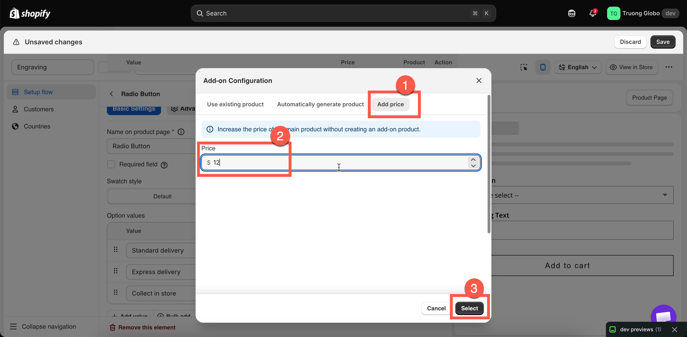

# Fixed amount

The **Fixed amount** mode increases the amount the customer pays. No Shopify product is created or linked.

Use it for services with no inventory to track and nothing to ship separately, such as engraving, express production, or a design fee.

## Steps



### Open the price field

On an input type, that is **Price** under **Add-on Settings** on the **Basic** tab. On a selection type, it is the **Price** cell on the option value's row. See [Where you can set add-ons](where-you-can-set-add-ons.md).



### Choose the Fixed amount tab

The dialog opens with three tabs. **Fixed amount** is the third.

A note confirms that this mode increases the price of the main product without creating an add-on product.



### Enter the amount

Type the amount in your store's currency. Negative amounts are rejected.



### Select Select

The dialog closes and the price is applied to the option.



### Set how it scales

On **Advanced**, the **Add-on quantity** dropdown controls whether the charge follows the product quantity or uses a value the customer enters. Three of the modes cannot be used with Fixed amount — see [What it cannot do](add-price-directly.md#what-it-cannot-do) below. See also [Advanced add-on modes](advanced-add-on-modes.md).



### Save and test on your storefront

Add the product to a cart and check the total. The charge is applied at checkout. See [How pricing is applied](how-pricing-is-applied.md).



<figure><figcaption>
The Fixed amount tab has a single price field and creates no product.
</figcaption></figure>

## What the customer sees

The add-on amount is displayed beside the option, using the format set in your store-wide settings. The default format is `(+ $5.00)`. Depending on your settings, the product price on the page can also update to include it.

There is **no separate cart line**. The charge is added to the main item's price, so the cart shows one line at the higher amount, with the option details listed below it.

This keeps the cart simple.

See [Add-on price display settings](price-display-settings.md).

## What it cannot do


**Three quantity modes are unavailable with Fixed amount.** The app blocks the combination rather than letting it fail quietly, because a fixed amount cannot be multiplied or counted the way a product-backed add-on can:

* **One time charge**
* **Fixed quantity**
* **Fixed quantity (by customer)**

In the **Add-on quantity** dropdown those three are greyed out while Fixed amount is in use, with the note *Not available with Fixed amount.* Coming the other way — picking **Fixed amount** while one of them is already set — the dialog says *Fixed amount doesn't work with …* and will not let you select it.

To charge a flat fee once per order, use [New product](auto-generate-a-product.md) with **One time charge** instead.



**No Shopify POS support.** Charges added this way do not work in the Shopify POS app. If an option set is published to the POS channel, use one of the product-backed modes instead. See [POS limitations](../point-of-sale/limitations.md).

**No inventory, and no out-of-stock handling.** There is no product to track, so the [Out of stock options](../option-types/shared-settings/out-of-stock-options.md) setting has no effect.


This mode also has no SKU, no weight, and no separate line in your Shopify product reports. If you need any of these, use [New product](auto-generate-a-product.md) instead. It takes the same amount of setup.

## When to use Fixed amount

<table><thead><tr><th width="330">Add-on</th><th>Why Fixed amount fits</th></tr></thead><tbody><tr><td>Engraving labor</td><td>Nothing physical is consumed</td></tr><tr><td>Express production</td><td>A scheduling promise, not an item</td></tr><tr><td>Artwork setup or proofing fee</td><td>A service</td></tr><tr><td>A custom-color surcharge</td><td>You are charging for effort, not for a product</td></tr><tr><td>A small handling fee</td><td>No stock, no shipping weight</td></tr></tbody></table>

## When to use something else

<table><thead><tr><th width="330">Add-on</th><th>Use instead</th></tr></thead><tbody><tr><td>Gift wrap, boxes, ribbon — anything you can run out of</td><td><a href="auto-generate-a-product.md">New product</a></td></tr><tr><td>Something you already sell</td><td><a href="use-an-existing-product.md">Existing product</a></td></tr><tr><td>Anything you also sell in person</td><td>Either product-backed mode</td></tr><tr><td>Anything that changes the shipping weight</td><td>Either product-backed mode</td></tr><tr><td>Anything you want to see in Shopify product reports</td><td>Either product-backed mode</td></tr></tbody></table>

## Examples

**A flat engraving fee**

<table><thead><tr><th width="290">Setting</th><th>Value</th></tr></thead><tbody><tr><td>Option</td><td><code>Engraving text</code>, a Text option</td></tr><tr><td>Price</td><td><strong>Fixed amount</strong> $5.00</td></tr><tr><td>Add-on quantity</td><td><strong>Default</strong> — one charge per bracelet</td></tr></tbody></table>

**Engraving by the character**

The same option with **Price** $0.50 and **Add-on quantity** set to **Per character**. A **Max character** value of `20` limits the charge to $10.00.

**Express production, once per order**

A Switch labeled `Express production`, **New product** $10.00, and **Add-on quantity** set to **One time charge**, so a customer buying three items is charged once. A flat fee charged once needs a product-backed mode — Fixed amount cannot do it.

**A tiered service charge**

A Radio button with `Standard` free, `Priority` at $8.00, `Same day` at $20.00, all three using **Fixed amount**.

## Notes

* Negative amounts are rejected.
* A price attached to a **default value** is charged as soon as the page loads. See [Required field and default value](../option-types/shared-settings/required-and-default-value.md#default-value).
* A hidden option is not charged. Hiding an option with a conditional rule removes its price from the total.
* On a multi-select option, every selected value with a price is charged. Use [Max selections](../option-types/shared-settings/limits.md#min-and-max-selections) to limit the number.
