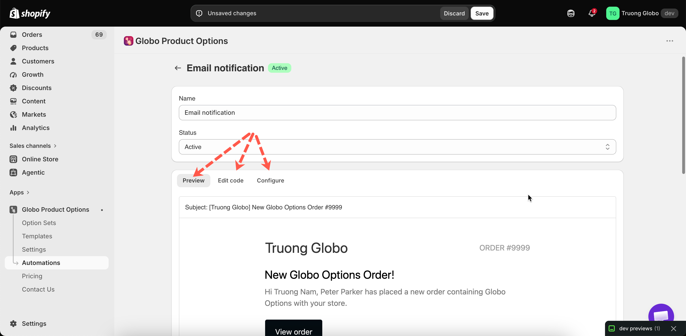
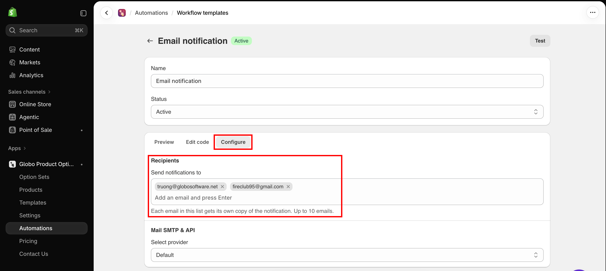

# Email notification

This workflow emails you — or anyone else you add — when a customer orders a product with options, and lists what they selected.

For a personalization business, this is usually the first automation to set up, because it puts the production details in the right inbox without anyone opening Shopify admin.

You can create one email notification workflow.

## The three tabs

The workflow editor has three tabs:

<table><thead><tr><th width="230">Tab</th><th>What it holds</th></tr></thead><tbody><tr><td><strong>Preview</strong></td><td>The email as it will arrive, with the subject line above it</td></tr><tr><td><strong>Edit code</strong></td><td><strong>Email subject</strong> and <strong>Email body (HTML)</strong>, plus the Liquid variable reference</td></tr><tr><td><strong>Configure</strong></td><td>Who receives it, which service sends it, and what it is sent from</td></tr></tbody></table>

<figure><figcaption><p>Preview what will arrive, edit the template, and choose how it is sent.</p></figcaption></figure>

## Editing the email

**Edit code** contains the subject and the body as HTML. Both accept Liquid variables, so the email can include the order number, the customer's details, and every line item with its options.

The full list of variables is available on the page, and in [Liquid variables reference](liquid-variables-reference.md).

Put the important details in the subject line, so you can read them in your inbox list:

```liquid
New personalized order {{ order_name }} — {{ customer_name }}
```

**Revert to default** restores the original template. It asks you to confirm first, because your own version is discarded.

## Who receives it

**Recipients** on the **Configure** tab decides where the notification goes. It works like Shopify's product tags: type an address and press **Enter** to turn it into a tag.

<table><thead><tr><th width="230">Rule</th><th>Detail</th></tr></thead><tbody><tr><td>How many</td><td>Up to <strong>10</strong> addresses</td></tr><tr><td>Adding several at once</td><td>Paste a whole list — commas, semicolons, and spaces all separate addresses</td></tr><tr><td>Duplicates</td><td>Rejected, with <em>This email is already in the list</em></td></tr><tr><td>Invalid addresses</td><td>Rejected before they are added</td></tr><tr><td>Empty list</td><td>The workflow cannot be saved. There has to be at least one address</td></tr></tbody></table>

Every address in the list gets its own copy, so each person receives the notification directly rather than seeing the others in a shared To field.


**Workflows you created before this setting existed** send to the store owner's email, and open with that address already in the list. Nothing changes until you save, so an existing workflow keeps working exactly as it did.


Use it to put the notification straight into the hands of whoever acts on it — your production inbox, the person who does engraving, a shared team address — instead of forwarding every order by hand.

<figure><figcaption><p>Each address in the list gets its own copy of the notification.</p></figcaption></figure>

## Choosing how it is sent

**Configure** sets which service delivers the email.

<table><thead><tr><th width="230">Provider</th><th width="180">Type</th><th>You need</th></tr></thead><tbody><tr><td><strong>Default</strong></td><td>Ours</td><td>Nothing. Works immediately</td></tr><tr><td>Google</td><td>SMTP</td><td>Server, port, encryption, username, password</td></tr><tr><td>Outlook</td><td>SMTP</td><td>The same</td></tr><tr><td>SendGrid</td><td>API</td><td>An API key</td></tr><tr><td>Sendinblue</td><td>API</td><td>An API key</td></tr><tr><td>Pepipost</td><td>API</td><td>An API key</td></tr><tr><td>Amazon SES</td><td>API</td><td>Key id, secret key, region</td></tr><tr><td>Elastic Email</td><td>API</td><td>An API key</td></tr><tr><td>Mailgun</td><td>API</td><td>An API key and a domain</td></tr><tr><td>Zoho</td><td>API</td><td>An API key, a from address, and a bounce address</td></tr></tbody></table>

The SMTP providers fill in their usual server and port, so you normally only enter your username and password.

### Custom sender information

With any provider, you can set the following:

<table><thead><tr><th width="230">Field</th><th>What it does</th></tr></thead><tbody><tr><td><strong>From email</strong></td><td>The address the email appears to come from</td></tr><tr><td><strong>From name</strong></td><td>The name shown alongside it</td></tr><tr><td><strong>Reply to</strong></td><td>Where replies go</td></tr></tbody></table>

### Choosing a provider

<table><thead><tr><th width="290">Situation</th><th>Choice</th></tr></thead><tbody><tr><td>You just want the emails, today</td><td><strong>Default</strong></td></tr><tr><td>You already use a sending service</td><td>That one, so all your mail is in one place</td></tr><tr><td>Emails must come from your own domain</td><td>Your own provider, with the sender fields set</td></tr><tr><td>Emails are going to spam</td><td>Your own provider, on a domain you have authenticated</td></tr><tr><td>You need delivery reporting</td><td>An API provider, which gives you its own dashboard</td></tr></tbody></table>


Start with **Default**. It works without any configuration, and you can switch to your own provider later without changing the template.


## Testing

**Send test email** sends the current template to **everyone on the Recipients list**, which is also the quickest way to confirm the list itself is right. **Send test to another email** sends a single copy somewhere else, which is useful for checking that it is not marked as spam.

Send a test after every change to the template or the provider. This is the only way to confirm that an SMTP password or API key is correct.

Test sending is rate-limited, so wait a few seconds between attempts.

## Notes

* You can create one email notification workflow per store, with up to 10 recipients on it.
* It runs shortly after an order containing app options is created.
* A workflow set to **Draft** does not send anything.
* This workflow requires order data access, which you approve once when you first open **Automations**.
* Provider credentials are stored so the workflow can send email. Where your provider offers one, use an application password or an API key rather than your main account password.
