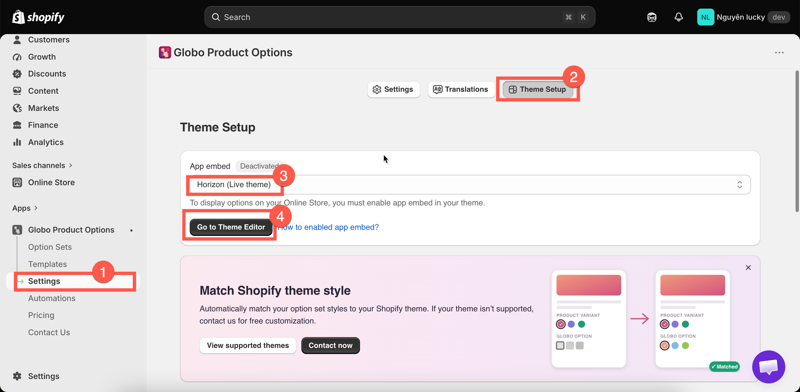
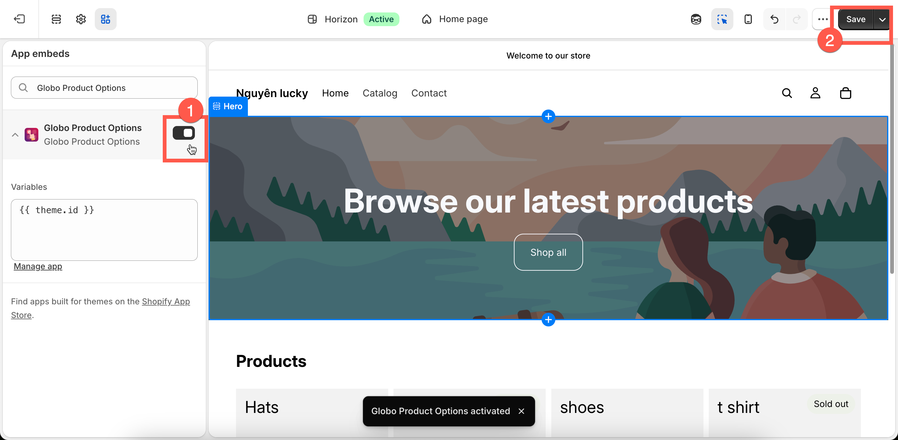

# Enable the app embed

The app displays its widget on your storefront through a Shopify **Theme App Embed**. Until the embed is enabled on your **live theme**, none of your option sets will appear, even if they have already been fully configured and assigned to products.

The app does **not modify or add code to your theme**.

## Steps



### Open Theme Setup

In the app, go to **Settings**, then the **Theme Setup** tab.

The page shows an **App embed** badge — **Activated** or **Deactivated** — for the theme selected in the dropdown below it. If you publish more than one theme, use the dropdown to check each.



### Click Go to Theme Editor button

This opens Shopify's theme editor for that theme, already scoped to the app embeds section.

<figure><figcaption>
Theme Setup shows whether the embed is on, for the theme you select.
</figcaption></figure>



### Turn on Globo Product Options

Find **Globo Product Options** in the **App embeds** list, turn its toggle on, and select **Save** in the theme editor.

<figure><figcaption>
Turn the toggle on, then save in the theme editor.
</figcaption></figure>



### Confirm it is activated

Go back to the app tab. The **App embed** badge will automatically change to **Activated** once the app detects the change — in most cases, you don’t need to reload the page.

Then open a product page where one of your active option sets is assigned and check that the options are displayed correctly.




Once the badge shows as **Activated,** you don't need to come back to this step anymore — unless you publish a different theme.


## Two things worth knowing


The **App Embed is enabled separately for each theme**. If you publish a different theme — even a duplicate of your current theme — the App Embed will not be enabled on the new theme, so your options will stop appearing.

If you’re working on a duplicate theme, make sure to **enable the App Embed on that theme before publishing it**.

This is the **most common reason** why options suddenly stop appearing.



Enabling the App Embed only makes the app available on your storefront — **it does not display the options by itself**.

For an option set to appear, it must also:

* Be **Active**
* Be published to the **Online Store**
* Be correctly assigned to the product based on its rule. See [Assign to products](../option-sets/assign-to-products.md) for more details.

Conversely, if you turn the App Embed off, this is a clean way to **disable the app across the storefront** without deleting your option sets or uninstalling the app.


## Other ways to access the same switch

The **Theme Setup** route above is the recommended method because it also confirms whether the App Embed was successfully activated. However, you can also enable it through either of these shortcuts:

* **Setup guide:** On the app’s Dashboard, click **Enable app embed** in step 2.
* **Shopify directly:** Go to **Online Store → Themes → Customize**, then click the **App embeds** icon in the left sidebar.
