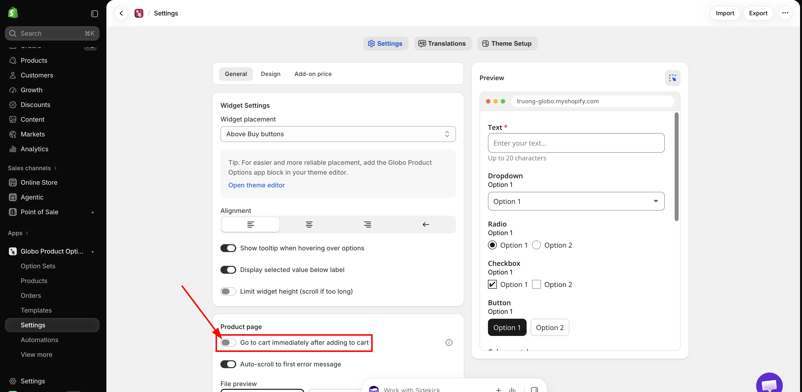
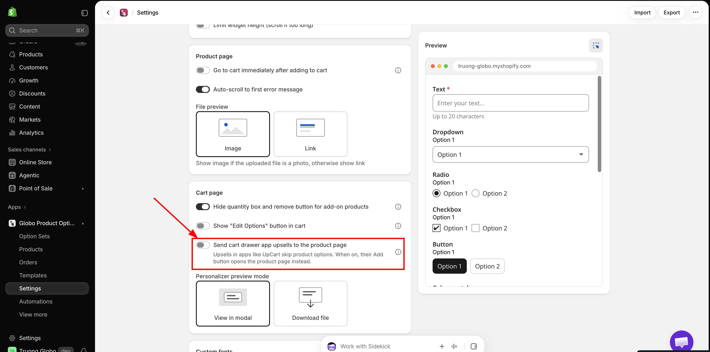

# Cart drawer apps

A cart drawer app replaces your theme's cart with its own slide-out drawer, usually to show upsells and free-gift offers there. That drawer is where your customers see add-on lines after adding a personalized product, so the app has to work inside it.

Three cart drawer apps are recognized automatically. There is nothing to connect and no selector to enter.

**The setup on this page is the same for all three.** Do it once, then read your app's page for the few things specific to it.

## Pages in this section

<table data-view="cards"><thead><tr><th></th><th></th><th data-hidden data-card-target data-type="content-ref"></th></tr></thead><tbody><tr><td><strong>UpCart</strong></td><td>Nothing specific — the setup below is all of it.</td><td><a href="upcart.md">upcart.md</a></td></tr><tr><td><strong>Monster Cart</strong></td><td>You no longer have to merge add-ons.</td><td><a href="monster-cart.md">monster-cart.md</a></td></tr><tr><td><strong>Kaching Cart</strong></td><td>Hidden variant selectors, and upsell filtering that works differently.</td><td><a href="kaching-cart.md">kaching-cart.md</a></td></tr></tbody></table>

## Set up

Two settings decide whether this works. One of them is on by default and has to be turned off, which is the step most people miss.



### Open the app's general settings

In your Shopify admin, open the app, then go to **Settings** > **Settings** > **General**.

<figure><figcaption>
Settings, then the Settings tab, then General.
</figcaption></figure>



### Turn off "Go to cart immediately after adding to cart"

It is in the **Product page** group, and it is **on** by default.

While it is on, adding a product sends the customer straight to your cart page. The drawer never opens, so the integration has nothing to act on and customers never see the drawer you paid for.

<figure><figcaption>
Turn this one off. It is the step most people miss.
</figcaption></figure>



### Check that "Hide quantity box and remove button for add-on products" is on

It is in the **Cart page** group, and it is **on** by default, so usually there is nothing to change.

This is what switches the drawer handling on. With it off, the app leaves the drawer alone entirely, and add-on lines appear in it as ordinary, independently editable cart lines.

<figure><figcaption>
Leave this one on. It is what makes the drawer handling run at all.
</figcaption></figure>



### Save, then add a product with an add-on from your storefront

The drawer should open, with the main item and its add-on line both displayed.



### Decide about drawer upsells

Read [Upsells in the drawer skip your option form](./#upsells-in-the-drawer-skip-your-option-form) below. If any product you upsell in the drawer uses options, turn on the third setting.



### The three settings at a glance

<table><thead><tr><th width="330">Setting</th><th width="110">Default</th><th>For a cart drawer app</th></tr></thead><tbody><tr><td><strong>Go to cart immediately after adding to cart</strong> General > Product page</td><td>On</td><td><strong>Turn it off.</strong> Otherwise the drawer never opens</td></tr><tr><td><strong>Hide quantity box and remove button for add-on products</strong> General > Cart page</td><td>On</td><td><strong>Leave it on.</strong> It switches the drawer handling on</td></tr><tr><td><strong>Send cart drawer app upsells to the product page</strong> General > Cart page</td><td>Off</td><td><strong>Turn it on</strong> if any product you upsell uses options</td></tr></tbody></table>

<figure><figcaption>
All three, set the way a store using a cart drawer app wants them.
</figcaption></figure>

## What the app does in the drawer

<table><thead><tr><th width="330">In the drawer</th><th>What the app does</th></tr></thead><tbody><tr><td>Add-on lines</td><td>Hides their quantity box and Remove button, so an add-on cannot be changed or deleted separately from the item it belongs to</td></tr><tr><td>The main item's quantity is changed</td><td>Recalculates the quantity of every add-on linked to it, following each add-on's own quantity mode</td></tr><tr><td>The drawer is opened, reloaded, or updated</td><td>Re-checks every line, so it stays correct after a customer edits the cart</td></tr><tr><td>The drawer's upsell list</td><td>Leaves out the add-on products the app generated for you, so customers are not offered a gift box or an engraving fee as an upsell. A product you already sell and use as an add-on is a normal product, and can still be upsold</td></tr></tbody></table>

How an add-on's quantity is recalculated depends on the **Add-on quantity** mode you chose for that option — a **One time charge** stays at one, **Dynamic quantity** multiplies, and so on. See [Advanced add-on modes](../../add-on-pricing/advanced-add-on-modes.md).

This applies only to add-ons that have their own cart line, which means add-ons priced as an [Existing product](../../add-on-pricing/use-an-existing-product.md) or a [New product](../../add-on-pricing/auto-generate-a-product.md). A [Fixed amount](../../add-on-pricing/add-price-directly.md) charge is added to the main item's price and has no separate line, so there is nothing in the drawer for the app to manage.

## Upsells in the drawer skip your option form

Every one of these apps shows upsells inside the drawer, and their Add button puts the product in the cart in one click, without opening a product page. If one of those products has options, the customer buys it without filling them in, and you receive an order you cannot fulfill.

The setting for this is **Send cart drawer app upsells to the product page**, in **Settings** > **Settings** > **General** > **Cart page**. It is **off** by default.

<figure><figcaption>
Off by default, so that installing this app does not change your upsell app's behavior on its own.
</figcaption></figure>


**Turn this on if any product you upsell in the drawer uses options.** It is off by default only so that installing this app does not silently change how your upsell app behaves.


With it on, the upsell's Add button reads **Choose options** and opens the product page, where the customer fills the form and adds to cart normally.

<table><thead><tr><th width="290">Turn it on when</th><th>Leave it off when</th></tr></thead><tbody><tr><td>Any upsell product has options, now or later</td><td>None of your upsell products use options</td></tr><tr><td>You would rather be safe than lose the occasional impulse add</td><td>You want to keep one-click upsells exactly as they are</td></tr></tbody></table>

It applies to **every** upsell in the drawer, not only the ones with options, because the drawer does not tell the app which products have an option set. Decide based on whether any of them do.

The button text is translatable per language, as **Choose options** in the **Cart widget** group. See [Translate widget text](../../translations-and-languages/translate-widget-text.md).

## What a drawer cannot do

A cart drawer is the upsell app's own interface, not your cart page. These limits apply whichever of the three you use, and they are worth knowing before you decide to run personalized products through a drawer.

<table><thead><tr><th width="290">Limitation</th><th>What it means for you</th></tr></thead><tbody><tr><td><strong>Edit Options is not available</strong></td><td>The <strong>Edit Options</strong> button is only rendered on your cart page. A customer who spots a misspelled engraving in the drawer has to open the cart page to fix it, or remove the item and start again. See <a href="../../storefront-display-and-design/cart-page.md">Cart page</a></td></tr><tr><td><strong>A personalized design cannot be previewed</strong></td><td><strong>Preview Your Design</strong> is also cart-page only, for the same reason. Customers using the <a href="../../product-personalizer/personalizer.md">Personalizer</a> cannot check their artwork from the drawer</td></tr><tr><td><strong>A quantity correction reloads the page</strong></td><td>If an add-on's quantity no longer matches the item it belongs to, or the add-on product does not have the stock for it, the app writes the correction to the cart and the page reloads, which closes the drawer. The cart is right afterwards, but the customer sees the drawer disappear</td></tr><tr><td><strong>Add-on quantities cannot be edited by the customer</strong></td><td>By design. Add-on quantities follow their <a href="../../add-on-pricing/advanced-add-on-modes.md">quantity mode</a>, and the controls are hidden rather than made editable</td></tr><tr><td><strong>Whether option details are listed is up to the drawer app</strong></td><td>The choices a customer made are stored on the cart line either way, and they always appear at checkout and on the order. Whether the drawer prints them under the item is the drawer app's own setting, not ours</td></tr><tr><td><strong>The upsell redirect is all or nothing</strong></td><td>Turning on <strong>Send cart drawer app upsells to the product page</strong> changes every upsell button in the drawer, not only the ones for products with options</td></tr></tbody></table>


None of this affects what is charged or what reaches the order. Option values and add-on lines are stored on the cart the moment the customer adds to cart, so checkout and your orders are correct even when the drawer displays less than your cart page would.


## Test it



### Add a product with two add-ons

The drawer should open, with both add-on lines shown, each without a quantity box or a Remove button.



### Change the main item's quantity in the drawer

The add-on quantities and the drawer total should update to match.



### Remove the main item

Its add-on lines should go with it.



### Check the upsell list

Your generated add-on products should not stay in it. If you turned the redirect on, the Add button should read **Choose options** and open the product page.



### Go to checkout

Check that the total matches what the drawer showed.



### Repeat on a phone



## If something looks wrong

<table><thead><tr><th width="330">What you see</th><th>What to check</th></tr></thead><tbody><tr><td>The drawer does not open after adding to cart</td><td><strong>Go to cart immediately after adding to cart</strong> is still on</td></tr><tr><td>Add-on lines still have a quantity box and a Remove button</td><td><strong>Hide quantity box and remove button for add-on products</strong> is off</td></tr><tr><td>Add-on quantities do not follow the main item</td><td>The <strong>Add-on quantity</strong> mode set on that option. <strong>Fixed quantity</strong> and <strong>One time charge</strong> are not supposed to follow it</td></tr><tr><td>An upsell was bought without its options</td><td>Turn on <strong>Send cart drawer app upsells to the product page</strong></td></tr><tr><td>Nothing in the drawer behaves as described</td><td>That the app embed is enabled on the published theme. See <a href="../../getting-started/enable-the-app-embed.md">Enable the app embed</a></td></tr></tbody></table>

If it still looks wrong, [contact support](../../help/contact-support.md) with your theme name and a link to a product that has an add-on.

## If you use another cart drawer app

Only the three above are recognized. With any other one, test that add-on lines appear in the drawer and that their quantity boxes and Remove buttons are hidden. If they are not, [contact support](../../help/contact-support.md) with the app's name.

Your theme's own cart drawer is a separate case and is supported on a wide range of themes. See [Ajax cart and redirect to cart](../../storefront-display-and-design/ajax-cart-and-redirect.md).

## Next steps

* [UpCart](upcart.md)
* [Monster Cart](monster-cart.md)
* [Kaching Cart](kaching-cart.md)
* [Cart page](../../storefront-display-and-design/cart-page.md) — every setting that affects add-on lines in the cart
