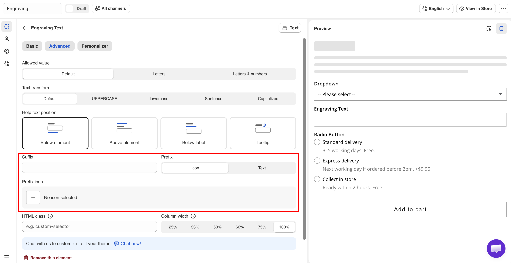

# Prefix, suffix, and icons

These settings add fixed text or an icon to a field. They do not change the value the customer submits. All of them are available on the **Advanced** tab.

## Prefix

Adds an icon or fixed text at the start of the field.

<table><thead><tr><th width="230">Value</th><th>Description</th></tr></thead><tbody><tr><td><strong>Icon</strong> (default)</td><td>Displays the <strong>Prefix icon</strong> setting, where you select an icon from the app's icon picker.</td></tr><tr><td><strong>Text</strong></td><td>Displays the <strong>Prefix text</strong> setting, where you enter text.</td></tr></tbody></table>

Nothing is displayed on the storefront until you select an icon or enter text.

Use an icon when it is widely understood, such as an envelope for an email field or a calendar for a date field. Use text for a symbol or unit, such as `$` or `#`. Keep prefix text to one or two characters, because it reduces the space available for the customer's input.

On the Range slider option type, **Prefix** and **Suffix** are plain text fields without the icon option.

## Suffix

Adds fixed text at the end of the field. Empty by default.

A suffix is normally a unit, such as `cm`, `kg`, or `%`.

Adding the unit as a suffix keeps the submitted value clean. The customer enters `30`, and `30` is saved to the order. This is required if you calculate the price from the value. See [Dimension add-on formula](../../add-on-pricing/dimension-formula.md).

A suffix is always displayed and is not part of the value. A [placeholder](placeholder-and-help-text.md#placeholder) is displayed only while the field is empty. Use the suffix for a unit and the placeholder for an example of the format.

## Element icons

The Section and Size chart option types have their own icon setting, which is separate from field prefixes. Section uses **Prefix icon** on the Basic tab, displayed beside the section heading. Size chart uses **Chart icon** on the Advanced tab, displayed beside the link that opens the chart.

## Choosing an icon

Wherever you pick an icon, the picker has two tabs.

<table><thead><tr><th width="200">Tab</th><th>Holds</th></tr></thead><tbody><tr><td><strong>Library</strong></td><td>The icons that come with the app</td></tr><tr><td><strong>Your images</strong></td><td>Images you uploaded yourself</td></tr></tbody></table>

Both tabs are searchable, so you can type what you are after rather than scrolling.

### Uploading your own image

Select **Upload image** on the **Your images** tab. Use it when the built-in icons do not cover what you sell — a fabric symbol, a care icon, your own badge.

<table><thead><tr><th width="230">Requirement</th><th>Detail</th></tr></thead><tbody><tr><td>Format</td><td>PNG, JPG, or WebP</td></tr><tr><td>File size</td><td>Up to 500 KB</td></tr><tr><td>Dimensions</td><td>Anything larger than 128 × 128 is scaled down for you, keeping its proportions</td></tr></tbody></table>

Icons display small, so upload the image close to the size it will be used at. A photograph scaled down to 128 pixels rarely reads as an icon — a simple shape on a transparent background does.


**Uploaded images are shared across your whole store.** They are saved to your account rather than to the option set you were editing, so once an image is uploaded you can reuse it in any option set.

That also means deleting one affects every option set using it. The app warns you, but it cannot tell you where the image is in use, so check before deleting.


<figure><figcaption>
Images you upload stay available to every option set.
</figcaption></figure>

## Notes

* Uploaded icons are images, so they do not change color with your theme the way the built-in icons do. Upload them in the color you want.
* Prefix and suffix text cannot be translated per language. If units differ by market, use separate option sets with [country rules](../../option-sets/assign-to-countries.md).
* Prefix and suffix text is not saved to the order. If your production team needs the unit, add it to the option's **Name**, for example `Width (cm)`.
* Prefix and suffix do not validate input. Use [Limits](limits.md) and [Text input rules](text-input-rules.md) to control what customers can enter.

<figure><figcaption>
Prefix, Prefix icon, and Suffix on the Advanced tab.
</figcaption></figure>
