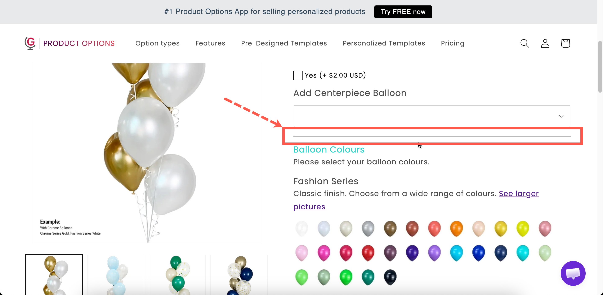

# Divider

A horizontal line between options. It is the simplest way to separate two groups.

## What customers see

A line across the widget, in the color, style, and thickness you set.

<figure><figcaption>
A divider is structure without words.
</figcaption></figure>

## Settings

<table><thead><tr><th width="250">Setting</th><th>What it does</th></tr></thead><tbody><tr><td><strong>Color</strong></td><td>The line color. Starts at black.</td></tr><tr><td><strong>Style</strong></td><td><strong>Solid</strong>, <strong>Double</strong>, <strong>Dashed</strong>, or <strong>Dotted</strong>. Starts on <strong>Solid</strong>.</td></tr><tr><td><strong>Thickness</strong></td><td>The line weight in pixels. Starts at <code>1</code>.</td></tr><tr><td><a href="../shared-settings/conditional-logic-and-add-on-fields.md#conditional-logic">Conditional logic</a></td><td>Show or hide the divider.</td></tr><tr><td><a href="../shared-settings/direction-width-and-css.md#html-class">HTML class</a> / <a href="../shared-settings/direction-width-and-css.md#column-width">Column width</a></td><td>Styling hook and width.</td></tr></tbody></table>

### Choosing the settings

<table><thead><tr><th width="230">Setting</th><th>Advice</th></tr></thead><tbody><tr><td><strong>Color</strong></td><td>A light gray almost always looks better than black. A divider should separate, not shout.</td></tr><tr><td><strong>Thickness</strong></td><td><code>1</code> for most cases. Anything above <code>2</code> starts to look like a design element rather than a separator.</td></tr><tr><td><strong>Style</strong></td><td><strong>Solid</strong> for structure. <strong>Dashed</strong> or <strong>Dotted</strong> reads as lighter, useful for separating items within a group rather than between groups.</td></tr><tr><td><a href="../shared-settings/direction-width-and-css.md#column-width">Column width</a></td><td>Set below 100% for a short centred rule rather than a full-width line.</td></tr></tbody></table>


Use dividers sparingly. A line after every option adds noise and makes the form look longer. If you are adding several, use [Sections](section.md) instead.


## Divider or Spacing?

<table><thead><tr><th width="230">Divider</th><th>Spacing</th></tr></thead><tbody><tr><td>A visible line</td><td>Invisible gap</td></tr><tr><td>Says "different thing"</td><td>Says "same thing, needs room"</td></tr><tr><td>Between groups</td><td>Around an important field</td></tr></tbody></table>

In many cases a [Section](section.md) is better than either, because it provides the separation along with a heading and optional collapsing.

## Examples

**Separating a paid group from a free one**

A light gray solid divider at 1px, between the free options and the paid extras.

**A soft break inside a group**

A dashed divider between two related sub-groups inside one section.

**A divider that only appears sometimes**

Conditional logic so the divider is displayed only when the options below it are visible, otherwise the line appears with nothing under it.

## Notes

* Available on all plans.
* Works in Shopify POS.
* Horizontal only.
