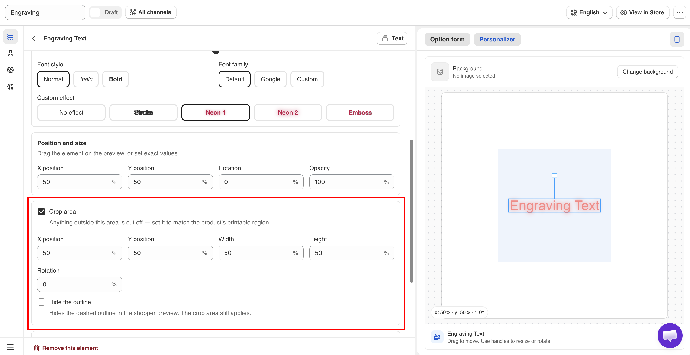

# Crop area

A crop area is a rectangle you define on the image. Any part of the layer outside it is not drawn.

Use it to give customers control of a layer without allowing them to place personalization where you cannot produce it.

**Applies to:** all twelve option types that support the Personalizer, both text and image.

## The settings

<table><thead><tr><th width="230">Setting</th><th width="150">Default</th><th>What it does</th></tr></thead><tbody><tr><td><strong>Crop area</strong></td><td>Off</td><td>Turns it on and reveals the rest</td></tr><tr><td><strong>X position</strong></td><td><code>50</code>%</td><td>Horizontal position of the region</td></tr><tr><td><strong>Y position</strong></td><td><code>50</code>%</td><td>Vertical position of the region</td></tr><tr><td><strong>Width</strong></td><td><code>50</code>%</td><td>How wide the region is</td></tr><tr><td><strong>Height</strong></td><td><code>50</code>%</td><td>How tall the region is</td></tr><tr><td><strong>Rotation</strong></td><td><code>0</code>°</td><td>Rotates the region, from -180 to 180</td></tr><tr><td><strong>Hide the outline</strong></td><td>Off</td><td>Hides the dashed outline for the customer. The crop area still applies</td></tr></tbody></table>

All values are percentages of the image, as with [layer positions](position-size-rotation.md).

<figure><figcaption>
The crop area is visible while you position it, and can be hidden from customers.
</figcaption></figure>

## When to use it

<table><thead><tr><th width="290">Situation</th><th>Why a crop area helps</th></tr></thead><tbody><tr><td>You let customers drag a layer</td><td>They cannot drag it off the printable area</td></tr><tr><td>You let customers resize a layer</td><td>An oversized layer is cropped instead of covering the whole product</td></tr><tr><td>An uploaded photo goes into a fixed window</td><td>The photo fills the window and nothing spills outside it</td></tr><tr><td>Your printable area is not the whole product</td><td>The preview shows the real boundary</td></tr><tr><td>Text must stay inside an engraved panel</td><td>Long entries are cut at the panel edge rather than running over the product</td></tr></tbody></table>


If you enable any [customer control](customer-controls.md), such as move, resize, or rotate, set a crop area as well. Without one, a customer can place their design anywhere on the image, including areas you cannot print.


## How to set one up



### Turn on Crop area

The region is displayed in the preview with a visible outline.



### Size it to your real printable area

Set **Width** and **Height** to match the area you can produce on.



### Move it into place

Use **X position** and **Y position** to align the outline with the printable area in your photo.



### Rotate it if the surface is not square

Use **Rotation** to match the region to an angled surface.



### Position the layer inside it

The layer's position is a separate setting. Set it where you want the design to start.



### Test the boundary

Enter a long value, or drag the layer if you allowed that, and check that it is cut at the edge of the region.



### Decide whether customers see the outline

**Hide the outline** removes the outline from the customer's view. See below.



## Hide the outline

<table><thead><tr><th width="230">Setting</th><th>Effect on the customer</th><th>Use when</th></tr></thead><tbody><tr><td>Off</td><td>They see the region's outline</td><td>You want them to understand where they can place things — useful when they can drag</td></tr><tr><td>On</td><td>The outline is invisible; the cropping still happens</td><td>The boundary is obvious from the product itself, and an outline would look like a flaw</td></tr></tbody></table>

If customers can move a layer, leave the outline **visible**. It shows them the limits of the printable area.

## Crop area or auto-fit?

Both settings prevent text from extending outside the area, but they work differently.

<table><thead><tr><th width="230"></th><th width="290">Crop area</th><th>Auto-fit max width</th></tr></thead><tbody><tr><td>What it does</td><td>Cuts off whatever is outside the region</td><td>Shrinks the text so it fits</td></tr><tr><td>Applies to</td><td>Text and image layers</td><td><a href="../../option-types/input-types/text.md">Text</a> and <a href="../../option-types/input-types/number.md">Number</a> only</td></tr><tr><td>Result with a long entry</td><td>Truncated in the preview</td><td>Smaller but complete</td></tr><tr><td>Best for</td><td>Enforcing a boundary, especially with customer controls</td><td>Keeping the whole entry visible</td></tr></tbody></table>

For engraving text, use [auto-fit](curve-and-auto-fit.md#auto-fit-max-width) first, as reducing the font size is usually better than cutting off the text. Add a **Crop area** when customers can move the layer or when the printable area is limited by your production process.

## Notes

* You can add one **Crop area** per layer. Each layer can have its own crop area.
* The **Crop area** does not move with the layer. It remains fixed while the layer moves within it.
* The **Crop area** affects the preview only. Set it to match your actual printable area.
* Rotating the crop area and rotating the layer are separate settings.
