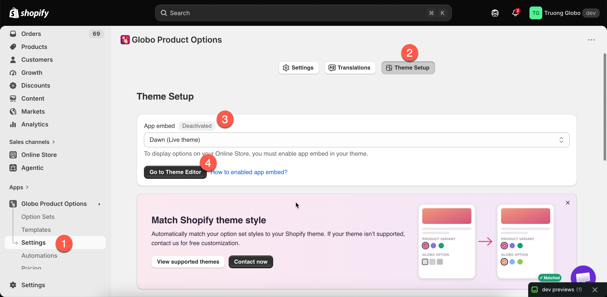

# Theme setup

**Settings** > **Theme Setup** is where you confirm that the app is turned on in the right theme.

## What is on the page

<table><thead><tr><th width="230">Element</th><th>What it does</th></tr></thead><tbody><tr><td>Theme selector</td><td>Lists every theme in your store. Your published theme is marked <strong>(Live theme)</strong></td></tr><tr><td><strong>App embed</strong> badge</td><td><strong>Activated</strong> or <strong>Deactivated</strong> for the selected theme</td></tr><tr><td><strong>Go to Theme Editor</strong></td><td>Appears when the selected theme shows <strong>Deactivated</strong>. Opens the Shopify theme editor at the app embed</td></tr></tbody></table>

<figure><figcaption>
Select a theme, and the badge tells you whether the app is running on it.
</figcaption></figure>

## The app embed

The app embed is what lets the app run on your storefront. Nothing you build is displayed to customers until it is on.

The app embed is **per theme**. Enabling it on one theme does not affect the others, so when you publish a new theme, including a duplicate of the same theme, you have to enable it again.

For full instructions, including two other ways to do this, see [Enable the app embed](../getting-started/enable-the-app-embed.md).

## Checking a theme before you publish it

Use the theme selector to check a theme you are **about to** publish.



### Select the draft theme

Select it from the theme selector.



### Read the badge

If the badge says **Deactivated**, your options disappear as soon as you publish that theme.



### Enable it now

Select **Go to Theme Editor**, turn the app embed on, and save.



### Preview the draft theme

Check a product page on the draft theme before you publish it.



Doing this before a theme launch prevents options from disappearing from your live store immediately after a redesign.

## Notes

* Enabling the embed does not edit theme files. Shopify stores it with the theme.
* Turning it off is a way to disable the app across your storefront without uninstalling it.
* The badge updates automatically when you return from the theme editor, because the app checks again when the tab becomes visible.
* The **Dashboard** displays the same status, along with a count of any [app blocks](../getting-started/add-the-app-block.md) you have placed.
