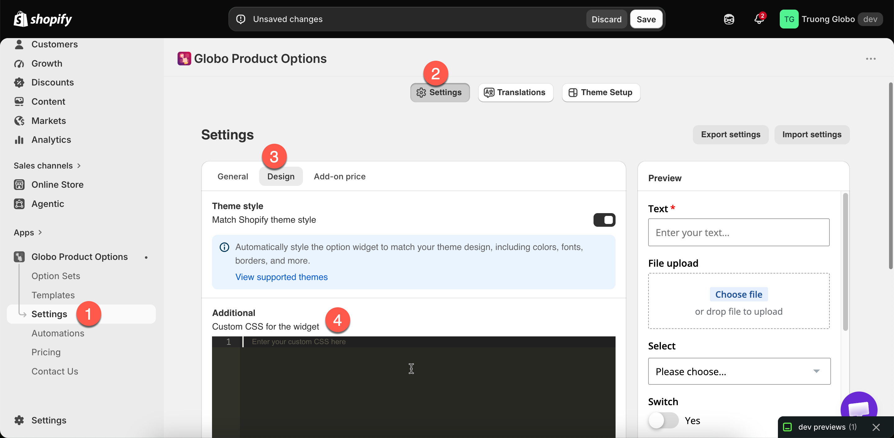

# Custom CSS

**Settings** > **Settings** > **Design** > **Additional** > **Custom CSS for the widget**. This is a code editor, and its contents are applied to the widget on your storefront.

<figure><figcaption></figcaption></figure>

## Try the settings first

Most of what merchants write CSS for has a setting, and a setting continues to work when your theme changes.

<table><thead><tr><th width="330">You want</th><th>Setting</th></tr></thead><tbody><tr><td>The widget to look like your theme</td><td><a href="match-your-theme-style.md">Match theme style</a></td></tr><tr><td>Different colors</td><td><a href="colors.md">Colors</a></td></tr><tr><td>Different fonts or sizes</td><td><a href="borders-and-typography.md">Borders and typography</a></td></tr><tr><td>Rounder or squarer controls</td><td>Border radius, same page</td></tr><tr><td>Fields side by side</td><td><a href="../option-types/shared-settings/direction-width-and-css.md#column-width">Column width</a></td></tr><tr><td>A shorter widget</td><td><a href="widget-behavior.md">Limit widget height</a></td></tr><tr><td>Options grouped or collapsible</td><td><a href="../option-types/static-types/section.md">Section</a></td></tr></tbody></table>

Use custom CSS for what those settings do not cover.

## Targeting one option

Global rules can affect the whole widget. Target a class on the specific option instead:



### Give the option an HTML class

Set **HTML class** on the option's **Advanced Settings**. Use letters, numbers, hyphens, and underscores only, with no leading dot. See [HTML class](../option-types/shared-settings/direction-width-and-css.md#html-class).



### Write a rule against it

```css
.engraving-field label {
  font-weight: 600;
  letter-spacing: 0.04em;
}

.engraving-field input {
  text-align: center;
}
```



### Check a real product page

Custom CSS applies to the storefront, not to the builder preview. Use **View in Store**.



### Check on a phone

Most CSS problems are layout problems, and they usually appear first on a phone.



## What custom CSS is useful for

<table><thead><tr><th width="290">Use</th><th>Notes</th></tr></thead><tbody><tr><td>Emphasising one important option</td><td>A background, a border, more spacing</td></tr><tr><td>Hiding something in a context no setting covers</td><td>Use a class rather than a broad selector</td></tr><tr><td>Fine spacing adjustments</td><td>Where the design settings are too coarse</td></tr><tr><td>Matching a house style the settings cannot reach</td><td>Unusual label placement, custom control shapes</td></tr><tr><td>Excluding something on one page type</td><td>Combine with your theme's own body classes</td></tr></tbody></table>

## Writing CSS that keeps working

<table><thead><tr><th width="290">Do</th><th>Avoid</th></tr></thead><tbody><tr><td>Target your own <strong>HTML class</strong> values</td><td>Targeting the app's internal class names, which can change</td></tr><tr><td>Keep rules short and specific</td><td>Broad selectors that catch more than you meant</td></tr><tr><td>Write down why each rule exists, in a comment</td><td>An unexplained block nobody dares delete</td></tr><tr><td>Test after every theme update</td><td>Assuming it still works</td></tr><tr><td>Use relative units and check mobile</td><td>Fixed pixel widths</td></tr></tbody></table>


Custom CSS is yours to maintain. It is not affected by **Match theme style** and is not updated when the app changes, so check it first when the widget looks wrong after an update. Keep it as short as possible.


## Notes

* Custom CSS is store-wide. One stylesheet applies to every option set.
* It is applied to the widget on the storefront. The builder preview is not affected.
* Your theme's own CSS also applies, and it may be more specific than your rules.
* Custom CSS does not change what the options collect or how they behave.
* If you would rather not write CSS, support can help with styling. See [Contact support](../help/contact-support.md).
