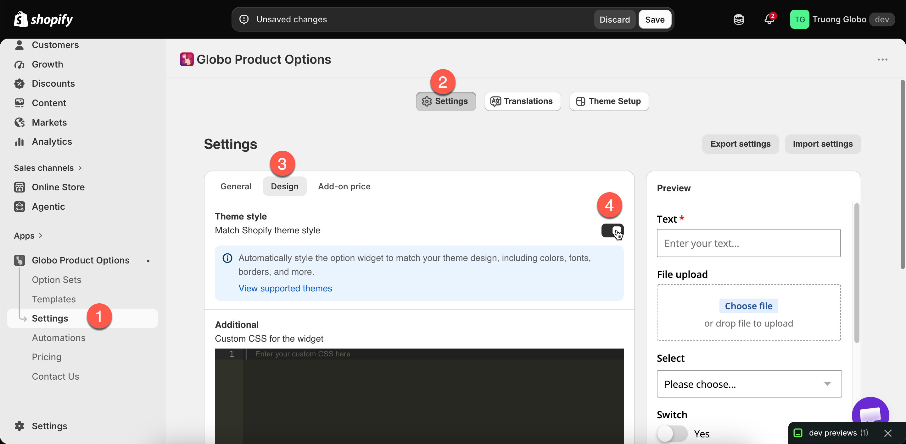

# Match your theme style

**Match theme style** makes the widget use your theme's appearance instead of the app's default styling. On a supported theme, this one setting replaces most of the work of matching the color and typography settings by hand.

Check the setting before you change anything: if your store was running a supported theme when you installed the app, it is already on.

## It may already be on

When you install the app, it looks at your published theme. If that theme is one it has styling for, **Match theme style** is turned on for you, so the widget matches from the start.

This happens **once, at install**. It does not follow you afterwards:

* Switch to a different supported theme later, and you turn the setting on yourself.
* Stores that installed the app before this existed are not changed.
* If anything goes wrong while checking, the setting is simply left off.

## Where it is

**Settings** > **Settings** > **Design** > **Theme style** > **Match theme style**.

Beside the setting is a link to the list of supported themes, which is the list below.

<figure><figcaption>
One switch, and a link to check whether your theme is covered.
</figcaption></figure>

## Supported themes

The app includes styling for these themes. Support is per theme **and per theme version**, and the app uses the closest version it has to the one you are running.

<table><thead><tr><th width="230">Theme</th><th width="230">Theme</th><th>Theme</th></tr></thead><tbody><tr><td>Atelier</td><td>Avante</td><td>Baseline</td></tr><tr><td>Be Yours</td><td>Blockshop</td><td>Blum</td></tr><tr><td>Cello</td><td>Colorblock</td><td>Combine</td></tr><tr><td>Concept</td><td>Craft</td><td>Crave</td></tr><tr><td>Dawn</td><td>Dwell</td><td>Edge</td></tr><tr><td>Empire</td><td>Eurus</td><td>Expanse</td></tr><tr><td>Fabric</td><td>Fashionopolism</td><td>Flow</td></tr><tr><td>Heritage</td><td>Horizon</td><td>Hyper</td></tr><tr><td>Ignite</td><td>Impulse</td><td>Krank</td></tr><tr><td>Luxe</td><td>Maximize</td><td>Monk</td></tr><tr><td>Noom</td><td>Origin</td><td>Outsiders</td></tr><tr><td>Pebble</td><td>Pitch</td><td>Prestige</td></tr><tr><td>Publisher</td><td>Purity</td><td>Refresh</td></tr><tr><td>Release</td><td>Ride</td><td>Rise</td></tr><tr><td>Ritual</td><td>Satoshi</td><td>Savor</td></tr><tr><td>Sense</td><td>Showcase</td><td>Sleek</td></tr><tr><td>Spotlight</td><td>Stockist</td><td>Studio</td></tr><tr><td>Supreme</td><td>Taste</td><td>Testament</td></tr><tr><td>Tinker</td><td>Trade</td><td>Ultra</td></tr><tr><td>Vessel</td><td>Wonder</td><td>Xclusive</td></tr><tr><td>Yuva</td><td>Zest</td><td></td></tr></tbody></table>

Some of these are sold under more than one name. **Maximize** is also sold as Swift, Various, Vast, and Vigor; **Supreme** as Heatwave, Royce, Realm, and Rose; and **Noom** as Boutique. If you run one of those, the styling for the theme it is named after applies.

If your theme is not listed, see [If your theme is not supported](match-your-theme-style.md#if-your-theme-is-not-supported) below.


The list is updated over time. If your theme is not listed here, check the **View supported themes** link beside the setting.


## What it does

With the setting on, the widget takes its input and button styling, control shapes, and typography from your theme rather than from the app's defaults.

The widget then looks like part of the product page rather than a separate form.

## What it does not do

<table><thead><tr><th width="290">Not covered</th><th>Where to handle it</th></tr></thead><tbody><tr><td>Where the widget sits on the page</td><td><a href="widget-placement.md">Widget placement</a></td></tr><tr><td>Behavior — tooltips, height limits, selected values</td><td><a href="widget-behavior.md">Widget behavior</a></td></tr><tr><td>Anything specific to your own customizations of the theme</td><td><a href="custom-css.md">Custom CSS</a></td></tr><tr><td>The builder's preview panel</td><td>Nothing — the preview always uses the app's own styling. Compare with <strong>View in Store</strong></td></tr></tbody></table>

## Steps



### Turn on Match theme style

**Settings** > **Settings** > **Design** > **Theme style**.



### Save



### Check a real product page

Use **View in Store** from the builder. The builder preview does not display the change because it never uses your theme's styling.



### Adjust anything that is left

Use the [color](colors.md), [border, and typography](borders-and-typography.md) settings, which continue to work alongside this one.



### Check on a phone

Check the widget again after any theme update.



## If your theme is not supported

Turning the setting on causes no problems. The widget keeps the app's own styling. Style it manually instead:



### Match your fonts

**Settings** > **Design** > **Typography**. Set the four text styles to your theme's fonts and sizes. See [Borders and typography](borders-and-typography.md).



### Match your colors

**Settings** > **Design** > **Color**. Copy the values from your theme's own settings so they match exactly. See [Colors](colors.md).



### Match your border weight and radius

Also in **Design**. Rounded controls in a theme with square controls are the most noticeable mismatch.



### Fill any gaps with custom CSS

See [Custom CSS](custom-css.md).



### Or contact support

Support can help with theme styling. See [Contact support](../help/contact-support.md).



## Notes

* This setting is store-wide, like everything in **Design**.
* Support is per theme version, and the app uses the nearest version it has. A very old or very new version of a supported theme may match less closely.
* A heavily customized copy of a supported theme may not match, because the app styles the original theme rather than your changes.
* Color, border, and typography settings still apply, so you can turn this on and then adjust them.
