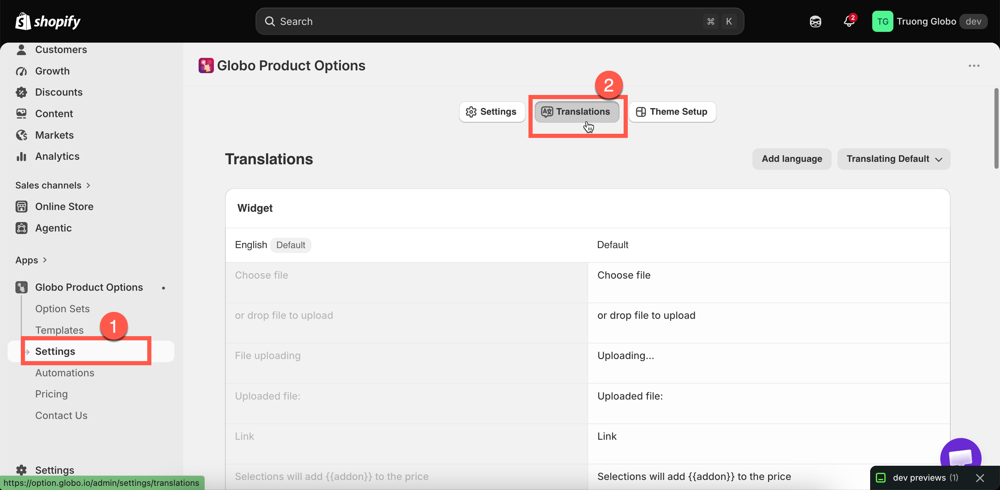

# Translate widget text

Widget text is the text supplied by the **app** rather than the text you wrote, such as `Choose file`, `This field is required`, and `Edit Options`. It is set once for the store and applies to every option set.

Use this page for two purposes: translating the text for another storefront language, and rewording it in your own language.

## Where it is

**Settings** in the app menu, then the **Translations** tab.

<figure><figcaption>
Four groups, and one set of values per language.
</figcaption></figure>

## The four groups

<table><thead><tr><th width="290">Group</th><th>Covers</th></tr></thead><tbody><tr><td><strong>Widget</strong></td><td>File upload prompts, the add-on message, quantity and search prompts</td></tr><tr><td><strong>Cart widget</strong></td><td>The cart-page controls: <strong>Edit Options</strong>, <strong>Cancel</strong>, <strong>Save Changes</strong>, <strong>Preview Your Design</strong>, <strong>Your Design</strong></td></tr><tr><td><strong>Add to cart error messages</strong></td><td>Two messages about items becoming unavailable or a checkout method not being usable</td></tr><tr><td><strong>Validation error messages</strong></td><td>Every message a customer sees when their entry does not pass a rule — about twenty of them</td></tr></tbody></table>

## Adding a language



### Select Add language

The list contains your storefront languages.



### Choose the language

It is added as a tab alongside **Default**.



### Fill in the values

Complete the four groups. Any value left blank falls back to the default.



### Save

Then test the storefront in that language. Leave a required field empty and try to add to cart, so you see a validation message.



**Remove language** removes a language's set of values. The default set cannot be removed.

## Variables

Several messages contain `{{ }}` placeholders that the app fills in from your option settings. Keep them in your translation; otherwise the message loses the value.

<table><thead><tr><th width="290">Variable</th><th>Filled with</th></tr></thead><tbody><tr><td><code>{{addon}}</code></td><td>The add-on amount</td></tr><tr><td><code>{{min_character}}</code> / <code>{{character_limit}}</code></td><td>Your min and max character settings</td></tr><tr><td><code>{{character_count}}</code></td><td>How many characters the customer has typed</td></tr><tr><td><code>{{min_value}}</code> / <code>{{max_value}}</code></td><td>Your min and max value settings</td></tr><tr><td><code>{{min_selection}}</code> / <code>{{max_selection}}</code> / <code>{{exactly_selection}}</code></td><td>Your selection limits</td></tr><tr><td><code>{{min_files}}</code> / <code>{{max_files}}</code></td><td>Your file count limits</td></tr></tbody></table>

The app includes a reference for these placeholders, so you can check them without leaving the page.


A message still displays if you remove its variable, but it reads "Please enter less than or equal to characters". If you shorten a message, keep the variable.


## Rewording the default messages

The default messages are accurate but generic. A few changes make them clearer:

<table><thead><tr><th width="290">Default</th><th>Better</th></tr></thead><tbody><tr><td><code>This field is required</code></td><td><code>Please fill this in before adding to your bag</code></td></tr><tr><td><code>Please enter less than or equal to {{character_limit}} characters</code></td><td><code>That is too long — up to {{character_limit}} characters fit</code></td></tr><tr><td><code>File not allowed</code></td><td><code>We can only accept JPG and PNG files</code></td></tr><tr><td><code>Please select at least {{min_selection}} options</code></td><td><code>Choose at least {{min_selection}} to continue</code></td></tr><tr><td><code>Choose file</code></td><td><code>Upload your photo</code></td></tr></tbody></table>

Customers read error messages at the point where they are already blocked, so plain wording is worth the few minutes it takes.

## Notes

* These settings are store-wide. There is no per-option-set override.
* Anything blank in a language falls back to the default set, so a partial translation still works.
* This is separate from [option content](translate-option-content.md), which is your own labels and values, and from the [app admin language](app-admin-language.md), which is the language you work in.
