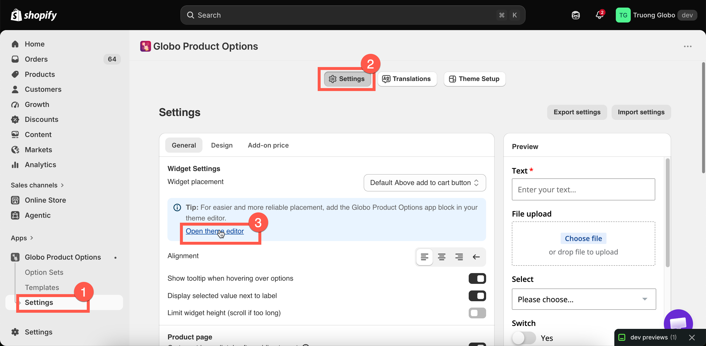
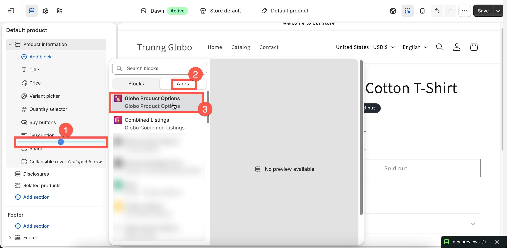
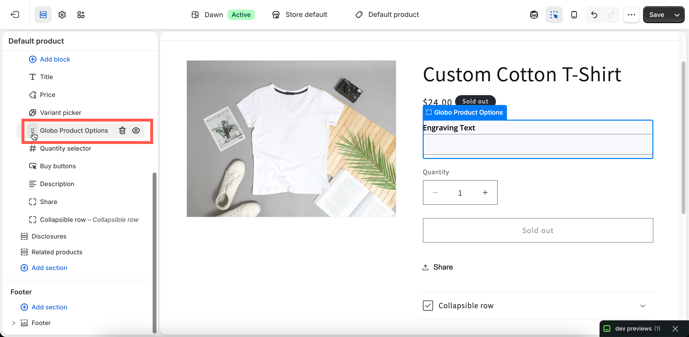

# Add the app block

The **App Block** is an optional second part of the theme integration:

* **App Embed** controls **whether the app runs** on your storefront.
* **App Block** controls **where the widget appears**.

You can simply drag the App Block to your preferred position in the product template, just like any other theme block.

## App embed vs app block

<table><thead><tr><th width="180">Piece</th><th width="120">Required?</th><th>What it does</th></tr></thead><tbody><tr><td><strong>App embed</strong></td><td>Yes</td><td>Loads the app on your storefront. Without it, the app won’t work. It also places the widget automatically based on the position selected in <strong>Settings → General</strong>.</td></tr><tr><td><strong>App block</strong></td><td>No</td><td>Lets you place the widget inside a specific section of your theme. The widget appears exactly where the block is placed, giving you direct control over its position without using a CSS selector.</td></tr></tbody></table>


The App Block does not replace the App Embed. If the App Embed is disabled, the App Block will not render anything. **Always enable the App Embed first.**


## When to use the App Block

Use the **App Block** when:

* Automatic placement puts the widget in an inconvenient location, and none of the built-in positions work.
* You want to place the widget **between two specific blocks** — for example, below the variant picker but above a trust badge.
* You want to display the options on a **Featured product** section on your homepage or another page.
* You prefer not to maintain a **CSS selector** in the app settings.

Stick with **automatic placement** if one of the built-in positions already places the widget where you want it. See [Widget placement](../storefront/widget-placement.md).

## Add it to your product template



### Open the Theme Customize editor

On the app’s dashboard, select **Add app block** on the **Active app blocks** card. This opens the product template with the app block ready to add.

You can also find the same shortcut under **Widget placement** in **Settings** > **General**.

Alternatively, open the theme editor from Shopify: **Online Store** > **Themes** > **Customize**, then use the template dropdown to select **Products** > **Default product**.

<figure><figcaption>
The dashboard counts your app blocks and links straight to adding one.
</figcaption></figure>



### Add the App block

In the left sidebar, find the product information section — its name varies by theme, often **Product information** or **Product** — and select **Add block**. Under the **Apps** tab, choose **Globo Product Options**.

<figure><figcaption></figcaption></figure>



### Drag it to the expected position

The block appears in the section's block list. Drag it up or down until it sits where you want the widget. The preview redraws as you move it, so you can judge the position directly.

<figure><figcaption></figcaption></figure>



### Save, then check

Select **Save** in the theme editor. Open a product page on your storefront to see the widget in its new position.



## Options on a home page or a regular page

Options can also appear inside a **Featured product** section outside the product template.

In the theme editor, open the page where you want the options to appear. If there isn’t a **Featured product** section, add one. Then select **Add block** > **Globo Product Options** inside the section.

The block’s **Product** setting is automatically populated from the section, but make sure it points to the product you expect. Then select **Save**.


**Important:** Adding the block alone is not enough. In the app, go to **Settings** > **General** > **Other pages** and enable the matching setting:

* **Show widget on home page (featured product section only)**
* **Show widget on regular page (featured product section only)**

If the setting is disabled, the widget won’t appear even when the app block has been added.


## Notes

* The product template and **Featured product** sections are the appropriate places to use the block. The block needs a product in context to determine which option sets apply.
* Adding a block does **not** disable automatic placement. If the widget appears twice, remove the block or change **Widget placement** so the automatic placement no longer applies.
* App blocks are saved with the theme, just like the app embed. A new theme does not include blocks from another theme.
* App blocks require an **Online Store 2.0** theme. If you’re using an older theme, use automatic placement with a custom CSS selector instead.
