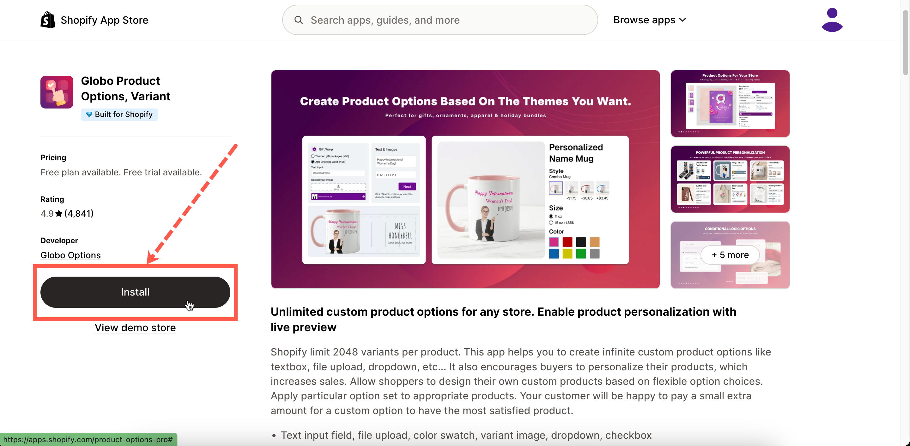
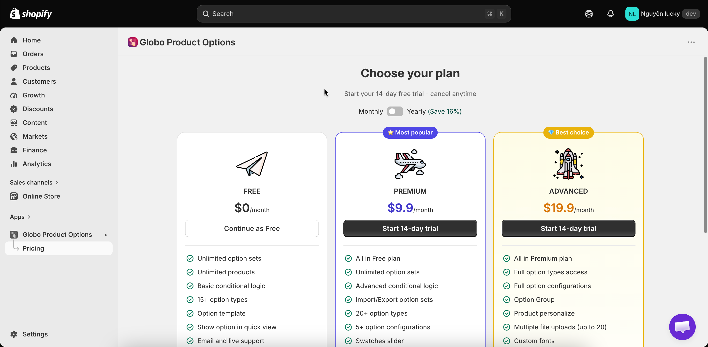
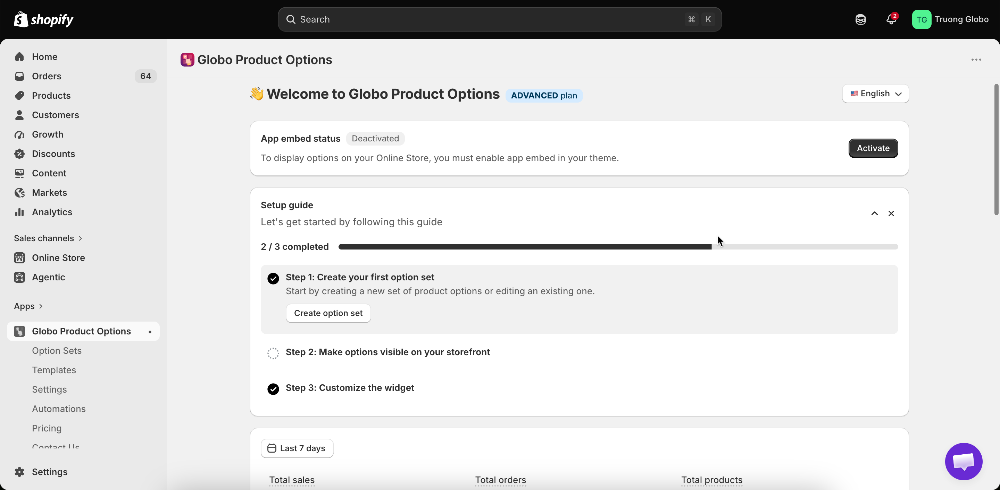

# Install the app

Installing the app takes about two minutes. When you’re done, the app will be installed in your Shopify admin, your plan will be selected, and you’ll be ready to start from the app dashboard.

## Before you start

* You need permission to install apps on the store. Staff members need the **Apps** permission; collaborators need the store owner to approve the installation.
* Nothing on your storefront changes during installation. Your product options will appear later, after you [enable the app embed](enable-the-app-embed.md).

## Steps



### Find the app in the Shopify App Store

Either open the app listing directly at [apps.shopify.com/product-options-pro](https://apps.shopify.com/product-options-pro), or from your Shopify admin, go to **Apps** > **Shopify App Store** and search for **Globo Product Options**.

Make sure you’re signed in to the correct store before installing. The App Store installs the app in whichever store you’re currently signed in to.

<figure><figcaption></figcaption></figure>



### Install and approve the permissions

Shopify shows a summary of the data the app will be able to access and asks you to approve the installation.

This screen is provided by Shopify, not the app. Review the information, then select **Install** to proceed. See [What the app can access](install-the-app.md#what-the-app-can-access) below for details on how each permission is used.

<figure><figcaption></figcaption></figure>



### Choose your plan

The app opens on the **Pricing** page. On a new installation, you must choose a plan before you can use the app. The app will keep you on this page until you select a plan.

* Use the **Monthly** / **Yearly** switch at the top to compare billing periods. Yearly billing is discounted.
* On the free plan, the button reads **Continue as Free**. Select it to continue without being charged.
* On a paid plan, the button reads **Start 14-day trial**. Select it to start your trial. Shopify will show its own approval screen for the recurring charge. You won’t be charged until the trial ends.
* If you have a discount code, enter it in the discount field before selecting a paid plan.

<figure><figcaption>
On a new install the app opens on Pricing and asks you to choose a plan before anything else.
</figcaption></figure>


Choosing the free plan does not lock you in. You can start a trial or upgrade at any time from **Pricing** — see [Change your plan](../plans/change-your-plan.md).




### Land on the dashboard

After you choose a plan, the app takes you to the **Dashboard**. At the top, you’ll see the **Setup guide** card with three steps and a progress bar:

1. **Create your first option set**
2. **Make options visible on your storefront** - this means enabling the app embed.
3. **Customize the widget**

The card automatically marks each step as completed. You can collapse the card while you work and close it when you’re done.

<figure><figcaption>
The Setup guide tracks the three things you need to do after installing.
</figcaption></figure>




The app is installed when you can see the Dashboard. Nothing is visible to shoppers yet — continue with the [Quickstart](quickstart.md).


## What the app can access

Shopify asks you to approve these permissions during installation. Here’s what each permission is used for.

<table><thead><tr><th width="250">Permission</th><th>What the app uses it for</th></tr></thead><tbody><tr><td>Products</td><td>Used to show your products and variants in pickers when you assign an option set or link an add-on product. This access is also used to create add-on products when you ask the app to generate them for you.</td></tr><tr><td>Themes</td><td>Checking whether the app embed is enabled on a theme, and listing your themes on the <strong>Theme Setup</strong> page.</td></tr><tr><td>Files</td><td>Storing the images you upload for image swatches, custom preview backgrounds, and personalization shapes, and the fonts you upload.</td></tr><tr><td>Orders</td><td>Reading order details so the app can show option data and power analytics.</td></tr><tr><td>Store languages</td><td>Listing your storefront languages so you can translate option content per language.</td></tr><tr><td>Sales channels</td><td>Publishing an option set to the Online Store and Point of Sale channels, and publishing add-on products it generates.</td></tr><tr><td>Storefront product data</td><td>Reading up-to-date variant and inventory data on the storefront so out-of-stock handling and pricing previews are correct.</td></tr><tr><td>Cart pricing</td><td>Applying add-on prices to the cart at checkout so the customer is charged the correct total. See <a href="../add-on-pricing/how-pricing-is-applied.md">How pricing is applied</a>.</td></tr></tbody></table>

Some permissions are requested later, only when you use a feature that requires them:

* **Permission to write to orders** is requested the first time you open **Automations**, because order-note and order-tag workflows modify orders. Permission to read orders is already covered above.
* **Customer permissions** are requested the first time you select specific customers in a customer rule.

In both cases, the app shows you what access it needs, and you approve it in Shopify, just as you did during the initial installation.

## Notes

* Installing the app does not add, remove, or edit any of your theme files.
* Installing the app does not create any products. Products are only created if you later choose the **Automatically generate product** add-on mode — see [Automatically generate a product](../add-on-pricing/auto-generate-a-product.md).
* Your chosen plan determines which option types and features are available. Locked features remain visible in the app but are greyed out and show an upgrade prompt — see [Locked features](../plans/compare-plans.md).
