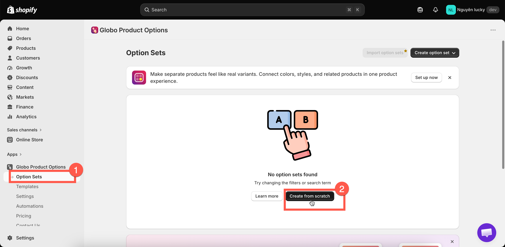
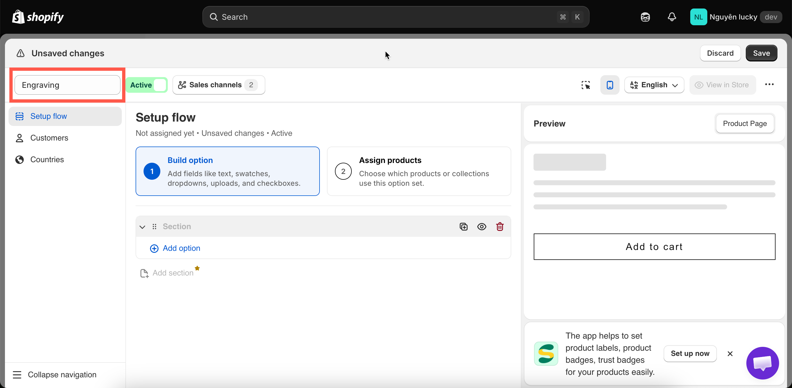
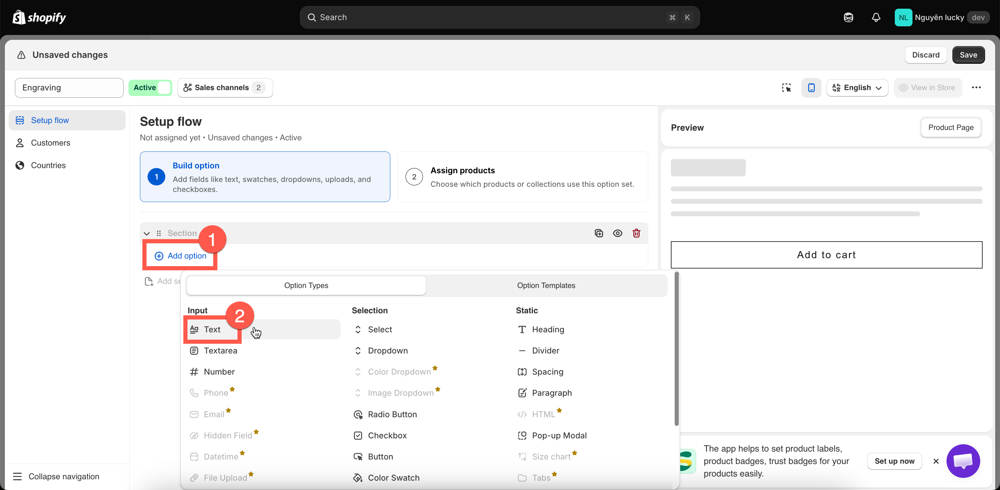
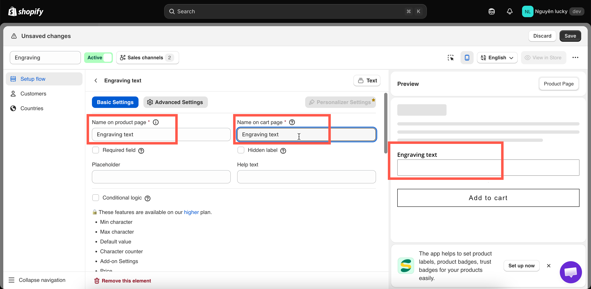
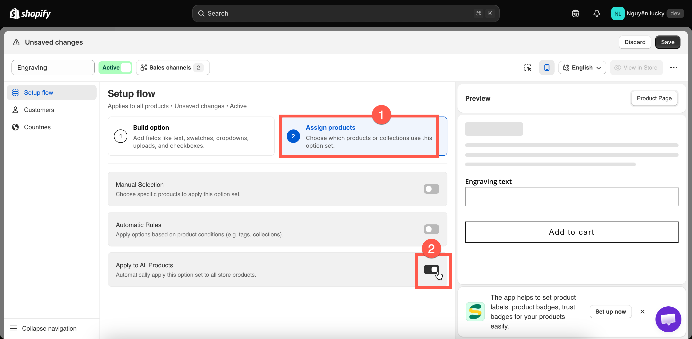
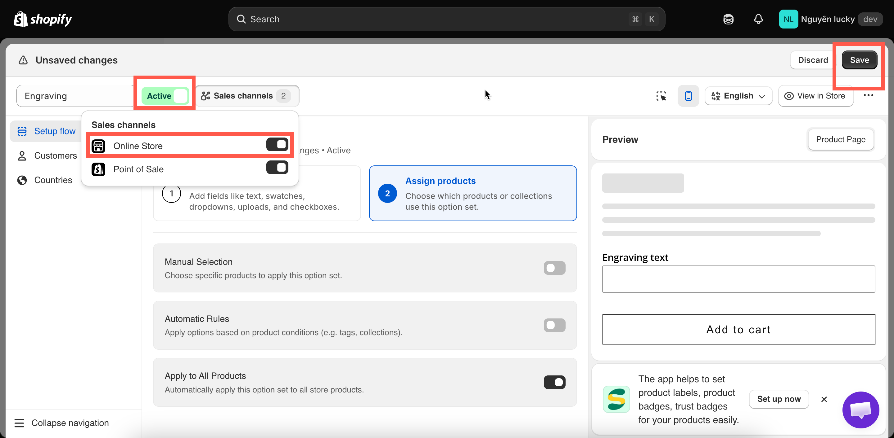

# Quickstart

The shortest complete path through the app. By the end, you’ll have a text field on your product page that customers can type into, and their input will be included with the order.

Everything you do in this guide is reversible.

## Before you start

* The app is installed, and you have chosen a plan — see [Install the app](install-the-app.md).
* You know which theme is currently live, and you can open the Shopify theme editor.
* You have a product that you can open on your storefront to use for testing.

## Steps



### Create an option set and name it

Go to **Option Sets** > **Create option set** > **Create from scratch**.

Replace the default name in the builder header with a name you’ll recognise — `Engraving`, for example. This name is for internal use only; customers won’t see it.

The builder opens on **Build option**, with one empty **Section** already in place. A section is simply a container for your options — add your first option inside it.

<figure><figcaption>
Start a new option set from scratch on the Option Sets page.
</figcaption></figure>

<figure><figcaption></figcaption></figure>



### Add a Text option and label it

Click the **Add option** button and select **Text** (it's the simplest of the 32 [option types](../option-types/): a single-line box).

<figure><figcaption></figcaption></figure>

On **Basic Settings**, two fields matter:

* **Label** — what shoppers read above the box. Set it to `Engraving text`.
* **Name** — what appears on the cart, at checkout, and on the order. Set it to `Engraving text` too.

The preview on the right updates as you type.

<figure><figcaption></figcaption></figure>


**Name** has rules that **Label** does not: it must be unique within the option set, and it cannot contain `.` `:` `"` `'` `\` or `|`. See [Label and Name](../option-types/shared-settings/labels-and-visibility.md).




### Assign it to your products

Switch to **Assign products** and turn on **Apply to All Products**.

That is the fastest way to test. The other two methods — picking products by hand, or matching a tag, type, vendor, price, or collection — are what you will actually use in production. See [Assign to products](../option-sets/assign-to-products.md).

<figure><figcaption>
Apply to All Products is the fastest way to test; narrow it down afterwards.
</figcaption></figure>


An option set will not save without **at least one option** and **a product rule turned on**. If either is missing, the builder jumps you back to that step.




### Save it as Active

Select **Save**, then set the status beside the option set name to **Active** and tick **Online Store** under **Sales channels**.

<figure><figcaption>
An option set must be Active and published to Online Store to reach shoppers.
</figcaption></figure>



### Enable the app embed

**This is the step most often missed.** Until the app embed is enabled in your theme, nothing you’ve built will appear on the storefront, no matter how the option set is configured.

Go to **Settings** > **Theme Setup**, confirm that the theme shown is your live theme, then select **Go to Theme Editor**. Turn on the **Globo Product Options** app embed and select **Save**.

<figure><figcaption></figcaption></figure>

<figure><figcaption></figcaption></figure>

Back in the app tab, it automatically changes to **Activated** within a few seconds.

There are two other ways to enable the app embed, as well as steps to verify that it’s working: [Enable the app embed](enable-the-app-embed.md).



## See it on your storefront

Open any product page. Your **Engraving text** field should appear above the **Add to cart** button, which is the app’s default position.

Enter some text and add the product to your cart. The text is saved with the item and appears beneath it on the cart page, at checkout, and on the order in your Shopify admin.




That’s the complete workflow: **build → assign → activate → embed → verify**. Everything else in these docs is a variation of this process.


You can move the widget elsewhere on the page and restyle it to match your theme — see [Widget placement](../storefront/widget-placement.md) and [Match your theme style](../storefront/match-your-theme-style.md).
