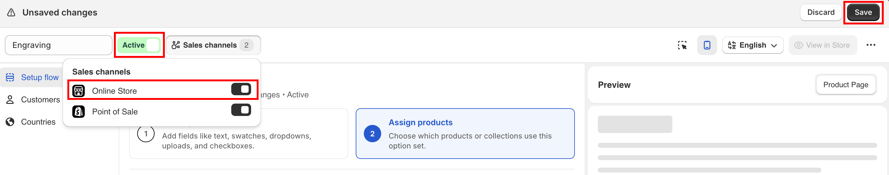
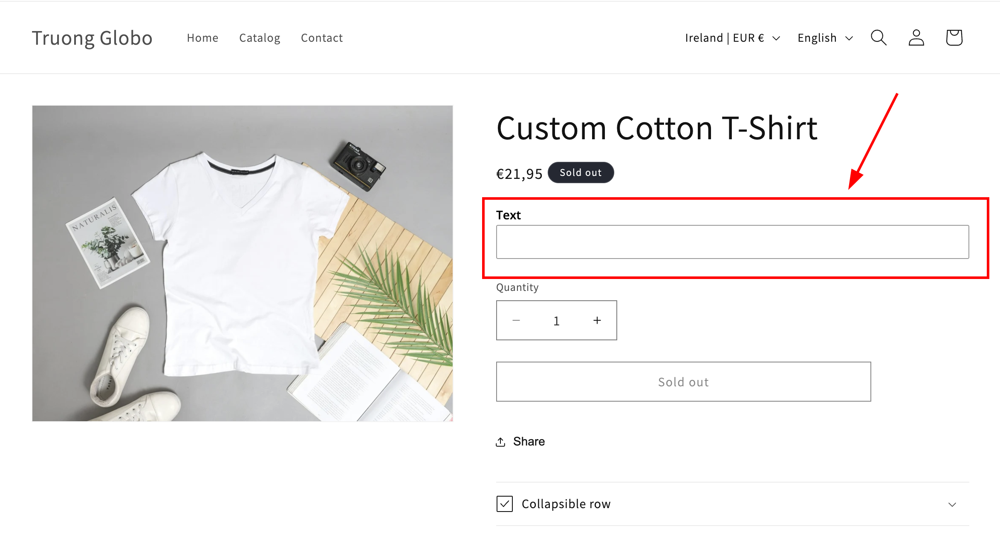

# Quickstart

The shortest complete path through the app. At the end you will have a text field on your product page that customers can type into, and what they type will reach your orders.

Everything here is reversible.

## Before you start

* The app is installed and you have chosen a plan — see [Install the app](install-the-app.md).
* You know which of your themes is live, and you can open the Shopify theme editor.
* You have a product you can open on your storefront to test with.

## Steps



### Create an option set and name it

**Option Sets** > **Create option set** > **Create from scratch**.

Replace the default name in the builder header with something you will recognise — `Engraving` will do. The name is internal; customers never see it.

The builder opens on **Build option**, with one empty **Section** already in place. A section is just a container — add your option inside it.

<figure><figcaption>
Start a new option set from scratch on the Option Sets page.
</figcaption></figure>

<figure><figcaption></figcaption></figure>



### Add a Text option and label it

Select the add button and pick **Text** — the simplest of the 32 [option types](../option-types/): a single-line box.

<figure><figcaption></figcaption></figure>

On **Basic Settings**, two fields matter:

* **Label** — what shoppers read above the box. Set it to `Engraving text`.
* **Name** — what appears on the cart, at checkout, and on the order. Set it to `Engraving text` too.

The preview on the right updates as you type.

<figure><figcaption>
Option types are grouped into Input, Selection, and Static.
</figcaption></figure>


**Name** has rules that **Label** does not: it must be unique within the option set, and it cannot contain `.` `:` `"` `'` `\` or `|`. See [Label and Name](../option-types/shared-settings/labels-and-visibility.md).




### Assign it to your products

Switch to **Assign products** and turn on **Apply to All Products**.

That is the fastest way to test. The other two methods — picking products by hand, or matching a tag, type, vendor, price, or collection — are what you will actually use in production. See [Assign to products](../option-sets/assign-to-products.md).

<figure><figcaption>
Apply to All Products is the fastest way to test; narrow it down afterwards.
</figcaption></figure>


An option set will not save without **at least one option** and **a product rule turned on**. If either is missing, the builder jumps you back to that step.




### Save it as Active

Select **Save**, then set the status beside the option set name to **Active** and tick **Online Store** under **Sales channels**.

A new option set is created as **Draft**, and a draft never appears on your storefront.

<figure><figcaption>
An option set must be Active and published to Online Store to reach shoppers.
</figcaption></figure>



### Enable the app embed

**This is the step people miss.** Until the app embed is on in your theme, nothing you built appears on the storefront — however the option set is configured.

Go to **Settings** > **Theme Setup**, confirm the theme shown is your live one, and select **Go to Theme Editor**. Turn on the **Globo Product Options** app embed and select **Save**.

<figure><figcaption></figcaption></figure>

<figure><figcaption></figcaption></figure>

Back in the app tab, the badge changes to **Activated** by itself within a few seconds.

Two other ways to do this, and how to confirm it worked: [Enable the app embed](enable-the-app-embed.md).



## See it on your storefront

Open any product page. Your **Engraving text** field is there, above the **Add to cart** button — the app's default position.

Type something in and add the product to your cart. The text travels with the item and appears under it on the cart page, at checkout, and on the order in your Shopify admin.

<figure><figcaption>
The option appears above Add to cart, which is the app's default position.
</figcaption></figure>


That is the whole loop: **build → assign → activate → embed → verify**. Everything else in these docs is a variation on it.


You can move the widget elsewhere on the page and restyle it to match your theme — see [Widget placement](../storefront/widget-placement.md) and [Match your theme style](../storefront/match-your-theme-style.md).
