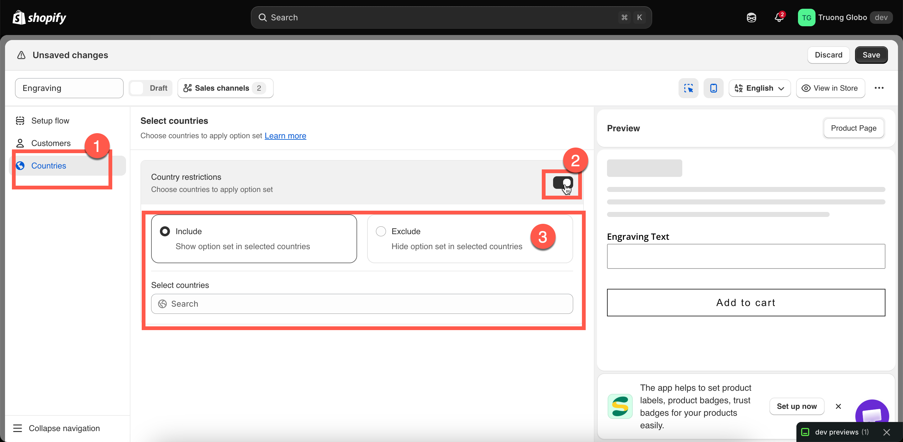

# Assign to countries

Some options are only relevant in certain markets — for example, a delivery-date picker for countries where you offer local delivery, engraving in a language your workshop supports, or a customs declaration field for export orders.

The **Countries** tab lets you control this with a single include-or-exclude list.

## Before you start

* Make sure you have an option set open in the builder and select **Countries** in the left sidebar.
* Country rules are available only on certain plans. If **Country restrictions** is unavailable, see [Compare plans](../plans/compare-plans.md).
* &#x20;Country restrictions are **off** by default, so the option set is shown in all countries.

## Steps



### Turn on Country restrictions

The block expands with two choices and a country selector.



### Choose Include or Exclude

<table><thead><tr><th width="180">Choice</th><th>Behaviour</th></tr></thead><tbody><tr><td><strong>Include</strong></td><td>Show the option set <strong>only</strong> in the countries you select. Everywhere else, it does not render.</td></tr><tr><td><strong>Exclude</strong></td><td>Show the option set <strong>everywhere except</strong> the countries you select.</td></tr></tbody></table>



### Select countries

Use the country field to search for and select countries. You can select as many as needed, and selected countries appear as removable entries.



### Save

Select **Save**. The rule takes effect on the next storefront page load.



<figure><figcaption>
One switch, one choice, one list — country targeting is deliberately simple.
</figcaption></figure>

## Worked examples

<table><thead><tr><th width="330">You want</th><th>Set up</th></tr></thead><tbody><tr><td>A delivery-date picker only where you deliver</td><td><strong>Include</strong> — your delivery countries</td></tr><tr><td>No engraving on exports, because of lead times</td><td><strong>Include</strong> — your home country only</td></tr><tr><td>Everything except two countries you cannot ship personalised goods to</td><td><strong>Exclude</strong> — those two countries</td></tr><tr><td>Local pickup options for one country</td><td><strong>Include</strong> — that country</td></tr><tr><td>A customs declaration field for international orders only</td><td><strong>Exclude</strong> — your home country</td></tr></tbody></table>

## How the country is determined

The country is based on the storefront's localization — specifically, the country or market the visitor is currently browsing. Shopify determines this based on the visitor's location and any country selector provided by your theme.

There are two important things to keep in mind:

* **It uses the browsing country, not the shipping address.** The shopper has not reached checkout yet, so there is no shipping address for the app to use.
* **Changing the country in your theme's country selector changes which option sets are shown.** The change takes effect on the next page load.


If your store uses Shopify Markets, country restrictions work alongside it. Shopify Markets controls pricing and product availability, while this rule controls whether the option set is displayed. They work independently, so a country can be included in an active market but still be excluded by this rule.


## Notes

* Country restrictions narrow the scope of an option set; they never expand it. The product rule still determines which products are in scope.
* With **Include** selected and no countries chosen, the option set will not be displayed anywhere. Select at least one country or turn off the restriction.
* The builder's live preview does not apply country rules. To test them, use your storefront and switch countries using your theme's country selector.
* Country rules apply to the **Online Store**. POS orders are placed in person, so country restrictions do not apply to them.
