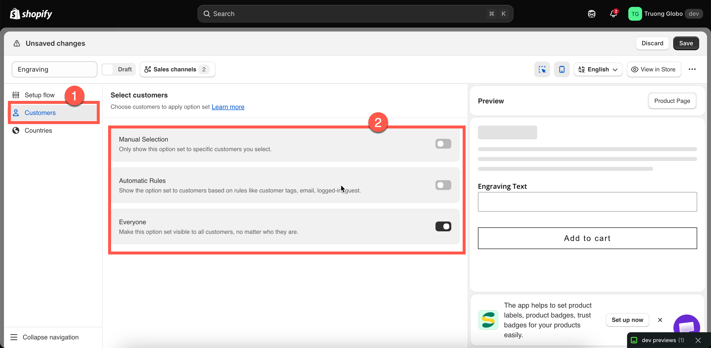

# Assign to customers

By default, an option set is shown to everyone. The **Customers** tab lets you narrow its visibility — for example, to offer wholesale-only options, a VIP engraving service, or a field that is only relevant to signed-in customers.

## Before you start

* Make sure you have an option set open in the builder and select **Customers** in the left sidebar.
* Customer rules are available only on certain plans. If the switches are unavailable, see [Compare plans](../plans/compare-plans.md).
* Customer rules narrow the scope of an option set that already has a product rule. They do not replace the product rule — the product rule still determines which products the option set applies to.

## The three methods

Like product rules, the three customer assignment methods are **mutually exclusive** — enabling one automatically disables the other two.

<table><thead><tr><th width="210">Method</th><th>Shows the option set to</th></tr></thead><tbody><tr><td><strong>Everyone</strong></td><td>All visitors, whether signed in or not. This is the default.</td></tr><tr><td><strong>Manual Selection</strong></td><td>Only the specific customers you select from your customer list.</td></tr><tr><td><strong>Automatic Rules</strong></td><td>Customers who match your conditions — customer tag, name, email, logged-in status, or guest status.</td></tr></tbody></table>

<figure><figcaption>
Everyone is the default, so an option set reaches all shoppers until you narrow it.
</figcaption></figure>

## Everyone

The option set is visible to all visitors, including those who are not signed in.

Keep this enabled unless you have a specific reason to limit visibility. Most option sets should be available to everyone.

## Manual Selection

Select individual customers from your Shopify customer list.



### Turn on Manual Selection

Enable **Manual Selection**. The section expands to show a customer table and a **Select customers** button.



### Approve customer data access, once

The first time you use Manual Selection, the app asks for permission to access your customer data. The permission notice explains that the data is used only for this feature and is not shared.

Click **Update** to approve the permission. This is handled through Shopify, similar to the initial app installation. You must approve access before you can select customers.



### Select customers

Selected customers appear in a table. To remove a customer, use the remove action on their row. To clear the entire list, click **Deselect all customers**. You'll be asked to confirm before the list is cleared.



### Review the list

Selected customers appear in a table. To remove a customer, use the remove action on their row. To clear the entire list, click **Deselect all customers**. You'll be asked to confirm before the list is cleared.




A manual customer rule must have at least one customer selected. If no customers are selected, the builder displays **“Please select customer to apply this option set.”** and disables **Save**.


Manual Selection works best for a fixed list of customers, such as a few wholesale accounts. If the list is likely to grow, tag those customers in Shopify and use an automatic rule instead.

## Automatic Rules



### Turn on Automatic Rules

The block expands with a **Customers must match** setting and one empty condition.



### Choose all conditions or any condition

**all conditions** requires every condition to be true; **any condition** requires at least one.



### Build a condition

<table><thead><tr><th width="270">Field</th><th>Matches against</th></tr></thead><tbody><tr><td><strong>Customer tags</strong></td><td>The tags on the customer's record in Shopify.</td></tr><tr><td><strong>Customer name</strong></td><td>The customer's name.</td></tr><tr><td><strong>Customer email</strong></td><td>The customer's email address.</td></tr><tr><td><strong>Logged-in customer</strong></td><td>Whether the visitor is signed in. No operator or value needed.</td></tr><tr><td><strong>Guest (non-logged in customer)</strong></td><td>Whether the visitor is browsing without signing in. No operator or value needed.</td></tr></tbody></table>

For **Customer tags**, **Customer name**, and **Customer email** the operators are: is equal to, is not equal to, starts with, ends with, contains, does not contain.

**Logged-in customer** and **Guest** are switches rather than comparisons — the app disables the operator and value fields when you pick either, because the field alone is the whole condition.



### Add more conditions if you need them

**Add another condition** appends a row; each row has a delete action.



<figure><figcaption>
Customer tags are the most practical field — you control them entirely.
</figcaption></figure>

### Worked examples

<table><thead><tr><th width="300">You want</th><th>Set up</th></tr></thead><tbody><tr><td>Wholesale-only bulk options</td><td>Customer tags — is equal to — <code>wholesale</code></td></tr><tr><td>Options only for signed-in shoppers</td><td>Logged-in customer</td></tr><tr><td>A "create an account for engraving" prompt for guests</td><td>Guest (non-logged in customer)</td></tr><tr><td>Free personalisation for VIPs</td><td>Customer tags — is equal to — <code>vip</code>, on a duplicate of your normal set with the add-on prices removed</td></tr><tr><td>One corporate client's branded options</td><td>Customer email — contains — <code>@theircompany.com</code></td></tr><tr><td>Trade customers except those on hold</td><td><strong>all conditions</strong>; Customer tags — is equal to — <code>trade</code>; Customer tags — is not equal to — <code>on-hold</code></td></tr></tbody></table>

## Notes

* Customer rules narrow an option set; they never widen it. A product outside the product rule stays outside, whoever is looking.
* Rules are evaluated on the storefront using the signed-in customer. A guest matches only **Everyone** or a **Guest** condition — a tag condition cannot match somebody the store does not know.
* Customer tags are managed in Shopify admin on the customer's record, not in this app.
* The live preview in the builder does not apply customer rules. Test by signing in to your storefront as a test customer.
* Manual customer selection needs the customer data permission described above.
