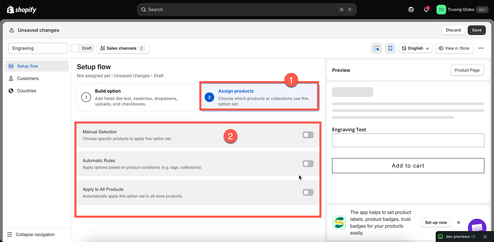
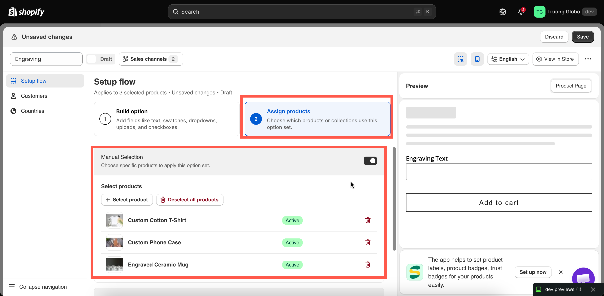
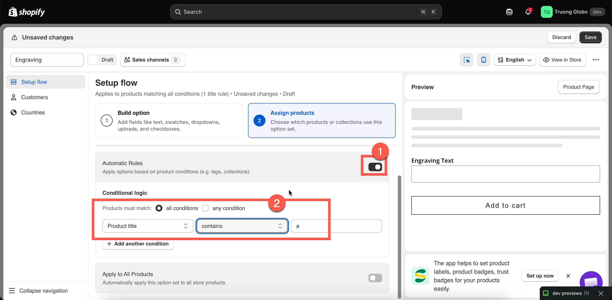

# Assign to products

Every option set needs a product rule. This tells the app which products the options should appear on, and the builder won't let you save an option set without one.

You can choose from three methods. They are **mutually exclusive**, so enabling one automatically disables the other two.

## Before you start

Make sure you have an option set open in the builder and are on **Setup flow** > **Assign products**.

## The three methods

<table><thead><tr><th width="210">Method</th><th>How it decides</th><th>Best for</th></tr></thead><tbody><tr><td><strong>Manual Selection</strong></td><td>You pick products by hand.</td><td>A short, stable list. Options for one flagship product.</td></tr><tr><td><strong>Automatic Rules</strong></td><td>Conditions on product title, type, vendor, price, tag, or collection.</td><td>Best for rules that should continue to apply as you add new products. This is the most common choice.</td></tr><tr><td><strong>Apply to All Products</strong></td><td>Every product in the store.</td><td>Store-wide options such as a delivery note or gift message.</td></tr></tbody></table>

<figure><figcaption>
Three targeting methods; switching one on switches the others off.
</figcaption></figure>

## Manual Selection



### Turn on Manual Selection

The section expands to show a product table and a **Select products** button.



### Select products

Click **Select products** to open Shopify's product picker. Search your catalogue and select multiple products at once.

You can also select individual variants.



### Review the list

Selected products appear in a table showing each product's image, title, vendor, type, and Shopify status (**Active** or **Draft**).

To remove a product, click the Remove action on its row. To clear the entire list, click **Deselect all products**. You'll be asked to confirm before clearing the list because this action cannot be undone.




A manual rule with no products selected is incomplete. The builder displays **“Please select product to apply this option set.”** and prevents you from clicking **Save**.


Manual selection has one important limitation: it does not automatically update as your catalogue changes. If you add a new engravable bracelet next month, you'll need to come back and add it manually. If you expect to add products regularly, an automatic rule is a better choice.

<figure><figcaption>
Manually selected products are listed with their Shopify status.
</figcaption></figure>

## Automatic Rules

Automatic rules describe which products should receive an option set instead of listing them individually. Any product that matches the rules will automatically have the option set applied, both now and in the future.



### Turn on Automatic Rules

The block expands to show an empty condition and a **Products must match** selector above it.



### Choose all conditions or any condition

<table><thead><tr><th width="230">Setting</th><th>Meaning</th></tr></thead><tbody><tr><td><strong>all conditions</strong></td><td>A product must satisfy <strong>every</strong> condition. Conditions narrow the match.</td></tr><tr><td><strong>any condition</strong></td><td>A product needs to satisfy <strong>at least one</strong>. Conditions widen the match.</td></tr></tbody></table>

With only one condition, this setting has no effect. It matters when you add a second condition.



### Build a condition

A condition includes three parts: a product data field, an operator, and a value.

<table><thead><tr><th width="200">Field</th><th>Matches against</th></tr></thead><tbody><tr><td><strong>Product title</strong></td><td>The product's title in Shopify.</td></tr><tr><td><strong>Product type</strong></td><td>The product's <strong>Type</strong> that set up in Shopify.</td></tr><tr><td><strong>Product vendor</strong></td><td>The product's <strong>Vendor</strong> that set up in Shopify.</td></tr><tr><td><strong>Product price</strong></td><td>The product's price.</td></tr><tr><td><strong>Product tag</strong></td><td>The product's tag that set up in Shopify</td></tr><tr><td><strong>Collection</strong></td><td>The products that are included in the collection.</td></tr></tbody></table>

The available operators depend on the field:

<table><thead><tr><th width="240">Field</th><th>Operators</th></tr></thead><tbody><tr><td>Product title, Product type, Product vendor</td><td>is equal to, is not equal to, starts with, ends with, contains, does not contain</td></tr><tr><td>Product price</td><td>is equal to, is not equal to, is greater than, is less than</td></tr><tr><td>Product tag, Collection</td><td>is equal to, is not equal to</td></tr></tbody></table>

For **Collection**, select the value using the collection picker instead of entering it manually.


Changing a condition's field resets its operator and value. This is intentional because the available operators vary by field. To avoid losing your selections, choose the field first, then the operator, and finally the value.




### Add more conditions if you need them

Click **Add another condition** to add a new row. Remove a condition using the delete action on its row.

Use the **all** / **any** setting above to combine multiple conditions.



### Check what it matches

Use **Preview matching products** to see which products currently match your conditions before saving. See [Live preview and inspector](live-preview-and-inspector.md).

This preview is not available when any condition uses **Collection**. To verify collection-based conditions, open a product from that collection using **View in Store**.



<figure><figcaption>
Conditions combine with all or any, and the operators change with the field.
</figcaption></figure>

Worked examples of automatic rules

<table><thead><tr><th width="300">You want</th><th>Set up</th></tr></thead><tbody><tr><td>Every product tagged <code>engravable</code></td><td>Product tag — is equal to — <code>engravable</code></td></tr><tr><td>Everything in the Wedding collection</td><td>Collection — is equal to — pick <em>Wedding</em></td></tr><tr><td>All t-shirts from one brand</td><td><strong>all conditions</strong>; Product type — is equal to — <code>T-Shirt</code>; Product vendor — is equal to — the brand name</td></tr><tr><td>Anything over $100, for insurance options</td><td>Product price — is greater than — <code>100</code></td></tr><tr><td>Anything tagged <code>custom</code> or <code>bespoke</code></td><td><strong>any condition</strong>; Product tag — is equal to — <code>custom</code>; Product tag — is equal to — <code>bespoke</code></td></tr><tr><td>Personalised products, except sale items</td><td><strong>all conditions</strong>; Product tag — is equal to — <code>personalised</code>; Product tag — is not equal to — <code>sale</code></td></tr><tr><td>Everything whose title mentions "Gift"</td><td>Product title — contains — <code>Gift</code></td></tr></tbody></table>


**Tags are the most reliable option.** You have full control over them; they can be updated in bulk in Shopify, and they are easy to understand in a rule. Consider using a dedicated tag for each option set, such as `opt-engraving`.


Three things to know about matching:

* **Text matching is case-sensitive and character-sensitive.** `T-Shirt` and `T-shirt` are different values when using **is equal to**. If you are unsure about the casing, use **contains** instead.
* **Price conditions are checked against variant prices.** If a product has variants with different prices, the rule matches when at least one variant price satisfies the condition.
* **The product must be saved** in Shopify before a rule can detect its tags or type.

## Apply to All Products

With this option enabled, the option set is applied to every product in your store, including products you add later.

Use it deliberately. It works well for store-wide options such as a delivery note or gift message, but it is not suitable for product-specific options because the option set will also appear on gift cards, digital downloads, and add-on products.


If you want to apply an option set to “almost all products,” use **Automatic Rules** with a **Product tag — is not equal to** condition, then add the tag to products you want to exclude. This gives you a store-wide default with an easy way to exclude specific products.


## Notes

* There is currently no limit on the number of products an option set can target. On plans with a product limit, the manual selection block warns you when you reach the limit.
* **Automatic Rules** and **Apply to All Products** may be restricted on some plans. If a switch is unavailable, see [Compare plans](../plans/compare-plans.md).
* Product rules are evaluated on the storefront each time a page loads, so changes to product tags take effect on the next page load.
* Draft products in Shopify can still match an automatic rule. You can see the option set when previewing the draft product.
