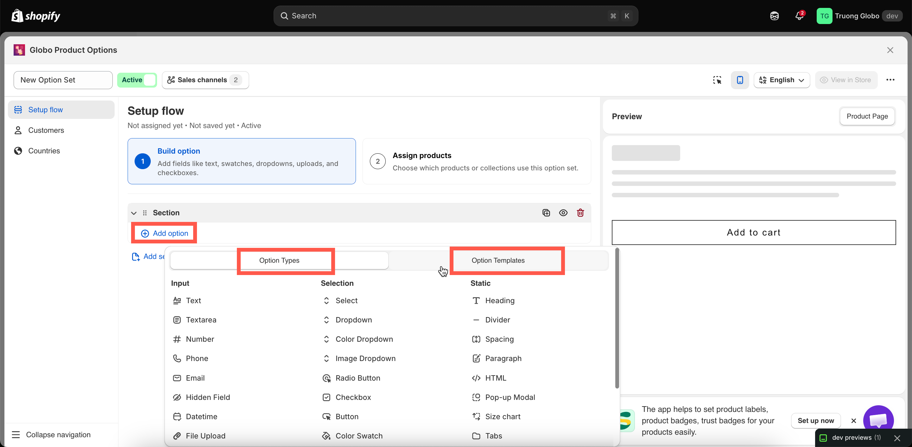
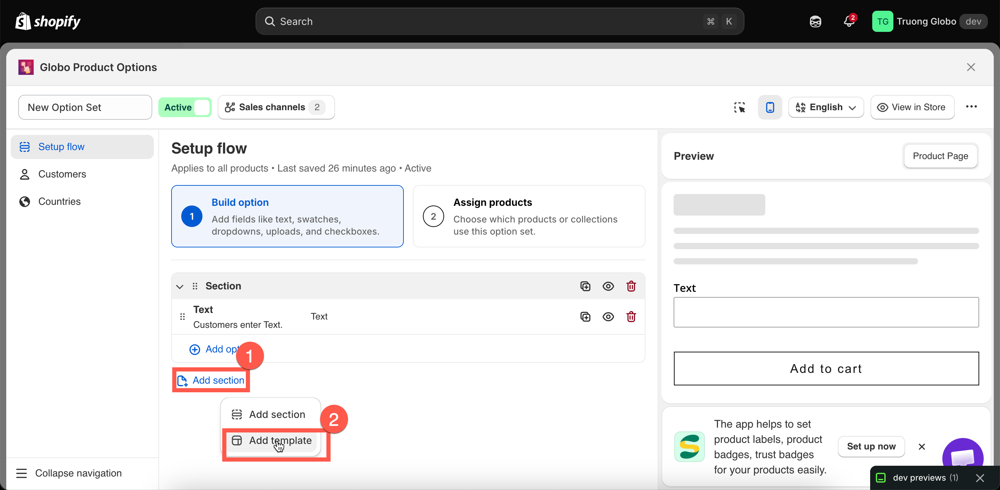
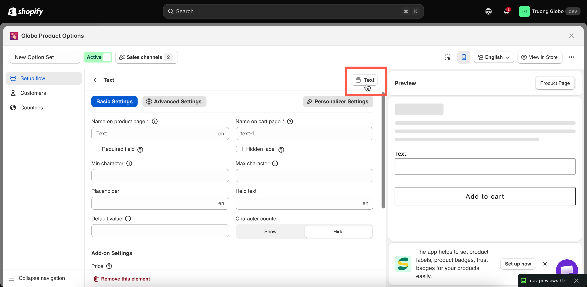
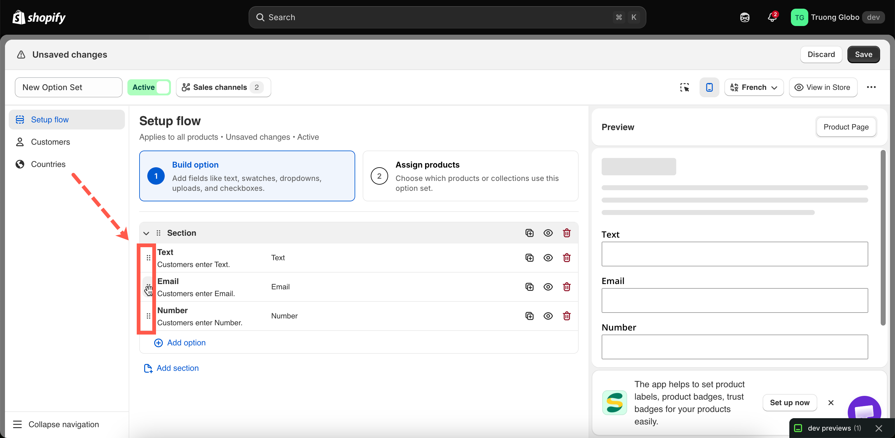
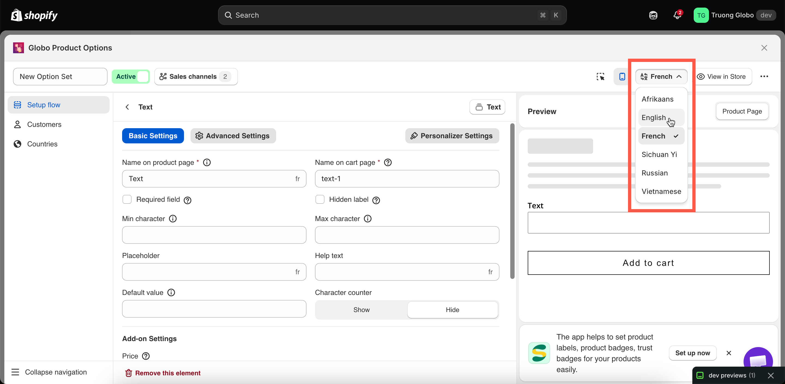

# Build your options

Everything on this page happens in the **Setup flow** > **Build option**. It is the panel where your form takes shape.

## Before you start

* An option set is open in the builder — see [Create an option set](create-an-option-set.md).
* If you are unsure which option type to use, see [Choose the right option type](../option-types/choose-the-right-type.md).

## Adding options

Select the **Add option** button inside a section. You will see two tabs — **Option Types** for all 32 types, grouped into **Input**, **Selection**, and **Static**; and **Option Templates** for a saved group of options inserted in one go.

<figure><figcaption></figcaption></figure>

Two shortcuts are worth knowing:

* **Insert between two options.** Hover between two options in the list to reveal the insert control. This is faster than adding an option at the end and dragging it into place.
* **Add template.** Insert a ready-made group of options and reuse it in another option set. For example, you can reuse a monogram block you’ve already built. If any names conflict, they are automatically renumbered, and conditional logic within the template is updated to keep working. See [Custom templates](../templates/custom-templates.md).

<figure><figcaption></figcaption></figure>

## Editing an option

Select an option to open its settings. They are split across tabs:

<table><thead><tr><th width="230">Tab</th><th>Contains</th></tr></thead><tbody><tr><td><strong>Basic Settings</strong></td><td>The essentials: label, name, required, values, limits, help text, placeholder, default value, add-on settings, and conditional logic.</td></tr><tr><td><strong>Advanced Settings</strong></td><td>Presentation and edge cases: layout, column width, prefix and suffix, HTML class, out-of-stock handling, tooltip style, scroll and slider behaviour, advanced add-on modes.</td></tr><tr><td><strong>Personalizer Settings</strong></td><td>Only on option types that can appear in the live preview. Fonts, effects, position, clip area, and customer controls. See <a href="../personalizer/">Product Personalizer</a>.</td></tr></tbody></table>

Which settings appear depends on the current option type. Every shared setting has its own reference page — see [Shared settings](../option-types/shared-settings/).


On the free plan, premium settings are folded into a collapsed group at the bottom of the panel with a count, rather than shown greyed-out inline. Expand it to see what a higher plan would add.


## Changing an option's type

The settings panel header shows the current option type and lets you change it.

Changing the type keeps the option in the same position and preserves any settings that are also supported by the new type, such as **Label**, **Name**, **Required**, and **Help text**. Settings that are not available for the new type are removed.


Switching between an input type and a selection type can remove settings that cannot be carried over. When switching to an input type, **option values and their prices** are removed. When switching to a selection type, input-specific limits such as **Max character** are removed.

After changing the type, review the option settings, especially its **Name**. Also check any conditional logic rules that use this option, as the available operators may change depending on the option type.


<figure><figcaption>
An option's type can be changed from its settings header.
</figcaption></figure>

## Duplicate, hide, and remove actions

Each option has an action menu with three entries.

<table><thead><tr><th width="180">Action</th><th>What it does</th></tr></thead><tbody><tr><td><strong>Duplicate</strong></td><td>Creates a copy of the option with all its settings, values, prices, and rules, and places the copy directly below the original. The copy’s <strong>Name</strong> is automatically renumbered to keep it unique. Rename it to a meaningful name if needed.</td></tr><tr><td><strong>Hide</strong> / <strong>Show</strong></td><td>Keeps the option in the set but controls whether it appears on the storefront. Use <strong>Hide</strong> to temporarily remove an option without deleting it, such as when you want to keep it for later or test a form without a specific field.</td></tr><tr><td><strong>Remove</strong></td><td>Deletes the option from the option set. You’ll be asked to confirm before it is removed.</td></tr></tbody></table>


Removing an option also removes its add-on configuration and values. Any conditional logic rule on another option that references the deleted option will no longer match. Review your conditional logic rules after deleting an option. See [Troubleshooting conditional logic](../conditional-logic/troubleshooting.md).


## Reordering

Drag an option by its handle to move it. The order in the builder is the same order shoppers see on the storefront, from top to bottom.

You can drag options within a section or between sections. Dragging a section moves the section and all the options inside it.

<figure><figcaption></figcaption></figure>

Some ordering tips:

* Put required options before optional ones so customers see the important fields first.
* Put the option that a conditional rule depends on **above** the option it reveals. The rule works either way, but showing a dependent field above its trigger can be confusing for shoppers.
* Group related options into sections instead of putting everything in one long list.

## Sections

A **Section** is a container with a visible heading that can optionally be collapsible. Add one using **Add section** in the add picker, then drag options into it. You can create any number of sections, with any number of options in each section.

Two settings control how a section appears:

* **Label** — the heading shoppers see.
* **Style** — **Default** (always open), **Expand** (collapsible and starts open), or **Collapse** (collapsible and starts closed).

Sections also support a **Prefix icon** and an **HTML class** for custom CSS.


Sections support conditional logic. A rule applied to a section can show or hide everything inside it at once, which is much easier than applying the same rule to multiple individual options.


Full reference: [Section](../option-types/static-types/section.md).

What the builder blocks while you work

The builder validates as you type and blocks **Save** until the problems are fixed.

<table><thead><tr><th width="300">Message</th><th>Cause</th></tr></thead><tbody><tr><td>Field is required</td><td><strong>Label</strong> or <strong>Name</strong> is empty.</td></tr><tr><td>Name must be unique</td><td>Another option in the set uses that <strong>Name</strong>, ignoring capitalisation and spaces.</td></tr><tr><td>Name cannot contain <code>.</code> <code>:</code> <code>"</code> <code>'</code> <code>\</code> <code>|</code></td><td>A blocked character in <strong>Name</strong>.</td></tr><tr><td>Value must be unique / Value can't be empty / Value can't contain <code>,</code> <code>:</code> <code>"</code> <code>'</code> <code>|</code></td><td>An option value breaks one of its three rules. See <a href="option-values.md">Working with option values</a>.</td></tr><tr><td>The value must be between min and max</td><td>A default value falls outside the limits you set.</td></tr><tr><td>The value must be less than max / greater than min</td><td><strong>Min</strong> and <strong>Max</strong> are the wrong way round.</td></tr><tr><td>HTML class only accepts letters, numbers, hyphens and underscore</td><td>A blocked character in <strong>HTML class</strong>.</td></tr><tr><td>Formula cannot contain subtraction</td><td>A <code>-</code> in a Dimension add-on formula. See <a href="../add-on-pricing/dimension-formula.md">Dimension add-on formula</a>.</td></tr><tr><td>You haven't added any options yet</td><td>The set has sections but no options inside them.</td></tr></tbody></table>

## Working in another language

If your storefront supports multiple languages, use the language switcher in the builder header to enter translated **labels**, **values**, and **help text** for each language. Select a language, edit the text, then switch to another language as needed.

**Name** is intentionally not translatable so your order data stays consistent across languages. See [Translate option content](../translations/translate-option-content.md).

<figure><figcaption></figcaption></figure>
