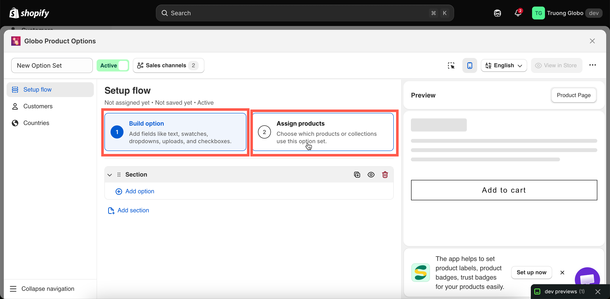
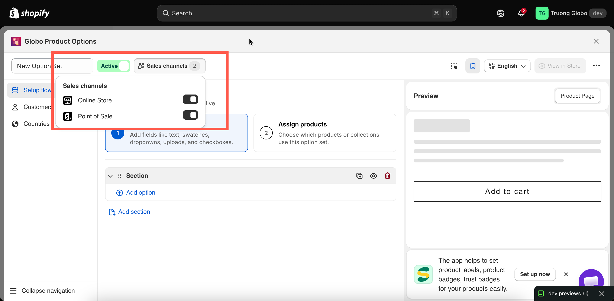
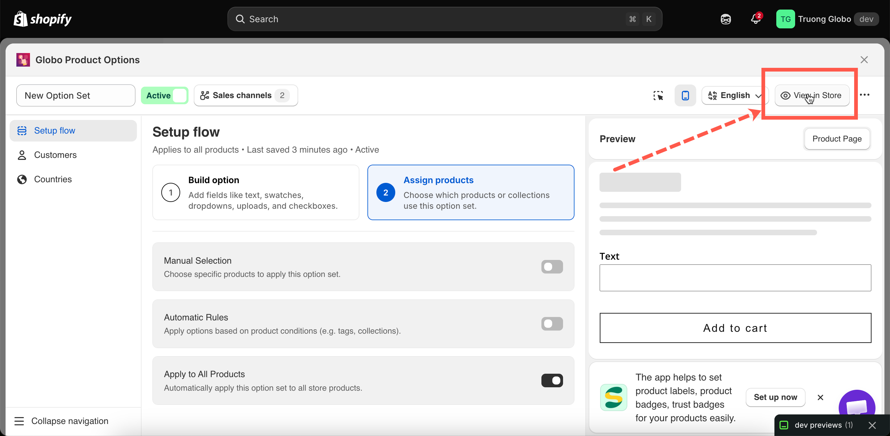

# Create an option set

**Before you start:** Make sure the app is installed and you’ve chosen a plan ([Install the app](../getting-started/install-the-app.md)). If you’re not sure which options to offer your customers yet, browse [Option types](../option-types/) or start with a [template](../templates/).

## Steps



### Create from scratch

Go to **Option Sets** > **Create option set** > **Create from scratch**.

The other option, **Use a template**, creates a copy of a complete option set that you can then edit — see [Templates](../templates/).

The builder opens on **Setup flow**, which has exactly two steps. These are the two things every option set needs:

1. **Build option** — the fields and choices you want to show customers.
2. **Assign products** — the products you want those options to apply to.

<figure><figcaption>
Setup flow reduces the required work to two steps.
</figcaption></figure>



### Add your options

Select **Add option** inside the section and choose an option type. The picker has two tabs:

* **Option Types** — the 32 individual option types.
* **Option Templates** — ready-made groups of options you can insert and customize.

<figure><figcaption></figcaption></figure>

For each option, set at least these three fields:

<table><thead><tr><th width="200">Field</th><th>Notes</th></tr></thead><tbody><tr><td><strong>Label</strong></td><td>The text shoppers see. No restrictions</td></tr><tr><td><strong>Name</strong></td><td>The name is stored with the cart item and order. Must be unique within the option set and cannot contain <code>.</code> , <code>:</code> , <code>"</code> , <code>'</code> , <code>\</code> , or <code>|</code> — see <a href="../option-types/shared-settings/labels-and-visibility.md">Label and Name</a></td></tr><tr><td><strong>Required field</strong></td><td>Whether customers must complete the option before adding the product to the cart.</td></tr></tbody></table>

Selection-style options also need their values — see [Working with option values](option-values.md). For reordering, duplicating, and grouping options, see [Build your options](build-options.md).



### Assign it to products

Switch to **Assign products** and turn on one of three methods:

<table><thead><tr><th width="220">Method</th><th>Best for</th></tr></thead><tbody><tr><td><strong>Manual Selection</strong></td><td>A fixed and small product list that you pick by hand</td></tr><tr><td><strong>Automatic Rules</strong></td><td>Anything matching a tag, type, vendor, price, or collection. Keeps working as your catalogue grows</td></tr><tr><td><strong>All Products</strong></td><td>Store-wide options such as a delivery note</td></tr></tbody></table>

Read here for full details: [Assign to products](assign-to-products.md).



### Optionally narrow by customer or country

Two additional tabs on the left rail are optional and available only on certain plans:

* **Customers** — limit the option set to specific customers.
* **Countries** — include or exclude specific countries.

Skip these tabs if you want the option set to be available to everyone, everywhere.

See [Assign to customers](assign-to-customers.md) and [Assign to countries](assign-to-countries.md).



### Check the preview, then Save

The live preview on the right renders the real widget, runs your conditional logic, and previews add-on prices. See [Live preview and inspector](live-preview-and-inspector.md).

Then select **Save** in the top-right.


You can save an option set only when it has **at least one option** and a **complete product rule**. If something is missing, the builder takes you to the relevant step and explains what needs to be completed.




### Publish the option set

Set the status to **Active** using the control beside the option set’s name, then check **Sales channels**:

<table><thead><tr><th width="200">Channel</th><th>What it covers</th></tr></thead><tbody><tr><td><strong>Online Store</strong></td><td>Your storefront: product pages, quickview popups, and featured-product sections</td></tr><tr><td><strong>Point of Sale</strong></td><td>Orders you take in person through the Shopify POS app</td></tr></tbody></table>

Both are on by default. Turn one off to say "these options are for in-store orders only", or the reverse.

<figure><figcaption>
Status and Sales channels sit next to the option set's name.
</figcaption></figure>


Selecting **Point of Sale** is not enough on its own. Some option types and one add-on mode are not supported on POS. See [POS limitations](../pos/limitations.md).




### View it on your storefront

Select **View in Store** in the builder header to open a product that this option set applies to. If the option set is **Active** and the [app embed](../getting-started/enable-the-app-embed.md) is enabled, your options will appear on the product page.

<figure><figcaption></figcaption></figure>




What Save stores, and what lives elsewhere

<table><thead><tr><th width="240">Saved with the option set</th><th>Store-wide, saved elsewhere</th></tr></thead><tbody><tr><td>Options and all their settings</td><td>Colours, borders, typography — <strong>Settings > Design</strong></td></tr><tr><td>Option values, prices, and images</td><td>Widget position — <strong>Settings > General</strong></td></tr><tr><td>Conditional logic rules</td><td>Widget text and validation messages — <strong>Settings > Translations</strong></td></tr><tr><td>Product, customer, and country rules</td><td>Automations — <strong>Automations</strong></td></tr><tr><td>Status and sales channels</td><td></td></tr><tr><td>The Personalizer background for this set</td><td></td></tr></tbody></table>

This is why copying an option set to another store does not copy its look. See [Import and export](import-and-export.md).

