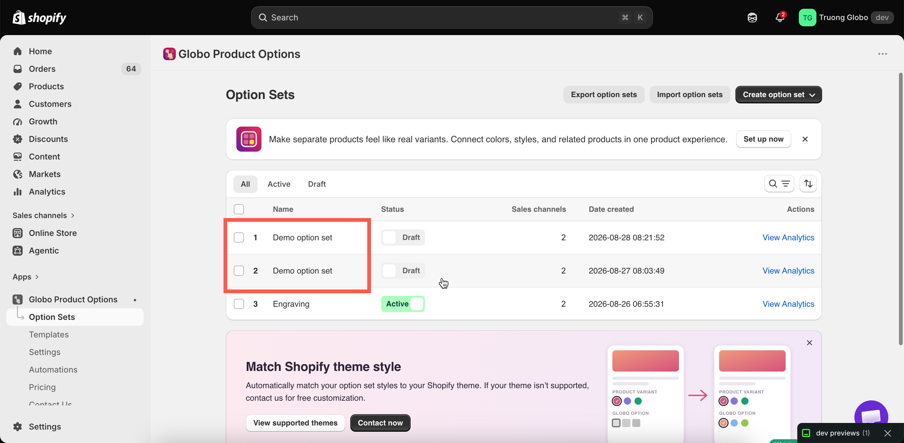

# Duplicate and delete

Both actions are available as bulk actions on the **Option Sets** list. Select the option sets you want to manage, then choose the appropriate action.

## Duplicate

Duplicating is a quick way to create a variation — for example, a version for a different customer group or country, or a copy to use before making major changes.


**A duplicate is a complete copy of the original, including its name, status, sales channels, and product rules.**

For example, if you duplicate an **Active** option set that applies to all products, the duplicate will also be **Active** and apply to all products. Both sets will have the same name, so shoppers may see the options twice until you update the duplicate.

After duplicating, we recommend doing these two things immediately:

1. **Rename the duplicate** so you can identify it easily.
2. Either **change its targeting** or **set it to Draft** until you are ready to use it.


<figure><figcaption>
A duplicate keeps the original's name and status — rename it straight away.
</figcaption></figure>

Everything else is copied too, including all options and their settings, values, prices, images, help text, conditional logic, all three targeting rules, and the Personalizer background.

One thing is **not** copied: **add-on products are shared**. If a value in the original option set is linked to a generated add-on product, the duplicate uses the same product. Both option sets will sell from the same product inventory.

This is usually what you want. If you need separate inventory, reconfigure the add-on product in the duplicate. See [Add-on pricing](../add-on-pricing/).


If you reuse the same structure regularly, consider saving it as a [custom template](../templates/custom-templates.md). Templates are designed for reuse and keep your option set list easier to manage.


Pattern: the same options, different for some shoppers

This is what duplicating is really for — wholesale pricing, market-specific wording, a members-only version.

1. **Duplicate the set that already works.**
2. **Set the copy to Draft**, so it cannot reach shoppers while you edit.
3. **Change what differs** — prices, wording, extra or fewer options.
4. **Split the audiences so they cannot overlap.** On the **Customers** tab give the copy `Customer tags — is equal to — wholesale`, and give the original the opposite, `Customer tags — is not equal to — wholesale`. **Skip this and both sets render for the same shopper.**
5. **Activate the copy.** Both are live, but only one applies to any given shopper.

The same pattern works with the **Countries** tab for market variations. See [Assign to customers](assign-to-customers.md) and [Assign to countries](assign-to-countries.md).

## Delete


Deleting an option set is **permanent**. There is no trash, undo, or recovery. All options, values, prices, conditional logic, and targeting rules are permanently deleted.


### Use Draft instead - in most cases

For most situations where you might consider deleting an option set, **Set as draft** is the better choice:

<table><thead><tr><th width="331.86328125">Draft</th><th>Delete</th></tr></thead><tbody><tr><td>Stops the option set from rendering immediately</td><td>Permanently removes the option set</td></tr><tr><td>Keeps all your settings and work</td><td>Removes all settings and work</td></tr><tr><td>Can be reversed at any time</td><td>Cannot be undone</td></tr><tr><td>Keeps the option set in your list</td><td>Removes it from your list</td></tr></tbody></table>

If you're unsure whether you'll need an option set again, set it to **Draft** rather than deleting it. You can always delete it later if you no longer need it.

### If you are deleting anyway

Before deleting an option set, there are three things to check:

1. **Export the option set.** Select the set and use **Export option sets** to create a backup that you can re-import later. See [Import and export](import-and-export.md).
2. **Review its add-on products.** Products generated by the app are **not** deleted when you delete the option set. They remain in your Shopify catalogue, so delete or archive them in Shopify admin if you no longer need them.
3. **Check your automations.** A workflow using dynamic order-tag mode can reference a specific option in a specific option set. Deleting that set will break the workflow. See [Update order tags](../automations/update-order-tags.md).

When you're ready, select the option sets you want to delete, choose **Delete option sets** from the bulk action menu, and confirm.

### What deleting does not touch

Deleting an option set does not affect:

* Orders that have already been placed. Option details on past orders are stored as part of the order record.
* Add-on products, as described above.
* Templates you saved from the option set.
* Store-wide settings, colours, and translations.
