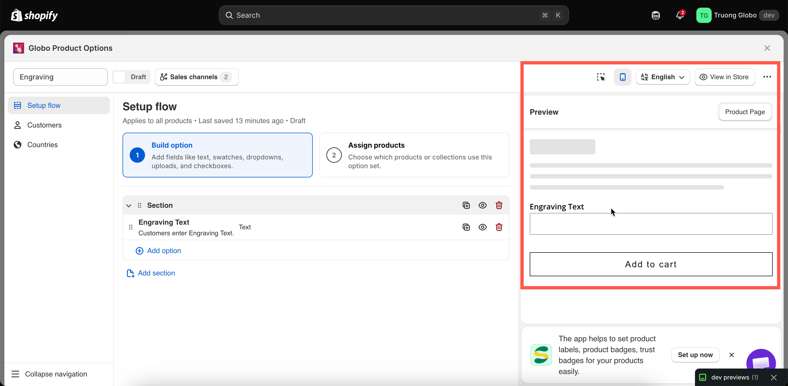
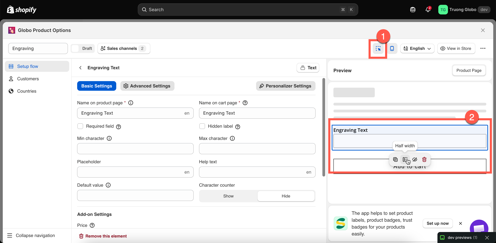
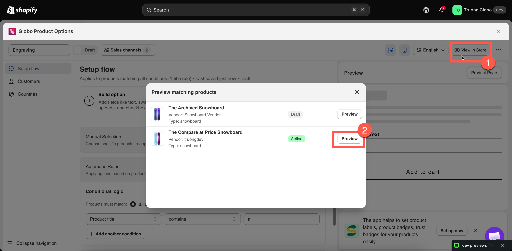

# Live preview and inspector

The preview on the right is a working version of your widget, not just a static mockup. It runs your conditional logic, updates add-on prices, and displays each option type as it will appear on your storefront.

Using the live preview makes it easier to test your option form and fine-tune its settings without constantly switching between the builder and your storefront.

## Before you start

Make sure you have an option set open in the builder with at least one option added.

## What the preview does

<table><thead><tr><th width="270">It does</th><th>It does not</th></tr></thead><tbody><tr><td>Render every option type as shoppers see it</td><td>Use your theme's fonts, colours, or spacing — it uses the app's own styling</td></tr><tr><td>Run conditional logic, so you can test show and hide rules</td><td>Add anything to a real cart</td></tr><tr><td>Show add-on price previews and the running total</td><td>Charge anything</td></tr><tr><td>Run validation, so you can see your error messages</td><td>Apply your customer or country rules</td></tr><tr><td>Draw the Personalizer live preview on the background image</td><td>Show other option sets that also apply to a product</td></tr></tbody></table>


Because the preview does not use your theme's styling, differences in font and colour between the preview and your storefront are expected. To align the widget with your theme on the storefront, see [Match your theme style](../storefront/match-your-theme-style.md).


## The four header controls

<table><thead><tr><th width="230">Control</th><th>What it does</th></tr></thead><tbody><tr><td>Editor / preview toggle</td><td>On narrow screens, switches between the settings panel and the preview. On wide screens both are visible at once.</td></tr><tr><td>Desktop / mobile toggle</td><td>Renders the preview at desktop or mobile width. Worth checking both — column widths and swatch sliders behave differently.</td></tr><tr><td>Inspector toggle</td><td>Turns the click-to-edit overlay on and off. See below.</td></tr><tr><td>Language switcher</td><td>Renders the preview in one of your storefront languages, using your translated labels and values.</td></tr></tbody></table>

<figure><figcaption>
The header controls change what the preview shows, not what shoppers get.
</figcaption></figure>

## The inspector

Turn on the inspector to make the preview interactive. Hover over an option to highlight it, then click it to open its settings in the panel. This lets you quickly go from spotting an issue in the preview to editing the corresponding option.

The inspector also displays a small action bar on the highlighted option:

<table><thead><tr><th width="200">Action</th><th>What it does</th></tr></thead><tbody><tr><td><strong>Duplicate</strong></td><td>Copies the option, exactly like the panel's duplicate action.</td></tr><tr><td><strong>Half width</strong></td><td>Sets the option's <strong>Column width</strong> to 50%.</td></tr><tr><td><strong>Full width</strong></td><td>Sets the option's <strong>Column width</strong> to 100%.</td></tr><tr><td><strong>Hide</strong></td><td>Hides the option from the storefront while keeping it in the set.</td></tr><tr><td><strong>Delete</strong></td><td>Removes the option.</td></tr></tbody></table>

Half width and full width are the most commonly used column widths, so they are available directly in the inspector. For more control, you can choose from the full range of widths — 25%, 33%, 50%, 66%, 75%, and 100% — in the option's **Advanced Settings.** See [Column width](../option-types/shared-settings/direction-width-and-css.md#column-width).

<figure><figcaption>
With the inspector on, the preview becomes a second way to edit.
</figcaption></figure>

## Testing conditional logic in the preview

This is one of the preview's most useful features. Conditional rules are evaluated live, so you can:

* Select the trigger option and see the dependent option appear.
* Deselect it and confirm that the dependent option disappears.
* Change a dropdown value and check which conditional branch is displayed.

There are two types of conditions the preview cannot test because it does not have real shopper context:

* **Conditions based on Shopify variants** — the preview does not have a selected variant, so variant-based conditions are not evaluated. Test these on a real product page using **View in Store**. See [Conditions based on Shopify variants](../conditional-logic/conditions-on-shopify-variants.md).
* **Customer and country rules** — these determine whether the entire option set is displayed and are evaluated only on the storefront.

## Preview matching products

When your product rule uses **Automatic Rules**, you can check which products currently match your conditions before saving the rule.

Open **Preview matching products** to see a list of matching products, including each product's image, title, vendor, type, and status. Click **Preview** on any product to open its storefront page.


This preview is not available when your automatic conditions include a **Collection** condition. The app displays a notice when this is the case. To verify collection-based rules, open a product from the collection and click **View in Store** instead.


<figure><figcaption>
Check an automatic rule against your real catalogue before saving.
</figcaption></figure>

## View in Store

**View in Store** in the builder header opens a real product page on your storefront where the option set is applied.

This is the most accurate way to test your option set. Use it to check:

* the widget's position within your theme
* how it looks with your theme's fonts and colours
* variant-based conditional logic
* the actual add-to-cart flow and what is added to the cart

For **View in Store** to work, the option set must be **Active**, published to the **Online Store**, and the [app embed](../getting-started/enable-the-app-embed.md) must be enabled.

## When the preview switches itself off

The live preview is disabled for very large option sets. The app counts each option, with each value in a selection option counted separately, and stops rendering the preview when the total reaches around 100.

This is intentional. Rendering hundreds of swatches on every keystroke would slow down the builder and make it difficult to use. Your option set will still save and work normally on the storefront — only the in-app preview is disabled.

If this happens, either split the option set into two smaller sets or test it using **View in Store**.
