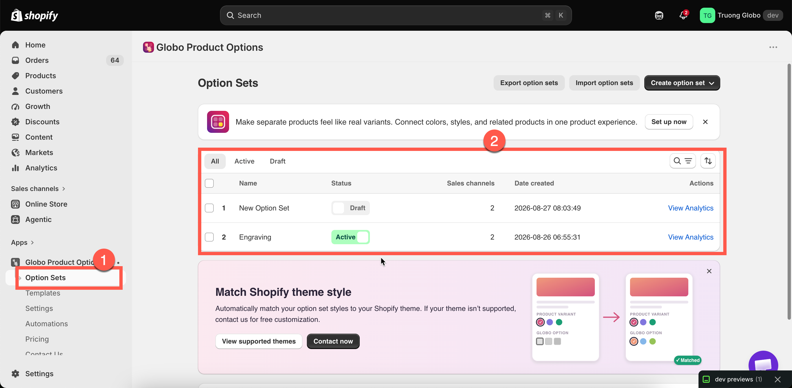
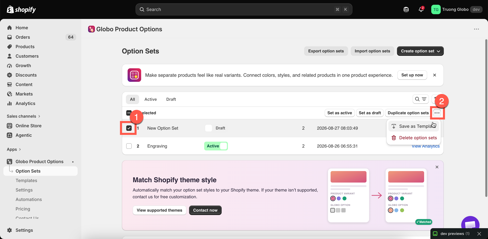

# Manage option sets

**Option Sets** is the central list of all the option sets you have created. As your list grows, you can use this page to quickly find and manage your option sets.

## What each row shows

<table><thead><tr><th width="180">Column</th><th>What it tells you</th></tr></thead><tbody><tr><td>ID</td><td>The option set's internal ID, which can be useful when contacting support.</td></tr><tr><td><strong>Name</strong></td><td>The name of the option set. Select it to open the builder.</td></tr><tr><td><strong>Status</strong></td><td><strong>Active</strong> or <strong>Draft</strong>. You can change the status directly from the list.</td></tr><tr><td><strong>Sales channels</strong></td><td>The sales channels where the option set is published. You can edit them directly from the list.</td></tr><tr><td><strong>Date created</strong></td><td>The date the option set was created.</td></tr><tr><td><strong>Actions</strong></td><td>Available actions for the option set, including <strong>View Analytics</strong>.</td></tr></tbody></table>

<figure><figcaption>
The Option Sets list, with filters, search, and bulk actions.
</figcaption></figure>

## Finding an option set

Use the tools in the **Option Sets** list to quickly find the option set you need.

<table><thead><tr><th width="200">Tool</th><th>How it works</th></tr></thead><tbody><tr><td>Search</td><td>Type in the search field to find option sets by name.</td></tr><tr><td>Status tabs</td><td>Filter by <strong>All</strong>, <strong>Active</strong>, or <strong>Draft</strong>. This is a quick way to find option sets that have not been activated yet.</td></tr><tr><td>Sort</td><td>Sort by <strong>Option set name</strong> (A–Z or Z–A) or <strong>Created</strong> (oldest or newest first).</td></tr><tr><td>Pagination</td><td>The list is divided into pages. Use the controls at the bottom to move between pages.</td></tr></tbody></table>

Your search, filter, and sort settings are preserved in the page URL. If you open an option set and then return to the list, you'll come back to the same view.

## Creating from this page

Click **Create option set** to choose between two options:

* **Create from scratch** — creates a new, empty option set. See [Create an option set](create-an-option-set.md).
* **Use a template** — opens **Templates**, where you can copy a ready-made option set. See [Templates](../templates/).

If your plan limits the number of option sets you can create and you have reached that limit, **Create from scratch** is disabled and an upgrade prompt is displayed.

## Bulk actions

Tick one or more rows and a bulk action bar appears.

<table><thead><tr><th width="230">Action</th><th>What it does</th></tr></thead><tbody><tr><td><strong>Set as active</strong></td><td>Publishes the selected option sets. You'll be asked to confirm, with a reminder that they will become available on their selected sales channels and products.</td></tr><tr><td><strong>Set as draft</strong></td><td>Removes the selected option sets from all sales channels. You'll be asked to confirm before this action is applied.</td></tr><tr><td><strong>Duplicate option sets</strong></td><td>Copies each selected set. See <a href="duplicate-and-delete.md">Duplicate and delete</a>.</td></tr><tr><td><strong>Save as Template</strong></td><td>Saves the selected option sets as reusable templates. See <a href="../templates/custom-templates.md">Custom templates</a>.</td></tr><tr><td><strong>Delete option sets</strong></td><td>Permanently removes the selected option sets. You'll be asked to confirm first, and this action cannot be undone.</td></tr></tbody></table>


**Delete option sets** cannot be undone. If you may need an option set later, use **Set as draft** instead. This hides the option set while keeping all of its settings intact.

For extra safety, export your option sets before deleting them. See [Import and export](import-and-export.md).


<figure><figcaption>
Bulk actions save opening each option set to change one thing.
</figcaption></figure>

## Changing status and channels without opening a set

Two settings can be edited directly from the row, so you don't need to open the builder:

* **Status** — switch an option set between **Active** and **Draft** directly from the list.
* **Sales channels** — open the row's channel settings, select or deselect **Online Store** or **Point of Sale**, then save your changes.

Unlike changes made in the builder, these updates are saved immediately.


To temporarily remove an option set from your storefront, set its status to **Draft**. All settings are preserved, and switching it back to **Active** restores the option set as it was. See [Create an option set](create-an-option-set.md) for details about each status and sales channel.


## Import and export

The page's secondary actions are **Export option sets** and **Import option sets**.

When exporting, you can choose what to include: the current page, all option sets, or only the option sets you select. Import accepts supported files, including files exported from other product options apps.

Both features are available only on certain plans. For details, see [Import and export](import-and-export.md).

## View Analytics

Each row's **Actions** menu includes **View Analytics**, which opens the revenue and usage report for that option set.

This feature requires a plan that includes advanced analytics. On plans without access, the action displays an upgrade prompt. See [Option set analytics](analytics.md).

## Keeping the list readable

Once you have more than a few option sets, these practices can make the list easier to manage:

* **Name option sets by product family, not by their contents.** `Engravable jewellery` is more useful than `Text + checkbox`.
* **Delete or draft test sets.** A list full of `Test`, `Test 2`, and `Copy of Test` makes it harder to identify which option sets are currently live.
* **Filter by Active when troubleshooting.** If an option appears twice on a product page, check whether multiple active option sets are applying to the same product. Filtering by **Active** makes them easier to identify.
* **Use Draft instead of deleting.** Draft option sets are hidden without losing their settings.
* **Export before making major changes.** Keep an exported file as a backup in case you need to restore your previous setup.
