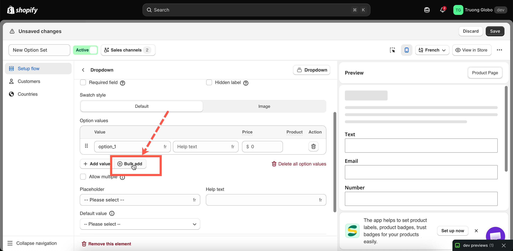
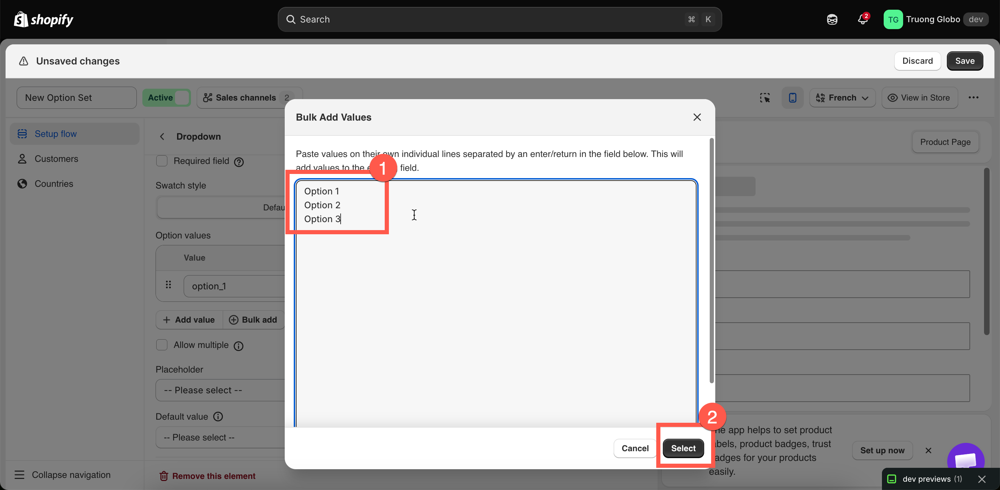
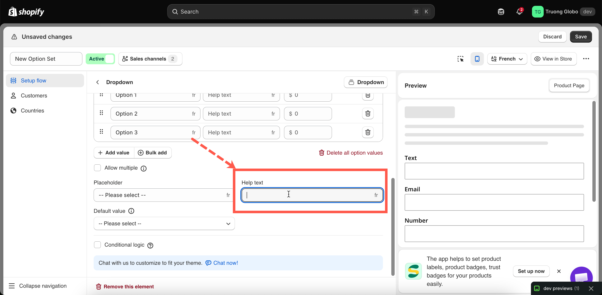

# Working with option values

Selection-style options — such as dropdowns, radio buttons, checkboxes, buttons, and swatches — use lists of choices. Each entry in the list is an **option value**. This page covers the rules and actions that apply to option values across all selection-style options.

Input-style options, such as **Text** or **Number**, do not have option values because customers enter a value instead of choosing one.

## The three rules for a value


**A value cannot be empty.**

**Values must be unique within the option.** The uniqueness check ignores capitalization and leading or trailing spaces, so `Red` and `red` are treated as the same value.

**A value cannot contain any of these characters:** `,` `:` `"` `'` `|`


These characters are restricted because option values are stored in the order record alongside other data, where they are used as separators.

The exception is **Product links**, where values are products you select rather than text you enter. The uniqueness check does not apply to product links.

## Adding values

### One at a time

Select **Add value** to add a new empty row. Enter the value, then set a price or image if needed.

### Many at once

Select **Bulk add**, then paste your list into the box with **one value per line.**

<figure><figcaption></figcaption></figure>

Bulk add validates the entire list before accepting it:

* Blank lines are ignored, and leading and trailing spaces are trimmed.
* If any line contains a blocked character, the entire paste is rejected and the reason is shown.
* If any line duplicates another line **or an existing value in the table**, the entire paste is rejected.

<figure><figcaption>
Bulk add takes one value per line and appends them to the existing list.
</figcaption></figure>

## Help text on a value

Each value can have its own short explanation, shown next to that choice rather than below the entire option.&#x20;

This is useful for explaining what a choice means or how it affects processing time — for example, `Adds 3 working days`.

Most selection types support help text for individual values. **Select**, **Product links**, and **Tabs** support help text at the option level only.

<figure><figcaption></figcaption></figure>

## Pricing a value

Select the **Price** cell to open the add-on dialog. It offers three modes:

<table><thead><tr><th width="270">Mode</th><th>Use it when</th></tr></thead><tbody><tr><td><strong>Use existing product</strong></td><td>You already sell the item as a product. The app uses the price and stock from a variant of an existing product.</td></tr><tr><td><strong>Automatically generate product</strong></td><td>You want stock tracking without creating the product manually. The app creates a product automatically at the price you specify, allowing the add-on to have its own stock tracking.</td></tr><tr><td><strong>Add price</strong></td><td>You only need to charge an additional amount. No stock is tracked. Not supported on Shopify POS.</td></tr></tbody></table>

Values without a price are free.

See [Add-on pricing](../add-on-pricing/) for an in-depth guide to all three modes, and [Advanced add-on modes](../add-on-pricing/advanced-add-on-modes.md) for how charges can scale with quantity.

## Colours and images on a value

Swatch-style options can have a **Color** or **Image** column, depending on the option’s **Swatch style** setting:

* **Color** — choose one color or two colors for a split swatch.
* **Image** — upload an image or reuse one of the product’s existing images.

See [Swatch style](../option-types/shared-settings/swatch-style-and-previews.md#swatch-style), [Color swatch](../option-types/selection-types/color-swatch.md), and [Image swatch](../option-types/selection-types/image-swatch.md).

## Translating values

If your storefront supports multiple languages, you can translate values for each language using the language switcher in the builder.

The option’s **Name** is not translated, so your order records remain consistent across languages.

See [Translate option content](../translations/translate-option-content.md).
