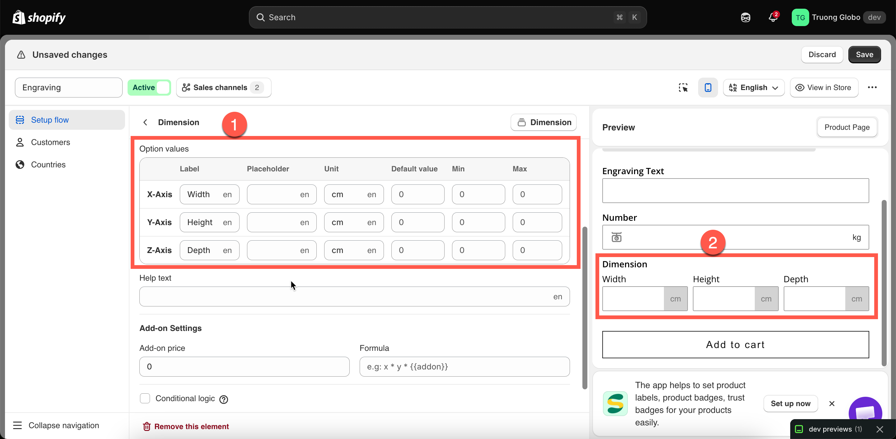
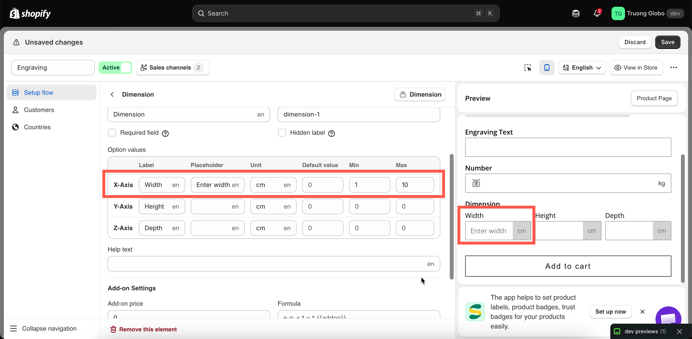

# Dimension

A single option that collects several measurements: width, height, and optionally depth. Each measurement has its own label, unit, and limits. Dimension is the only option type with a **Formula**, which calculates the add-on price from the values the customer enters.

Use it for made-to-measure products such as blinds, canvases, worktops, glass, framed prints, and cut fabric.


Dimensions are not supported in the Shopify POS app, and the app displays a notice when you add it. For in-person orders, use multiple [Number](number.md) fields to collect measurements instead. See [POS limitations](../../pos/limitations.md).


## What customers see

Two or three numeric fields on one row, each with its own label and unit.

<figure><figcaption>
All the measurements sit in one option, so the row reads as a single question.
</figcaption></figure>

## Basic Settings

<table><thead><tr><th width="250">Setting</th><th>What it does</th></tr></thead><tbody><tr><td><a href="../shared-settings/labels-and-visibility.md#label">Label</a> / <a href="../shared-settings/labels-and-visibility.md#name">Name</a></td><td>Customer-facing text, and the name on the order.</td></tr><tr><td><a href="../shared-settings/required-and-default-value.md#required-field">Required field</a></td><td>Blocks add to cart until every axis has a value.</td></tr><tr><td><a href="../shared-settings/labels-and-visibility.md#hidden-label">Hidden label</a></td><td>Hides the label.</td></tr><tr><td><strong>Option values</strong></td><td>The axis rows themselves. See below.</td></tr><tr><td><a href="../shared-settings/placeholder-and-help-text.md#help-text">Help text</a></td><td>Guidance that stays visible — the right place for your minimum and maximum sizes.</td></tr><tr><td><strong>Add-on price</strong></td><td>The base amount the formula works from.</td></tr><tr><td><strong>Formula</strong></td><td>How the measurements turn into a charge. See below.</td></tr><tr><td><a href="../shared-settings/conditional-logic-and-add-on-fields.md#conditional-logic">Conditional logic</a></td><td>Show or hide based on other choices.</td></tr></tbody></table>

### The axis rows

A Dimension option starts with three rows, tagged **X-Axis**, **Y-Axis**, and **Z-Axis**. They correspond to **Width**, **Height**, and **Depth**. Each row has its own settings:

<table><thead><tr><th width="200">Column</th><th>What it is</th></tr></thead><tbody><tr><td><strong>Label</strong></td><td>What the customer reads above that field — <code>Width</code>, <code>Drop</code>, <code>Diameter</code>.</td></tr><tr><td><strong>Placeholder</strong></td><td>Example text inside the empty field.</td></tr><tr><td><strong>Unit</strong></td><td>The unit shown with the field — <code>cm</code>, <code>m</code>, <code>inch</code>.</td></tr><tr><td><strong>Default value</strong></td><td>A starting figure.</td></tr><tr><td><strong>Min</strong> / <strong>Max</strong></td><td>The smallest and largest you can produce on that axis.</td></tr></tbody></table>

Delete the third row if your product needs only two measurements. Set **Min** and **Max** on every row you keep, so customers cannot order a size you cannot produce.

Each axis can use a different unit. For example, `Width` can use centimeters while `Quantity of panels` uses a plain count.

<figure><figcaption>
Each axis is a row with its own label, unit, and limits.
</figcaption></figure>

## Add-on price and Formula

Instead of a flat charge, the price is calculated from the measurements the customer enters.

<table><thead><tr><th width="230">Field</th><th>What it holds</th></tr></thead><tbody><tr><td><strong>Add-on price</strong></td><td>A number the formula can refer to as <code>{{addon}}</code> — typically your rate per unit of area or length.</td></tr><tr><td><strong>Formula</strong></td><td>An expression using <code>x</code>, <code>y</code>, <code>z</code> for the three axes and <code>{{addon}}</code> for the price above.</td></tr></tbody></table>

The placeholder in the field shows the expected format: `x * y * {{addon}}`.

<table><thead><tr><th width="230">Formula</th><th>Means</th><th>Example</th></tr></thead><tbody><tr><td><code>x * y * {{addon}}</code></td><td>Price by area</td><td>60 × 90 at a rate of 0.01 → $54.00</td></tr><tr><td><code>x * {{addon}}</code></td><td>Price by width alone</td><td>200 at a rate of 0.5 → $100.00</td></tr><tr><td><code>(x + y) * 2 * {{addon}}</code></td><td>Price by perimeter, for framing</td><td>60 and 90 at 0.2 → $120.00</td></tr><tr><td><code>x * y * z * {{addon}}</code></td><td>Price by volume</td><td>For boxes and packing</td></tr></tbody></table>


**A formula cannot contain subtraction.** A `-` is rejected with the message "Formula cannot contain subtraction." Use multiplication, addition, and division instead.


Set your rate in **Add-on price** and keep the formula simple. Then test it by entering the smallest and largest sizes you allow, and check that both prices are correct.

Full detail and more worked examples: [Dimension add-on formula](../../add-on-pricing/dimension-formula.md).

## Advanced Settings

<table><thead><tr><th width="250">Setting</th><th>What it does</th></tr></thead><tbody><tr><td><a href="../shared-settings/placeholder-and-help-text.md#help-text-position">Help text position</a></td><td>Where the help text sits.</td></tr><tr><td><a href="../shared-settings/direction-width-and-css.md#html-class">HTML class</a> / <a href="../shared-settings/direction-width-and-css.md#column-width">Column width</a></td><td>Styling hook and field width.</td></tr></tbody></table>

Dimension has no prefix or suffix settings, because each axis has its own **Unit**.

## Personalizer Settings

Not supported.

## Examples

**A made-to-measure blind priced by area**

<table><thead><tr><th width="290">Setting</th><th>Value</th></tr></thead><tbody><tr><td>Label / Name</td><td><code>Blind size</code></td></tr><tr><td>X-Axis</td><td>Label <code>Width</code>, unit <code>cm</code>, min <code>30</code>, max <code>240</code></td></tr><tr><td>Y-Axis</td><td>Label <code>Drop</code>, unit <code>cm</code>, min <code>30</code>, max <code>250</code></td></tr><tr><td>Z-Axis</td><td>Deleted</td></tr><tr><td>Add-on price</td><td><code>0.012</code></td></tr><tr><td>Formula</td><td><code>x * y * {{addon}}</code></td></tr><tr><td>Required field</td><td>On</td></tr><tr><td>Help text</td><td><code>Measure the recess, not the window. Widths from 30 to 240 cm.</code></td></tr></tbody></table>

**A canvas print priced by area**

Width and height in centimeters, **Min** `20` and **Max** `150` on each, formula `x * y * {{addon}}`.

**A frame priced by perimeter**

Width and height in centimeters, formula `(x + y) * 2 * {{addon}}`, because the cost of a frame follows the length of the molding.

**Cut-to-length fabric**

Delete two of the three rows. Label the remaining axis `Length`, set the unit to `m`, and use the formula `x * {{addon}}`.

## Notes

* Available on the Advanced plan.
* **Not supported on Shopify POS.**
* No Personalizer support.
* Up to three axes. For more measurements, add a second Dimension option or use [Number](number.md) fields.
* The formula cannot contain subtraction.
* Each measurement is stored in the order as its own value with the axis label, for example `Width: 120`.
* Set **Min** and **Max** on every axis. Without them, a customer can order a size you cannot produce, and the formula still calculates a price for it.
