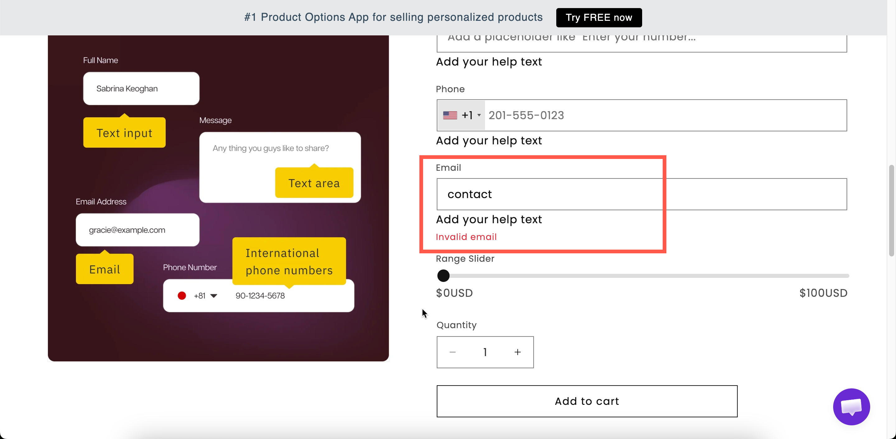

# Email

A field for an email address. The app checks the format before the customer can add the product to the cart.

Use it when you need an email address other than the buyer's own, such as a gift recipient, a second contact for a proof, or a colleague to copy in. Shopify already collects the buyer's email at checkout, so do not ask for it again.

## What customers see

A single-line field with your label above it. If the entry is not a valid address, adding to cart is blocked and the message `Invalid email` is displayed.

<figure><figcaption>
Format validation is built in — there is no setting to turn it on.
</figcaption></figure>

## Basic Settings

<table><thead><tr><th width="250">Setting</th><th>What it does</th></tr></thead><tbody><tr><td><a href="../shared-settings/labels-and-visibility.md#label">Label</a> / <a href="../shared-settings/labels-and-visibility.md#name">Name</a></td><td>Customer-facing text, and the name on the order.</td></tr><tr><td><a href="../shared-settings/required-and-default-value.md#required-field">Required field</a></td><td>Blocks add to cart until an address is entered.</td></tr><tr><td><a href="../shared-settings/labels-and-visibility.md#hidden-label">Hidden label</a></td><td>Hides the label.</td></tr><tr><td><a href="../shared-settings/placeholder-and-help-text.md#placeholder">Placeholder</a></td><td>An example address.</td></tr><tr><td><a href="../shared-settings/placeholder-and-help-text.md#help-text">Help text</a></td><td>Guidance that stays visible — the right place to explain what you will use the address for.</td></tr><tr><td><a href="../shared-settings/required-and-default-value.md#default-value">Default value</a></td><td>Pre-fills the field.</td></tr><tr><td><a href="../shared-settings/conditional-logic-and-add-on-fields.md#conditional-logic">Conditional logic</a></td><td>Show or hide based on other choices.</td></tr></tbody></table>

## Advanced Settings

<table><thead><tr><th width="250">Setting</th><th>What it does</th></tr></thead><tbody><tr><td><a href="../shared-settings/prefix-suffix-and-icons.md#suffix">Suffix</a></td><td>Fixed text after the field.</td></tr><tr><td><a href="../shared-settings/prefix-suffix-and-icons.md#prefix">Prefix</a> / <a href="../shared-settings/prefix-suffix-and-icons.md#prefix">Prefix icon</a> / <a href="../shared-settings/prefix-suffix-and-icons.md#prefix">Prefix text</a></td><td>An icon or text at the start — an envelope icon is the obvious choice.</td></tr><tr><td><a href="../shared-settings/placeholder-and-help-text.md#help-text-position">Help text position</a></td><td>Where the help text sits.</td></tr><tr><td><a href="../shared-settings/direction-width-and-css.md#html-class">HTML class</a> / <a href="../shared-settings/direction-width-and-css.md#column-width">Column width</a></td><td>Styling hook and field width.</td></tr></tbody></table>

## Validation

Format checking is always on and cannot be disabled. An invalid entry blocks **Add to cart** and displays `Invalid email`. You can change this message for each language under **Settings > Translations**. See [Translate widget text](../../translations/translate-widget-text.md).

The check applies to the format only. It confirms that the entry looks like an email address, but it cannot confirm that the mailbox exists.

## Add-on pricing

Email cannot carry an add-on price.

If you charge for the delivery itself, such as a digital gift card sent to a recipient, add the price to the [Switch](switch.md) or [Checkbox](../selection-types/checkbox.md) that enables the feature. Then display the email field with [conditional logic](../../conditional-logic/).

## Personalizer Settings

Not supported.

## Examples

**Gift recipient's email for a digital gift**

<table><thead><tr><th width="270">Setting</th><th>Value</th></tr></thead><tbody><tr><td>Label / Name</td><td><code>Recipient email</code></td></tr><tr><td>Required field</td><td>On</td></tr><tr><td>Placeholder</td><td><code>them@example.com</code></td></tr><tr><td>Help text</td><td><code>We will email the gift here on the date you choose.</code></td></tr><tr><td>Conditional logic</td><td>Show when <strong>Send as a gift</strong> is selected</td></tr></tbody></table>

**A second address for a proof**

**Required field** off, help text `Optional. We will copy this address on the artwork proof.`

**Notify me when the custom piece ships**

**Required field** off, an envelope prefix icon, and help text explaining that Shopify already emails the buyer and this address is for someone else.

## Notes

* Available on paid plans.
* Works in Shopify POS.
* Cannot carry an add-on price.
* No Personalizer support.
* Only one address per field. For several recipients, add several Email options. A [Textarea](textarea.md) also works, but its entries are not validated.


An email address is personal data. Collect it only when you need it, state the reason in help text, and make sure your privacy policy covers it. See [Permissions and data](../../reference/permissions-and-data.md).

