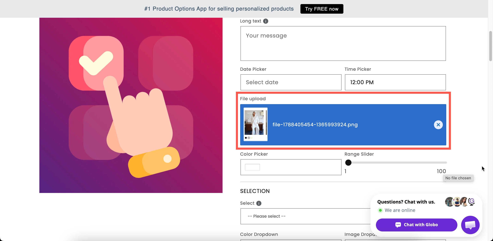

# File upload

A field the customer uses to attach files. Use it for print-on-demand products, photo gifts, and custom artwork.

## What customers see

An upload control with your label above it. After uploading, the file is listed as a thumbnail if it is an image, or as a link otherwise, depending on your store-wide **File preview** setting.

<figure><figcaption>
Uploaded images can preview as thumbnails, so the shopper can confirm they sent the right file.
</figcaption></figure>

## Basic Settings

<table><thead><tr><th width="250">Setting</th><th>What it does</th></tr></thead><tbody><tr><td><a href="../shared-settings/labels-and-visibility.md#label">Label</a> / <a href="../shared-settings/labels-and-visibility.md#name">Name</a></td><td>Customer-facing text, and the name on the order.</td></tr><tr><td><a href="../shared-settings/required-and-default-value.md#required-field">Required field</a></td><td>Blocks add to cart until at least one file is attached.</td></tr><tr><td><a href="../shared-settings/labels-and-visibility.md#hidden-label">Hidden label</a></td><td>Hides the label.</td></tr><tr><td><strong>Allow multiple (up to 20)</strong></td><td>Lets the customer attach more than one file. Off by default. Reveals the two file-count limits.</td></tr><tr><td><a href="../shared-settings/limits.md#min-and-max-number-of-files">Min number of files</a> / <a href="../shared-settings/limits.md#min-and-max-number-of-files">Max number of files</a></td><td>Between 1 and 20 each. Only shown once <strong>Allow multiple</strong> is on.</td></tr><tr><td><strong>Allowed extensions</strong></td><td>Which file types are accepted. Starts as <code>jpg</code>, <code>jpeg</code>, <code>png</code>.</td></tr><tr><td><a href="../shared-settings/placeholder-and-help-text.md#help-text">Help text</a></td><td>Guidance that stays visible — the right place for your quality requirements.</td></tr><tr><td><a href="../shared-settings/conditional-logic-and-add-on-fields.md#conditional-logic">Conditional logic</a></td><td>Show or hide based on other choices.</td></tr></tbody></table>

There is no placeholder, no default value, and **no add-on price** on this type.

### Allowed extensions

The picker groups the accepted extensions into nine categories, so you can allow a whole group at once:

<table><thead><tr><th width="250">Group</th><th>Contains</th></tr></thead><tbody><tr><td><strong>Image</strong></td><td>jpg, jpeg, png, gif, bmp, webp, tif, heic, dng</td></tr><tr><td><strong>Graphics</strong></td><td>svg, eps, ico, stl, 3mf and other design and 3D formats</td></tr><tr><td><strong>Document</strong></td><td>doc, docx, rtf, txt</td></tr><tr><td><strong>Spreadsheet</strong></td><td>Spreadsheet formats</td></tr><tr><td><strong>Presentation</strong></td><td>Presentation formats</td></tr><tr><td><strong>Audio</strong></td><td>mp3, wav, mpc</td></tr><tr><td><strong>Video</strong></td><td>mp4, mov and others</td></tr><tr><td><strong>Archive &#x26; Compressed</strong></td><td>zip, rar, 7z, bin</td></tr><tr><td><strong>Others</strong></td><td>Specialist formats, including machine and font files</td></tr></tbody></table>

A search field lets you find a single extension without opening its group.


Allow only file formats that you can actually use. For example, `heic` files may not be supported by some design tools, while `zip` files must be extracted before you can check their contents. Limiting the allowed formats reduces the number of files you need to request again.


## Advanced Settings

<table><thead><tr><th width="250">Setting</th><th>What it does</th></tr></thead><tbody><tr><td><strong>Enable image editor</strong></td><td>Lets customers adjust an image before it is uploaded — cropping, rotating, and similar. Off by default.</td></tr><tr><td><a href="../shared-settings/placeholder-and-help-text.md#help-text-position">Help text position</a></td><td>Where the help text sits.</td></tr><tr><td><a href="../shared-settings/direction-width-and-css.md#html-class">HTML class</a> / <a href="../shared-settings/direction-width-and-css.md#column-width">Column width</a></td><td>Styling hook and field width.</td></tr></tbody></table>

Enable the **Enable image editor** for printed products. It lets the customer crop the image to the correct shape before uploading, which reduces the number of unusable files you receive.

## Personalizer Settings

File upload is the only option type that draws an image supplied by the customer. The uploaded image is displayed on the product photo immediately.

Its personalizer settings are:

* **Image shape**: a preset shape to mask the image into, or a shape you upload
* **Background mode**: how the image fits the shape. The values are **Stretch**, **Cover**, **Contain**, **Full width**, and **Full height**
* **Width**, **Height**, **X-Axis**, **Y-Axis**, **Opacity**, **Rotation**
* **Clip area**: a region the image cannot be moved outside of
* **Allow customers to**: change position, resize, or rotate the image

Use these settings to let a customer upload a photo and see it on the product. See [Image layers](../../personalizer/layer-settings/image-layers.md) and [Customer controls](../../personalizer/layer-settings/customer-controls.md).

## Add-on pricing

File upload cannot carry a price.

To charge for an upload, such as an artwork setup fee, add the price to a [Switch](switch.md) or [Checkbox](../selection-types/checkbox.md), then display the upload field with [conditional logic](../../conditional-logic/).

## Store-wide settings that affect it

<table><thead><tr><th width="290">Setting</th><th>Where</th><th>Effect</th></tr></thead><tbody><tr><td><strong>File preview</strong></td><td>Settings > Settings > General > Product page</td><td><strong>Show image if the uploaded file is a photo, otherwise show link</strong>, or <strong>Show link</strong> for everything.</td></tr><tr><td>Maximum file size</td><td>Your plan</td><td>Each plan allows a different size per file. See <a href="../../plans/compare-plans.md">Compare plans</a>.</td></tr><tr><td><strong>Choose file</strong>, <strong>File uploading</strong>, <strong>Uploaded file:</strong> and similar wording</td><td>Settings > Translations</td><td>All editable per language.</td></tr></tbody></table>

## Examples

**One photo to print in a frame**

<table><thead><tr><th width="290">Setting</th><th>Value</th></tr></thead><tbody><tr><td>Label / Name</td><td><code>Your photo</code></td></tr><tr><td>Required field</td><td>On</td></tr><tr><td>Allow multiple</td><td>Off</td></tr><tr><td>Allowed extensions</td><td><code>jpg</code>, <code>jpeg</code>, <code>png</code></td></tr><tr><td>Enable image editor</td><td>On</td></tr><tr><td>Help text</td><td><code>JPG or PNG, at least 1500 × 1500 pixels for a sharp print.</code></td></tr><tr><td>Personalizer</td><td>On, masked into the frame shape, customer may reposition</td></tr></tbody></table>

**A four-photo collage**

**Allow multiple** on, **Min number of files** `4`, **Max number of files** `4`, image editor on.

**Print-ready artwork from a designer**

**Allowed extensions** set to document and graphics formats, including `pdf`, `svg`, and `eps`. **Required field** off, with help text stating your bleed and color requirements.

**Reference images for a repair quote**

**Allow multiple** on, **Min number of files** `2`, **Max number of files** `6`, with help text asking for one photo per angle.

## Notes

* Available on paid plans. Multiple file upload and the per-file size limit are separately plan-gated.
* Works in Shopify POS.
* Cannot carry an add-on price.
* Up to 20 files per option.
* Uploaded files are attached to the order, so your team can download them from the order in Shopify admin.
* Large files take time to upload on a slow connection. Limit the allowed extensions and state your requirements in help text.
