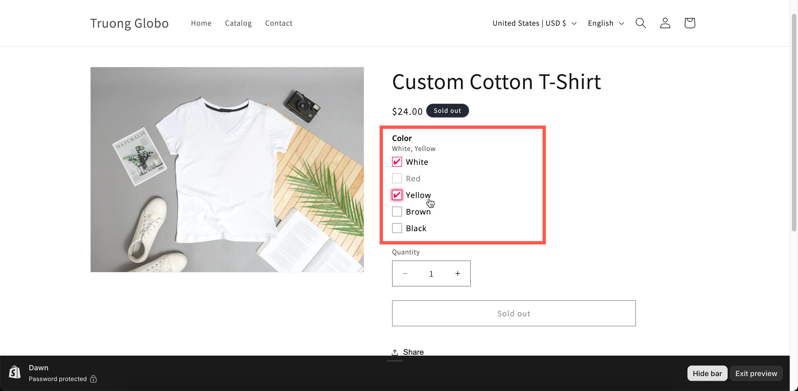

# Checkbox

A list where any number of values can be ticked. It is multi-select by nature, so there is no **Allow multiple** switch.

This is the type for a menu of extras: toppings, add-on services, accessories, upgrades. Each value can carry its own price, so the total adds up as the shopper ticks.

## What customers see

A list with a tick box beside each value. With **Swatch style** set, each value can also show a colour chip or a picture.

<figure><figcaption></figcaption></figure>

## Basic Settings

<table><thead><tr><th width="250">Setting</th><th>What it does</th></tr></thead><tbody><tr><td><a href="../shared-settings/labels-and-visibility.md#label">Label</a> / <a href="../shared-settings/labels-and-visibility.md#name">Name</a></td><td>Customer-facing text, and the name on the order.</td></tr><tr><td><a href="../shared-settings/required-and-default-value.md#required-field">Required field</a></td><td>At least one value must be ticked.</td></tr><tr><td><a href="../shared-settings/labels-and-visibility.md#hidden-label">Hidden label</a></td><td>Hides the label.</td></tr><tr><td><a href="../shared-settings/swatch-style-and-previews.md#swatch-style">Swatch style</a></td><td><strong>Default</strong>, <strong>Color</strong>, or <strong>Image</strong>.</td></tr><tr><td><strong>Option values</strong></td><td>The choices, with prices and their own help text. See <a href="../../option-sets/option-values.md">Working with option values</a>.</td></tr><tr><td><a href="../shared-settings/limits.md#min-and-max-selections">Min selections</a> / <a href="../shared-settings/limits.md#min-and-max-selections">Max selections</a></td><td>How many they must and may tick. Setting both the same means exactly that many.</td></tr><tr><td><a href="../shared-settings/placeholder-and-help-text.md#help-text">Help text</a></td><td>Guidance for the whole option.</td></tr><tr><td><a href="../shared-settings/required-and-default-value.md#default-value">Default value</a></td><td>Pre-ticks one or more values.</td></tr><tr><td><a href="../shared-settings/conditional-logic-and-add-on-fields.md#conditional-logic">Conditional logic</a></td><td>Show or hide based on other choices.</td></tr></tbody></table>


**Min selections** and **Max selections** appear straight away on a Checkbox, unlike the other multi-select types where they wait for **Allow multiple**. That is because a Checkbox is always multi-select.


## Advanced Settings

<table><thead><tr><th width="250">Setting</th><th>What it does</th></tr></thead><tbody><tr><td><a href="../shared-settings/conditional-logic-and-add-on-fields.md#advanced-settings">Advanced settings</a> / <a href="../shared-settings/conditional-logic-and-add-on-fields.md#set-quantity">Set quantity</a></td><td>How add-ons scale — including <strong>Mixed quantity</strong>.</td></tr><tr><td><a href="../shared-settings/collapsible-layouts-and-sliders.md#enable-custom-layout">Enable custom layout</a></td><td>Unlocks the collapsible layouts.</td></tr><tr><td><a href="../shared-settings/collapsible-layouts-and-sliders.md#layout-type">Layout type</a></td><td><strong>Expand</strong> or <strong>Collapse</strong>. No slider on this type.</td></tr><tr><td><a href="../shared-settings/collapsible-layouts-and-sliders.md#scroll-type">Scroll type</a>, <strong>Scroll height</strong>, <strong>Number of option values</strong></td><td>Give a long list its own scroll area.</td></tr><tr><td><a href="../shared-settings/direction-width-and-css.md#direction-style">Direction style</a></td><td><strong>Vertical</strong> or <strong>Horizontal</strong>.</td></tr><tr><td><a href="../shared-settings/out-of-stock-options.md">Out of stock options</a></td><td>How sold-out values look.</td></tr><tr><td><a href="../shared-settings/placeholder-and-help-text.md#help-text-position">Help text position</a></td><td>Where the option-level help text sits.</td></tr><tr><td><a href="../shared-settings/direction-width-and-css.md#html-class">HTML class</a> / <a href="../shared-settings/direction-width-and-css.md#column-width">Column width</a></td><td>Styling hook and field width.</td></tr></tbody></table>

## Add-on pricing on a multi-select

This is where Checkbox differs most from the single-select types: **every ticked value with a price is charged**. Three ticks at $4.00 each is $12.00.

That makes two settings especially important:

<table><thead><tr><th width="250">Setting</th><th>Why it matters here</th></tr></thead><tbody><tr><td><strong>Max selections</strong></td><td>Your ceiling on the total. Without it a shopper can tick everything.</td></tr><tr><td><strong>Advanced settings</strong></td><td><strong>Mixed quantity</strong> gives each value its own quantity box, so a shopper can take two of one topping and one of another. Available on multi-select types only.</td></tr></tbody></table>

<table><thead><tr><th width="290">Mode</th><th>Three values ticked at $4.00, order quantity 2</th></tr></thead><tbody><tr><td><strong>Default</strong></td><td>$24.00 — each extra follows the product quantity</td></tr><tr><td><strong>One time charge</strong></td><td>$12.00 — each extra charged once</td></tr><tr><td><strong>Mixed quantity</strong></td><td>Whatever the customer sets per value, multiplied as configured</td></tr></tbody></table>

See [Advanced add-on modes](../../add-on-pricing/advanced-add-on-modes.md).

## Personalizer Settings

Supported as an **image layer**: ticked values can each draw an image onto the product photo. Settings are image shape, background mode, size, position, rotation, clip area, and customer controls. See [Image layers](../../personalizer/layer-settings/image-layers.md).

Bear in mind that several ticks means several layers, which can overlap. Use the position settings to place them deliberately.

## Checkbox or Switch?

A [Switch](../input-types/switch.md) is one yes-or-no with the price on the option. A Checkbox is a list with the price on each value. Use a Switch for exactly one extra, a Checkbox from two upwards.

## Examples

**Pick any three toppings**

<table><thead><tr><th width="290">Setting</th><th>Value</th></tr></thead><tbody><tr><td>Label / Name</td><td><code>Toppings</code></td></tr><tr><td>Option values</td><td>Eight toppings, free</td></tr><tr><td>Min selections / Max selections</td><td><code>3</code> / <code>3</code></td></tr><tr><td>Help text</td><td><code>Choose exactly three.</code></td></tr></tbody></table>

**Paid extras, capped at two**

Values priced $4.00 each, **Max selections** `2`, **Advanced settings** **One time charge**.

**A required acknowledgement**

One value, `I confirm the spelling is correct`, **Required field** on, no price.

**Colour add-ons with stock**

**Swatch style** **Color**, each value linked to a generated add-on product, **Out of stock options** **Blur**.

**A long list, tidied away**

**Enable custom layout** on, **Layout type** **Collapse**, **Scroll type** **By number of option values** showing six.

## Notes

* Available on all plans.
* Works in Shopify POS.
* Always multi-select.
* **Required field** means at least one tick. For "exactly two", use min and max selections.
* No slider layout — use [Color swatch](color-swatch.md) or [Image swatch](image-swatch.md) for that.
* Every ticked value appears on the order, so a shopper ticking five values produces five entries.
