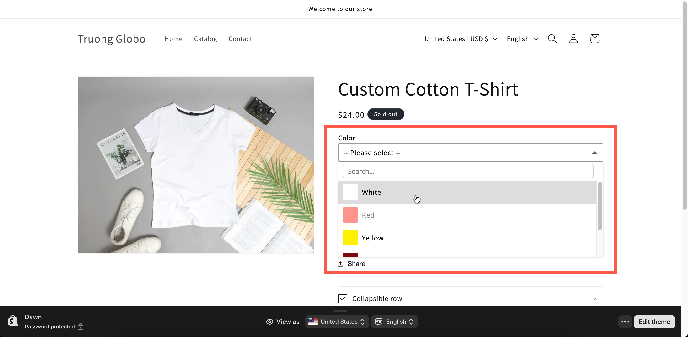

# Color dropdown

A [Dropdown](dropdown.md) where each entry has a color chip. Use it for a long color list. Forty colors take up most of the page as a swatch grid, but only one line as a dropdown.

## What customers see

A field showing the current color and its name. Opening it lists every color with a chip beside its name, and the list is searchable if you turn search on.

<figure><figcaption></figcaption></figure>

## Basic Settings

<table><thead><tr><th width="250">Setting</th><th>What it does</th></tr></thead><tbody><tr><td><a href="../shared-settings/labels-and-visibility.md#label">Label</a> / <a href="../shared-settings/labels-and-visibility.md#name">Name</a></td><td>Customer-facing text, and the name on the order.</td></tr><tr><td><a href="../shared-settings/required-and-default-value.md#required-field">Required field</a></td><td>Blocks add to cart until a color is chosen.</td></tr><tr><td><a href="../shared-settings/labels-and-visibility.md#hidden-label">Hidden label</a></td><td>Hides the label.</td></tr><tr><td><a href="../shared-settings/swatch-style-and-previews.md#swatch-style">Swatch style</a></td><td><strong>Color</strong> or <strong>Image</strong>. Starts on <strong>Color</strong>.</td></tr><tr><td><strong>Option values</strong></td><td>The colors, with a <strong>Color</strong> column for each. Single or split two-color chips. See <a href="../../option-sets/option-values.md">Working with option values</a>.</td></tr><tr><td><a href="../shared-settings/selection-behaviour.md#allow-multiple">Allow multiple</a></td><td>Lets the customer choose several colors.</td></tr><tr><td><a href="../shared-settings/limits.md#min-and-max-selections">Min selections</a> / <a href="../shared-settings/limits.md#min-and-max-selections">Max selections</a></td><td>Shown once <strong>Allow multiple</strong> is on.</td></tr><tr><td><a href="../shared-settings/placeholder-and-help-text.md#placeholder">Placeholder</a></td><td>The unselected prompt.</td></tr><tr><td><a href="../shared-settings/placeholder-and-help-text.md#help-text">Help text</a></td><td>Guidance that stays visible.</td></tr><tr><td><a href="../shared-settings/required-and-default-value.md#default-value">Default value</a></td><td>Preselects a color.</td></tr><tr><td><a href="../shared-settings/conditional-logic-and-add-on-fields.md#conditional-logic">Conditional logic</a></td><td>Show or hide based on other choices.</td></tr></tbody></table>

## Advanced Settings

<table><thead><tr><th width="250">Setting</th><th>What it does</th></tr></thead><tbody><tr><td><a href="../shared-settings/conditional-logic-and-add-on-fields.md#advanced-settings">Advanced settings</a> / <a href="../shared-settings/conditional-logic-and-add-on-fields.md#set-quantity">Set quantity</a></td><td>How the add-on scales with quantity.</td></tr><tr><td><a href="../shared-settings/selection-behaviour.md#search-suggestion">Search suggestion</a></td><td>Adds a search box. Worth turning on past about fifteen colors.</td></tr><tr><td><a href="../shared-settings/selection-behaviour.md#not-allow-deselect">Not allow deselect</a></td><td>Stops the customer clearing their choice. Single-select only.</td></tr><tr><td><a href="../shared-settings/swatch-style-and-previews.md#color-preview">Color preview</a></td><td>Previews the chosen color applied to a text option.</td></tr><tr><td><strong>Select text box</strong></td><td>Which text option the preview applies to. Appears once <strong>Color preview</strong> is on.</td></tr><tr><td><a href="../shared-settings/out-of-stock-options.md">Out of stock options</a></td><td>How sold-out colors look.</td></tr><tr><td><a href="../shared-settings/placeholder-and-help-text.md#help-text-position">Help text position</a></td><td>Where the help text sits.</td></tr><tr><td><a href="../shared-settings/direction-width-and-css.md#html-class">HTML class</a> / <a href="../shared-settings/direction-width-and-css.md#column-width">Column width</a></td><td>Styling hook and field width.</td></tr></tbody></table>

### Color preview

Turn on **Color preview** and set **Select text box** to a [Text](../input-types/text.md) option in the same option set. The customer's text is then displayed in the color they selected, without using the Personalizer.

Use it when the color applies to text, such as thread color, ink color, or foil color. See [Swatch style and previews](../shared-settings/swatch-style-and-previews.md#color-preview).

## Personalizer Settings

Supported as an **image layer**. Each color value can have an image that is displayed on the product photo when it is selected. The settings are image shape, background mode, size, position, rotation, clip area, and customer controls.

Use this when you have a photograph of the product in each color. See [Image layers](../../personalizer/layer-settings/image-layers.md).

## Add-on pricing

Prices are set on each color value, so a premium finish can cost more than a standard one, and each value can use a different mode.

**Out of stock options** works only when values are linked to add-on products. Sold-out colors can then be blurred or hidden automatically. See [Stock and inventory](../../add-on-pricing/stock-and-inventory.md).

## Color dropdown or Color swatch?

<table><thead><tr><th width="230"></th><th width="230">Color dropdown</th><th>Color swatch</th></tr></thead><tbody><tr><td>Space used</td><td>One line, closed</td><td>A grid, always open</td></tr><tr><td>Color names visible</td><td>Yes, beside each chip</td><td>On hover, as a tooltip</td></tr><tr><td>Search</td><td>Yes</td><td>No</td></tr><tr><td>Slider layout</td><td>No</td><td>Yes</td></tr><tr><td>Best for</td><td>Twenty or more colors, or named colors</td><td>Under twenty, where seeing them all matters</td></tr></tbody></table>

If your colors have meaningful names, such as `Antique brass` or `Sage`, a dropdown is better because it shows the name and color chip together. If the color itself is all the customer needs to see, a swatch grid is a better choice.

## Examples

**Forty thread colors**

<table><thead><tr><th width="290">Setting</th><th>Value</th></tr></thead><tbody><tr><td>Label / Name</td><td><code>Thread color</code></td></tr><tr><td>Swatch style</td><td><strong>Color</strong></td></tr><tr><td>Search suggestion</td><td>On</td></tr><tr><td>Not allow deselect</td><td>On</td></tr><tr><td>Required field</td><td>On</td></tr><tr><td>Color preview</td><td>On, pointing at <code>Embroidered name</code></td></tr></tbody></table>

**Two-tone finishes**

Each value is set to a two-color split chip, so `Black and gold` displays both colors.

**Colors with different prices**

Standard colors are free, and metallic colors are priced using **Automatically generate product** so you can track their inventory.

## Notes

* Available on the Advanced plan.
* Works in Shopify POS.
* There is no slider or collapsible layout, because a dropdown is already compact.
* Color chips are set on each value in the values table rather than globally.
* Colors displayed on screen may not exactly match the physical product. If color accuracy matters, mention this in the help text.
