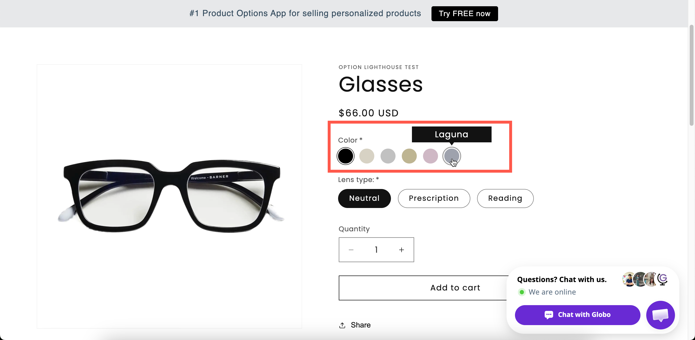

# Color swatch

A grid of color chips that shows every color at once, making it easy for customers to compare and choose.

Use it when your color palette is fixed and reasonably short. For a long list of named colors, use [Color dropdown](color-dropdown.md) for a more compact layout. If customers need to choose any color, use [Color picker](../input-types/color-picker.md).

## What customers see

A grid of chips, each a single color or split into two. Hovering displays the value's name, and the selected chip is marked. For many colors, you can display them as a slider instead.

<figure><figcaption>
All the colors at once — the reason to choose a swatch grid over a dropdown.
</figcaption></figure>

## Basic Settings

<table><thead><tr><th width="250">Setting</th><th>What it does</th></tr></thead><tbody><tr><td><a href="../shared-settings/labels-and-visibility.md#label">Label</a> / <a href="../shared-settings/labels-and-visibility.md#name">Name</a></td><td>Customer-facing text, and the name on the order.</td></tr><tr><td><a href="../shared-settings/required-and-default-value.md#required-field">Required field</a></td><td>Blocks add to cart until a color is chosen.</td></tr><tr><td><a href="../shared-settings/labels-and-visibility.md#hidden-label">Hidden label</a></td><td>Hides the label.</td></tr><tr><td><a href="../shared-settings/swatch-style-and-previews.md#swatch-style">Swatch style</a></td><td><strong>Color</strong> or <strong>Image</strong>. Starts on <strong>Color</strong>.</td></tr><tr><td><strong>Option values</strong></td><td>The colors, each with a <strong>Color</strong> column — one color, or two for a split chip. See <a href="../../option-sets/option-values.md">Working with option values</a>.</td></tr><tr><td><a href="../shared-settings/selection-behaviour.md#allow-multiple">Allow multiple</a></td><td>Lets the customer choose several colors.</td></tr><tr><td><a href="../shared-settings/limits.md#min-and-max-selections">Min selections</a> / <a href="../shared-settings/limits.md#min-and-max-selections">Max selections</a></td><td>Shown once <strong>Allow multiple</strong> is on.</td></tr><tr><td><a href="../shared-settings/placeholder-and-help-text.md#help-text">Help text</a></td><td>Guidance for the whole option.</td></tr><tr><td><a href="../shared-settings/required-and-default-value.md#default-value">Default value</a></td><td>Preselects a color.</td></tr><tr><td><a href="../shared-settings/conditional-logic-and-add-on-fields.md#conditional-logic">Conditional logic</a></td><td>Show or hide based on other choices.</td></tr></tbody></table>

## Advanced Settings

<table><thead><tr><th width="270">Setting</th><th>What it does</th></tr></thead><tbody><tr><td><a href="../shared-settings/conditional-logic-and-add-on-fields.md#advanced-settings">Advanced settings</a> / <a href="../shared-settings/conditional-logic-and-add-on-fields.md#set-quantity">Set quantity</a></td><td>How add-ons scale — including <strong>Mixed quantity</strong> when multiple is on.</td></tr><tr><td><strong>Swatch color width</strong> / <strong>Swatch color height</strong></td><td>The chip size in pixels. Both start at <code>32</code>.</td></tr><tr><td><a href="../shared-settings/collapsible-layouts-and-sliders.md#enable-custom-layout">Enable custom layout</a></td><td>Unlocks the layouts below.</td></tr><tr><td><a href="../shared-settings/collapsible-layouts-and-sliders.md#layout-type">Layout type</a></td><td><strong>Expand</strong>, <strong>Collapse</strong>, or <strong>Slider</strong>.</td></tr><tr><td><a href="../shared-settings/collapsible-layouts-and-sliders.md#scroll-type">Scroll type</a>, <strong>Scroll height</strong>, <strong>Number of option values</strong></td><td>Scroll area for the Expand and Collapse layouts.</td></tr><tr><td><a href="../shared-settings/collapsible-layouts-and-sliders.md#slider-settings">Number of rows</a>, <strong>Swatches per row</strong>, <strong>Show navigation arrows</strong>, <strong>Show indicators</strong>, <strong>Slider style</strong></td><td>Slider layout settings.</td></tr><tr><td><a href="../shared-settings/swatch-style-and-previews.md#color-preview">Color preview</a></td><td>Previews the chosen color applied to a text option.</td></tr><tr><td><strong>Select text box</strong></td><td>Which text option the preview applies to.</td></tr><tr><td><a href="../shared-settings/selection-behaviour.md#not-allow-deselect">Not allow deselect</a></td><td>Stops the customer clearing their choice. Single-select only.</td></tr><tr><td><a href="../shared-settings/direction-width-and-css.md#direction-style">Direction style</a></td><td><strong>Vertical</strong> or <strong>Horizontal</strong>.</td></tr><tr><td><a href="../shared-settings/out-of-stock-options.md">Out of stock options</a></td><td>How sold-out colors look. <strong>Blur</strong> works particularly well here.</td></tr><tr><td><a href="../shared-settings/placeholder-and-help-text.md#help-text-position">Help text position</a></td><td>Where the option-level help text sits.</td></tr><tr><td><a href="../shared-settings/direction-width-and-css.md#html-class">HTML class</a> / <a href="../shared-settings/direction-width-and-css.md#column-width">Column width</a></td><td>Styling hook and field width.</td></tr></tbody></table>

### Chip size

**Swatch color width** and **Swatch color height** are specific to this type. [Image swatch](image-swatch.md) has its own equivalents.

Both default to 32 pixels, which suits a standard color chip. Increase them when colors are subtle or similar to each other, or make them rectangular for something like a fabric strip.

Larger chips push the **Add to cart** button further down the page. With more than about a dozen large chips, use the slider layout.

## Personalizer Settings

Supported as an **image layer**. Each color value can have an image, usually a photograph of the product in that color, that is drawn onto the product photo when the value is selected. The settings are image shape, background mode, size, position, rotation, clip area, and customer controls. See [Image layers](../../personalizer/layer-settings/image-layers.md).

## Add-on pricing

Prices are set on each color. A common setup is to offer standard colors for free and charge extra for premium finishes.

Linking each color to an add-on product gives it its own inventory, which **Out of stock options** then uses. This is the simplest way to make a color temporarily unavailable without editing the option set. See [Stock and inventory](../../add-on-pricing/stock-and-inventory.md).

## Color swatch or Color dropdown?

<table><thead><tr><th width="230"></th><th width="230">Color swatch</th><th>Color dropdown</th></tr></thead><tbody><tr><td>All colors visible</td><td>Yes</td><td>No</td></tr><tr><td>Names visible</td><td>On hover</td><td>Beside each chip</td></tr><tr><td>Search</td><td>No</td><td>Yes</td></tr><tr><td>Slider layout</td><td>Yes</td><td>No</td></tr><tr><td>Vertical space</td><td>More</td><td>One line</td></tr><tr><td>Best for</td><td>Under twenty colors</td><td>Twenty or more, or named colors</td></tr></tbody></table>

## Examples

**Twelve paint colors**

<table><thead><tr><th width="290">Setting</th><th>Value</th></tr></thead><tbody><tr><td>Label / Name</td><td><code>Frame color</code></td></tr><tr><td>Swatch style</td><td><strong>Color</strong></td></tr><tr><td>Swatch color width / height</td><td><code>40</code> / <code>40</code></td></tr><tr><td>Out of stock options</td><td><strong>Blur</strong></td></tr><tr><td>Not allow deselect</td><td>On</td></tr><tr><td>Required field</td><td>On</td></tr><tr><td>Each value</td><td>Linked to a generated add-on product for stock</td></tr></tbody></table>

**Forty colors as a slider**

**Enable custom layout** on, **Layout type** set to **Slider**, **Number of rows** `2`, **Swatches per row** `6.5`, and **Show navigation arrows** set to **Show**.

**Two-tone finishes**

Each value is set to a two-color split chip.

**Thread color with a live text preview**

**Color preview** on, with **Select text box** set to your engraving text option.

## Notes

* Available on all plans. The slider layout may not be available on all plans.
* Works in Shopify POS.
* Colors are set on each value in the values table.
* Value names are displayed on hover. Mobile customers may not see them at all, so use [Color dropdown](color-dropdown.md) when the names carry important information.
* Colors displayed on screen may not exactly match the physical product. Mention this in the help text if color accuracy matters.
