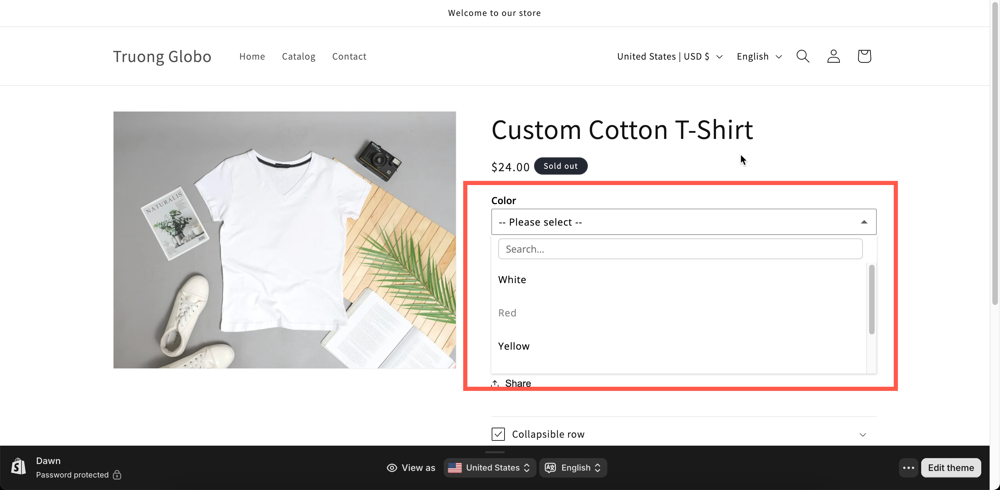

# Dropdown

The app's own dropdown. It matches the rest of your widget, and it supports what the native [Select](select.md) does not: search, images, inventory display, selection limits, and the live preview.

Use this type unless you specifically need the native picker.

## What customers see

A field that opens a styled list. Depending on your settings, the list can include a search box, a picture beside each entry, and out-of-stock entries marked as unavailable.

<figure><figcaption>
The app draws this dropdown, so it can carry search, images, and stock state.
</figcaption></figure>

## Basic Settings

<table><thead><tr><th width="250">Setting</th><th>What it does</th></tr></thead><tbody><tr><td><a href="../shared-settings/labels-and-visibility.md#label">Label</a> / <a href="../shared-settings/labels-and-visibility.md#name">Name</a></td><td>Customer-facing text, and the name on the order.</td></tr><tr><td><a href="../shared-settings/required-and-default-value.md#required-field">Required field</a></td><td>Blocks add to cart until something is chosen.</td></tr><tr><td><a href="../shared-settings/labels-and-visibility.md#hidden-label">Hidden label</a></td><td>Hides the label.</td></tr><tr><td><a href="../shared-settings/swatch-style-and-previews.md#swatch-style">Swatch style</a></td><td><strong>Default</strong> or <strong>Image</strong>. Choosing Image adds a picture per entry.</td></tr><tr><td><strong>Option values</strong></td><td>The list of choices, with prices, help text, and images. See <a href="../../option-sets/option-values.md">Working with option values</a>.</td></tr><tr><td><a href="../shared-settings/selection-behaviour.md#allow-multiple">Allow multiple</a></td><td>Lets the customer choose several. Reveals the two limits below.</td></tr><tr><td><a href="../shared-settings/limits.md#min-and-max-selections">Min selections</a> / <a href="../shared-settings/limits.md#min-and-max-selections">Max selections</a></td><td>How many they must and may choose.</td></tr><tr><td><a href="../shared-settings/placeholder-and-help-text.md#placeholder">Placeholder</a></td><td>The unselected prompt. Starts as <code>-- Please select --</code>.</td></tr><tr><td><a href="../shared-settings/placeholder-and-help-text.md#help-text">Help text</a></td><td>Guidance that stays visible.</td></tr><tr><td><a href="../shared-settings/required-and-default-value.md#default-value">Default value</a></td><td>Preselects one or more values.</td></tr><tr><td><a href="../shared-settings/conditional-logic-and-add-on-fields.md#conditional-logic">Conditional logic</a></td><td>Show or hide based on other choices.</td></tr></tbody></table>

## Advanced Settings

<table><thead><tr><th width="250">Setting</th><th>What it does</th></tr></thead><tbody><tr><td><a href="../shared-settings/conditional-logic-and-add-on-fields.md#advanced-settings">Advanced settings</a> / <a href="../shared-settings/conditional-logic-and-add-on-fields.md#set-quantity">Set quantity</a></td><td>How the add-on scales with quantity.</td></tr><tr><td><a href="../shared-settings/selection-behaviour.md#search-suggestion">Search suggestion</a></td><td>Adds a search box to the top of the list.</td></tr><tr><td><a href="../shared-settings/selection-behaviour.md#not-allow-deselect">Not allow deselect</a></td><td>Stops the customer clearing their choice. Single-select only.</td></tr><tr><td><a href="../shared-settings/out-of-stock-options.md">Out of stock options</a></td><td><strong>Show</strong>, <strong>Hide</strong>, <strong>Blur</strong>, or <strong>Strike-through</strong> for sold-out values.</td></tr><tr><td><a href="../shared-settings/placeholder-and-help-text.md#help-text-position">Help text position</a></td><td>Where the help text sits.</td></tr><tr><td><a href="../shared-settings/prefix-suffix-and-icons.md#prefix">Prefix</a> / <a href="../shared-settings/prefix-suffix-and-icons.md#prefix">Prefix icon</a> / <a href="../shared-settings/prefix-suffix-and-icons.md#prefix">Prefix text</a></td><td>An icon or text at the start of the field.</td></tr><tr><td><a href="../shared-settings/direction-width-and-css.md#html-class">HTML class</a> / <a href="../shared-settings/direction-width-and-css.md#column-width">Column width</a></td><td>Styling hook and field width.</td></tr></tbody></table>

Dropdown does not support collapsible or slider layouts. Those layouts are available for the grid-based option types, and a dropdown is already a compact way to display a long list.

## Personalizer Settings

Dropdown supports the live preview as an **image layer**. Each value can have an image that is displayed on the product photo when the value is selected.

Settings are **Image shape**, **Background mode**, width, height, position, opacity, rotation, clip area, and customer controls. See [Image layers](../../personalizer/layer-settings/image-layers.md).

This makes Dropdown a compact way to offer many visual designs. The list stays small, and the product photo updates with each choice.

## Add-on pricing

Prices are set on each option value, and each value supports all three modes. The option-level **Advanced settings** controls how the charge scales, including **Mixed quantity** when **Allow multiple** is on, which gives every value its own quantity box.

See [Add-on pricing](../../add-on-pricing/) and [Advanced add-on modes](../../add-on-pricing/advanced-add-on-modes.md).

## Examples

**A long list with search**

<table><thead><tr><th width="290">Setting</th><th>Value</th></tr></thead><tbody><tr><td>Label / Name</td><td><code>Thread color</code></td></tr><tr><td>Option values</td><td>Forty color names</td></tr><tr><td>Search suggestion</td><td>On</td></tr><tr><td>Out of stock options</td><td><strong>Hide</strong></td></tr><tr><td>Required field</td><td>On</td></tr><tr><td>Not allow deselect</td><td>On</td></tr></tbody></table>

**Several paid extras, capped**

**Allow multiple** on, **Max selections** `3`, each value priced, and **Advanced settings** set to **Mixed quantity** so the customer can order two of one value.

**A design chooser with live preview**

**Swatch style** set to **Image**, an image on each value, and **Personalizer Settings** on so the selected design is displayed on the product photo.

**A mandatory size**

Single-select, with **Required field** on, **Not allow deselect** on, and values linked to add-on products so sold-out sizes are hidden.

## Notes

* Available on all plans.
* Works in Shopify POS.
* Values follow the order of the values table.
* **Not allow deselect** is hidden when **Allow multiple** is on, because it applies only to single-select.
* **Min selections** and **Max selections** appear only when **Allow multiple** is on.
* For a grid of large swatches rather than a list, use [Color swatch](color-swatch.md) or [Image swatch](image-swatch.md), which support slider layouts.
