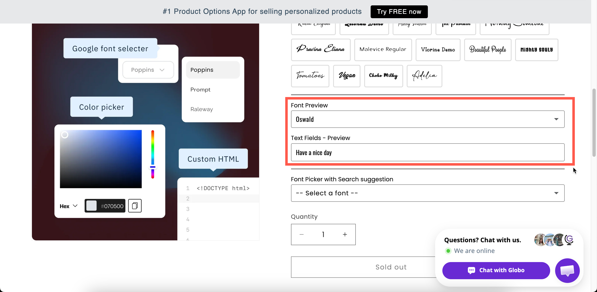

# Font picker

A list of fonts that lets customers choose the typeface for their text. With **Font preview** enabled, each font name is displayed in its own typeface so customers can see what they are choosing.

Use it when the customer's text will be produced in a font they select, such as for engraving, embroidery, printed names, or signage.

## What customers see

A dropdown or a row of buttons listing your fonts. With **Font preview** on, each entry is rendered in that font.

<figure><figcaption>
With Font preview on, customers see the lettering rather than imagining it.
</figcaption></figure>

## Basic Settings

<table><thead><tr><th width="250">Setting</th><th>What it does</th></tr></thead><tbody><tr><td><a href="../shared-settings/labels-and-visibility.md#label">Label</a> / <a href="../shared-settings/labels-and-visibility.md#name">Name</a></td><td>Customer-facing text, and the name on the order.</td></tr><tr><td><a href="../shared-settings/required-and-default-value.md#required-field">Required field</a></td><td>Blocks add to cart until a font is chosen.</td></tr><tr><td><a href="../shared-settings/labels-and-visibility.md#hidden-label">Hidden label</a></td><td>Hides the label.</td></tr><tr><td><strong>Google fonts</strong></td><td>The Google fonts offered. Starts with Roboto, Open Sans, Montserrat, Poppins, and Oswald. Up to 30 fonts.</td></tr><tr><td><strong>Custom fonts</strong></td><td>Fonts you uploaded yourself, in <strong>Settings > Settings > General > Custom fonts</strong>. Several can be offered.</td></tr><tr><td><a href="../shared-settings/placeholder-and-help-text.md#placeholder">Placeholder</a></td><td>The unselected prompt. Starts as <code>-- Select a font --</code>.</td></tr><tr><td><a href="../shared-settings/placeholder-and-help-text.md#help-text">Help text</a></td><td>Guidance that stays visible.</td></tr><tr><td><a href="../shared-settings/required-and-default-value.md#default-value">Default value</a></td><td>Preselects a font.</td></tr><tr><td><a href="../shared-settings/conditional-logic-and-add-on-fields.md#conditional-logic">Conditional logic</a></td><td>Show or hide based on other choices.</td></tr></tbody></table>

### Google fonts and Custom fonts

The two lists are configured separately and are combined into one list for the customer.

<table><thead><tr><th width="230">List</th><th>Where the fonts come from</th></tr></thead><tbody><tr><td><strong>Google fonts</strong></td><td>A searchable picker of Google's font library. Add up to 30. The picker tells you when you have reached the limit.</td></tr><tr><td><strong>Custom fonts</strong></td><td>Font files you uploaded to the app. Upload them once in <strong>Settings</strong>, then select them here. See <a href="../../settings/custom-fonts.md">Custom fonts</a>.</td></tr></tbody></table>


Only offer fonts you can produce. If a customer selects a font your engraving machine does not support, you have to contact them to arrange an alternative. Five fonts you can produce reliably are better than thirty.


## Advanced Settings

<table><thead><tr><th width="250">Setting</th><th>What it does</th></tr></thead><tbody><tr><td><strong>Style</strong></td><td><strong>Dropdown</strong> or <strong>Button</strong>. Dropdown is a list; Button shows the fonts as a row of tappable buttons.</td></tr><tr><td><a href="../shared-settings/selection-behaviour.md#search-suggestion">Search suggestion</a></td><td>Adds a search box. Worth turning on for a long list.</td></tr><tr><td><a href="../shared-settings/swatch-style-and-previews.md#font-preview">Font preview</a></td><td>Draws each font name in that font.</td></tr><tr><td><strong>Select text box</strong></td><td>Which text option the font preview applies to. Appears once <strong>Font preview</strong> is on.</td></tr><tr><td><a href="../shared-settings/placeholder-and-help-text.md#help-text-position">Help text position</a></td><td>Where the help text sits.</td></tr><tr><td><a href="../shared-settings/prefix-suffix-and-icons.md#prefix">Prefix</a> / <a href="../shared-settings/prefix-suffix-and-icons.md#prefix">Prefix icon</a> / <a href="../shared-settings/prefix-suffix-and-icons.md#prefix">Prefix text</a></td><td>An icon or text at the start of the field.</td></tr><tr><td><a href="../shared-settings/direction-width-and-css.md#html-class">HTML class</a> / <a href="../shared-settings/direction-width-and-css.md#column-width">Column width</a></td><td>Styling hook and field width.</td></tr></tbody></table>

### Font preview and Select text box

Turn on **Font preview** and set **Select text box** to your text option. The customer's own words are then displayed in the font they hover over or select, rather than only the font names.

Combine this with the [Personalizer](../../personalizer/) on the text option, and the words are also displayed on the product photo in that font.

## Add-on pricing

Font picker cannot have a price, because a font is a presentation choice rather than a stocked item.

If a particular font costs you more, for example a licensed script or a font that needs hand-finishing, put the charge on a separate [Switch](../input-types/switch.md) or [Radio button](radio-button.md) and use [conditional logic](../../conditional-logic/) to display it when that font is selected.

## Personalizer Settings

The Personalizer is not set on the picker. It belongs to the **text** option, and the font choice is applied to it.

To let customers choose a font and see their text in it on the product photo:



### Add a text option and turn on its Personalizer

Configure it as a text layer. See [Text layers](../../personalizer/layer-settings/text-layers.md).



### Set its Font family

Select **Google** or **Custom** and choose the font. This is the starting font. See [Fonts](../../personalizer/layer-settings/fonts.md).



### Add a Font picker for the customer's choice

Turn on **Font preview** and set **Select text box** to the text option.



## Examples

**Five engraving fonts**

<table><thead><tr><th width="290">Setting</th><th>Value</th></tr></thead><tbody><tr><td>Label / Name</td><td><code>Engraving font</code></td></tr><tr><td>Google fonts</td><td>Five fonts your machine can cut</td></tr><tr><td>Style</td><td><strong>Button</strong></td></tr><tr><td>Font preview</td><td>On, pointing at <code>Engraving text</code></td></tr><tr><td>Default value</td><td>Your most popular font</td></tr><tr><td>Required field</td><td>On</td></tr></tbody></table>

**A long list, searchable**

Thirty Google fonts, with **Style** set to **Dropdown**, **Search suggestion** on, and **Font preview** on.

**Your own brand fonts**

Uploaded custom fonts only, no Google fonts, and **Style** set to **Button** so all three are always visible.

## Notes

* Available on the **Advanced** plan. Custom fonts may not be available on all plans.
* Works in Shopify POS.
* Up to 30 Google fonts per option.
* This type cannot have an add-on price.
* There is no **Out of stock options** setting, because fonts have no inventory.
* The browser loads each font in the list when previewing, so a long list takes longer to display. Keep the list short.
* The selected font name is included in the order, so your team knows which font to use.
