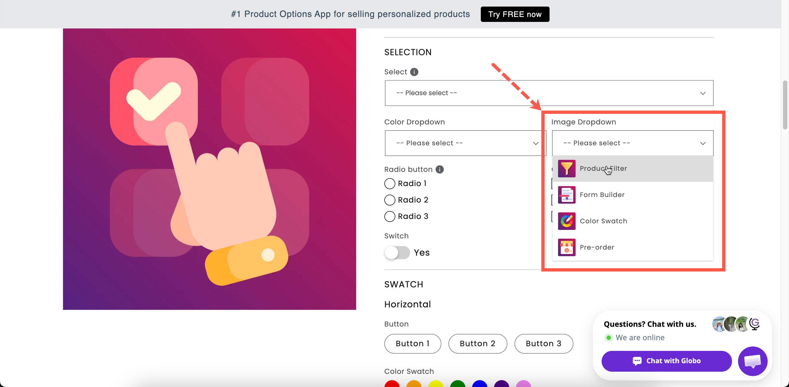

# Image dropdown

A [Dropdown](dropdown.md) where each entry includes an image. Use it when the choice is visual but the list is too long for a swatch grid, such as 30 print designs, 20 fabric patterns, or a catalog of frame styles.

## What customers see

A field showing the current choice. Opening it lists every entry with its picture, and the list is searchable if you turn search on. With **Image display outside dropdown** on, the selected picture is also displayed beside the closed field.

<figure><figcaption></figcaption></figure>

## Basic Settings

<table><thead><tr><th width="250">Setting</th><th>What it does</th></tr></thead><tbody><tr><td><a href="../shared-settings/labels-and-visibility.md#label">Label</a> / <a href="../shared-settings/labels-and-visibility.md#name">Name</a></td><td>Customer-facing text, and the name on the order.</td></tr><tr><td><a href="../shared-settings/required-and-default-value.md#required-field">Required field</a></td><td>Blocks add to cart until something is chosen.</td></tr><tr><td><a href="../shared-settings/labels-and-visibility.md#hidden-label">Hidden label</a></td><td>Hides the label.</td></tr><tr><td><strong>Option values</strong></td><td>The choices, each with an <strong>Image</strong> column. Upload a picture, or reuse one of the product's own images. See <a href="../../option-sets/option-values.md">Working with option values</a>.</td></tr><tr><td><a href="../shared-settings/selection-behaviour.md#allow-multiple">Allow multiple</a></td><td>Lets the customer choose several.</td></tr><tr><td><a href="../shared-settings/limits.md#min-and-max-selections">Min selections</a> / <a href="../shared-settings/limits.md#min-and-max-selections">Max selections</a></td><td>Shown once <strong>Allow multiple</strong> is on.</td></tr><tr><td><a href="../shared-settings/placeholder-and-help-text.md#placeholder">Placeholder</a></td><td>The unselected prompt.</td></tr><tr><td><a href="../shared-settings/placeholder-and-help-text.md#help-text">Help text</a></td><td>Guidance that stays visible.</td></tr><tr><td><a href="../shared-settings/required-and-default-value.md#default-value">Default value</a></td><td>Preselects a value.</td></tr><tr><td><a href="../shared-settings/conditional-logic-and-add-on-fields.md#conditional-logic">Conditional logic</a></td><td>Show or hide based on other choices.</td></tr></tbody></table>

This type has no **Swatch style** setting, because it always displays images.

## Advanced Settings

<table><thead><tr><th width="290">Setting</th><th>What it does</th></tr></thead><tbody><tr><td><a href="../shared-settings/conditional-logic-and-add-on-fields.md#advanced-settings">Advanced settings</a> / <a href="../shared-settings/conditional-logic-and-add-on-fields.md#set-quantity">Set quantity</a></td><td>How the add-on scales with quantity.</td></tr><tr><td><a href="../shared-settings/selection-behaviour.md#search-suggestion">Search suggestion</a></td><td>Adds a search box to the list.</td></tr><tr><td><a href="../shared-settings/selection-behaviour.md#not-allow-deselect">Not allow deselect</a></td><td>Stops the customer clearing their choice. Single-select only.</td></tr><tr><td><strong>Image display outside dropdown</strong></td><td>Shows the chosen image beside the closed field, so the choice stays visible without reopening the list. Off by default.</td></tr><tr><td><a href="../shared-settings/out-of-stock-options.md">Out of stock options</a></td><td>How sold-out entries look.</td></tr><tr><td><a href="../shared-settings/placeholder-and-help-text.md#help-text-position">Help text position</a></td><td>Where the help text sits.</td></tr><tr><td><a href="../shared-settings/direction-width-and-css.md#html-class">HTML class</a> / <a href="../shared-settings/direction-width-and-css.md#column-width">Column width</a></td><td>Styling hook and field width.</td></tr></tbody></table>

### Image display outside dropdown

Turn this on when customers need to keep seeing their selected image while they complete the rest of the form, for example a print design, fabric, or frame.

Without it, the closed dropdown displays only the value name, and the customer has to reopen the dropdown to see the image again.

## Personalizer Settings

Supported as an **image layer**. When a value is selected, its image can be displayed on the product photo. The settings are image shape, background mode, size, position, rotation, clip area, and customer controls.

Customers can then select a design from the dropdown and see it on the product in the Personalizer preview. See [Image layers](../../personalizer/layer-settings/image-layers.md).

## Add-on pricing

Prices are set on each value, so different designs can cost different amounts. Linking values to add-on products gives each design its own inventory, which **Out of stock options** then uses. See [Add-on pricing](../../add-on-pricing/).

## Image dropdown or Image swatch?

<table><thead><tr><th width="230"></th><th width="230">Image dropdown</th><th>Image swatch</th></tr></thead><tbody><tr><td>Space used</td><td>One line, closed</td><td>A grid, always open</td></tr><tr><td>Names shown</td><td>Beside each picture</td><td>On hover</td></tr><tr><td>Search</td><td>Yes</td><td>No</td></tr><tr><td>Slider layout</td><td>No</td><td>Yes</td></tr><tr><td>Picture size</td><td>Small thumbnails</td><td>Adjustable, plus a zoom tooltip</td></tr><tr><td>Best for</td><td>Twenty or more designs</td><td>Under twenty, where the picture is the whole decision</td></tr></tbody></table>

If customers need to compare pictures side by side, use [Image swatch](image-swatch.md).&#x20;

## Examples

**Thirty print designs**

<table><thead><tr><th width="290">Setting</th><th>Value</th></tr></thead><tbody><tr><td>Label / Name</td><td><code>Print design</code></td></tr><tr><td>Option values</td><td>Thirty entries, each with its artwork image</td></tr><tr><td>Search suggestion</td><td>On</td></tr><tr><td>Image display outside dropdown</td><td>On</td></tr><tr><td>Required field</td><td>On</td></tr><tr><td>Personalizer</td><td>On, so the design appears on the product photo</td></tr></tbody></table>

**Fabric swatches with different prices**

Standard fabrics are free, and premium ones are priced through **Automatically generate product** so each has its own inventory.

**Frame styles**

Values with a photograph of each frame style, **Image display outside dropdown** on, and **Not allow deselect** on.

## Notes

* Available on the Advanced plan.
* Works in Shopify POS.
* This type is always image-based. There is no text-only or color mode.
* Every value needs an image. Without one, the entry is blank.
* Use images with consistent sizing, cropping, and lighting, so the list looks consistent.
* Image dropdown does not support slider or collapsible layouts.
