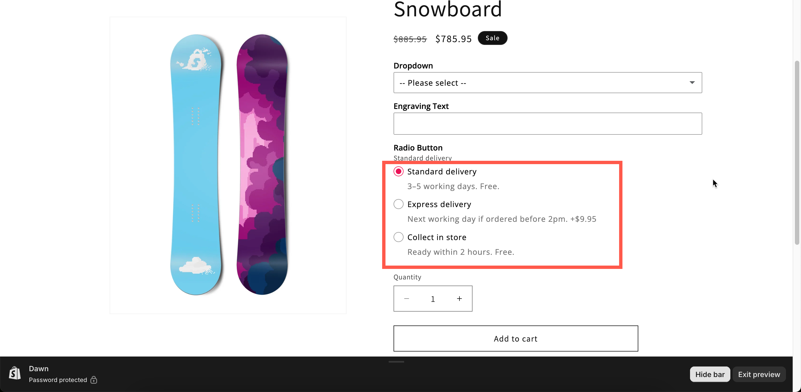

# Radio button

A list where the customer selects one value. Unlike a dropdown, every choice is visible without opening anything, so use it when the values need to be read rather than only recognized.

This type is always single-select, so there is no **Allow multiple** setting. To let customers select several values, use [Checkbox](checkbox.md).

## What customers see

A vertical list with a selectable marker beside each value. With **Swatch style** set, each value can also display a color chip or a picture.

<figure><figcaption></figcaption></figure>

## Basic Settings

<table><thead><tr><th width="250">Setting</th><th>What it does</th></tr></thead><tbody><tr><td><a href="../shared-settings/labels-and-visibility.md#label">Label</a> / <a href="../shared-settings/labels-and-visibility.md#name">Name</a></td><td>Customer-facing text, and the name on the order.</td></tr><tr><td><a href="../shared-settings/required-and-default-value.md#required-field">Required field</a></td><td>Blocks add to cart until one is chosen.</td></tr><tr><td><a href="../shared-settings/labels-and-visibility.md#hidden-label">Hidden label</a></td><td>Hides the label.</td></tr><tr><td><a href="../shared-settings/swatch-style-and-previews.md#swatch-style">Swatch style</a></td><td><strong>Default</strong>, <strong>Color</strong>, or <strong>Image</strong>.</td></tr><tr><td><strong>Option values</strong></td><td>The choices, with prices and their own help text. See <a href="../../option-sets/option-values.md">Working with option values</a>.</td></tr><tr><td><a href="../shared-settings/placeholder-and-help-text.md#help-text">Help text</a></td><td>Guidance for the whole option.</td></tr><tr><td><a href="../shared-settings/required-and-default-value.md#default-value">Default value</a></td><td>Preselects one value.</td></tr><tr><td><a href="../shared-settings/conditional-logic-and-add-on-fields.md#conditional-logic">Conditional logic</a></td><td>Show or hide based on other choices.</td></tr></tbody></table>

Radio button has no placeholder.

## Advanced Settings

<table><thead><tr><th width="250">Setting</th><th>What it does</th></tr></thead><tbody><tr><td><a href="../shared-settings/conditional-logic-and-add-on-fields.md#advanced-settings">Advanced settings</a> / <a href="../shared-settings/conditional-logic-and-add-on-fields.md#set-quantity">Set quantity</a></td><td>How the add-on scales with quantity.</td></tr><tr><td><a href="../shared-settings/collapsible-layouts-and-sliders.md#enable-custom-layout">Enable custom layout</a></td><td>Unlocks the collapsible layouts.</td></tr><tr><td><a href="../shared-settings/collapsible-layouts-and-sliders.md#layout-type">Layout type</a></td><td><strong>Expand</strong> or <strong>Collapse</strong>. No slider on this type.</td></tr><tr><td><a href="../shared-settings/collapsible-layouts-and-sliders.md#scroll-type">Scroll type</a>, <strong>Scroll height</strong>, <strong>Number of option values</strong></td><td>Give a long list its own scroll area.</td></tr><tr><td><a href="../shared-settings/direction-width-and-css.md#direction-style">Direction style</a></td><td><strong>Vertical</strong> or <strong>Horizontal</strong>.</td></tr><tr><td><a href="../shared-settings/out-of-stock-options.md">Out of stock options</a></td><td>How sold-out values look.</td></tr><tr><td><a href="../shared-settings/placeholder-and-help-text.md#help-text-position">Help text position</a></td><td>Where the option-level help text sits.</td></tr><tr><td><a href="../shared-settings/direction-width-and-css.md#html-class">HTML class</a> / <a href="../shared-settings/direction-width-and-css.md#column-width">Column width</a></td><td>Styling hook and field width.</td></tr></tbody></table>

## Per-value help text

Radio button supports help text on each value, and because the list is always open, that text is always visible. No other single-select type displays the explanation and the choice together.

Use this type whenever the choices need explaining:

```
○ Standard delivery
  3–5 working days. Free.

○ Express delivery
  Next working day if ordered before 2pm. +$9.95

○ Collect in store
  Ready within 2 hours. Free.
```

A dropdown hides that text until it is opened, and a button row has no space for it.

## Personalizer Settings

Supported as an **image layer**. Each value can have an image that is drawn onto the product photo when the value is selected. The settings are image shape, background mode, size, position, rotation, clip area, and customer controls. See [Image layers](../../personalizer/layer-settings/image-layers.md).

## Add-on pricing

Prices are set on each value, and each value supports all three modes. The option-level **Advanced settings** controls how the charge scales.

Because only one value can be selected, there is either one charge or none. This makes Radio button a good type for tiered upgrades where the customer selects one level.

See [Add-on pricing](../../add-on-pricing/).

## Radio button, Button, or Dropdown?

<table><thead><tr><th width="230"></th><th width="180">Radio button</th><th width="180">Button</th><th>Dropdown</th></tr></thead><tbody><tr><td>All choices visible</td><td>Yes</td><td>Yes</td><td>No</td></tr><tr><td>Per-value help text visible</td><td><strong>Yes</strong></td><td>Cramped</td><td>Only when open</td></tr><tr><td>Suits long value names</td><td><strong>Yes</strong></td><td>No</td><td>Yes</td></tr><tr><td>Vertical space used</td><td>Most</td><td>Little</td><td>Least</td></tr><tr><td>Slider layout</td><td>No</td><td>Yes</td><td>No</td></tr></tbody></table>

## Examples

**Delivery speed**

<table><thead><tr><th width="290">Setting</th><th>Value</th></tr></thead><tbody><tr><td>Label / Name</td><td><code>Delivery speed</code></td></tr><tr><td>Option values</td><td><code>Standard</code>, <code>Express</code>, <code>Collect in store</code>, each with its own help text</td></tr><tr><td>Prices</td><td>Standard free, Express $9.95, Collect free</td></tr><tr><td>Advanced settings</td><td><strong>One time charge</strong>, since delivery is per order</td></tr><tr><td>Default value</td><td><code>Standard</code></td></tr><tr><td>Required field</td><td>On</td></tr></tbody></table>

**Three service tiers**

Values `Basic`, `Plus`, and `Premium`, each with help text listing what it includes and its own price.

**A finish, shown as colors**

**Swatch style** set to **Color**, with values `Matt black`, `Brushed brass`, and `Chrome`, each with its color chip and its own lead-time note.

**A long list, collapsed**

**Enable custom layout** on, **Layout type** set to **Collapse**, and **Scroll type** set to **By number of option values**, showing eight.

## Notes

* Available on all plans.
* Works in Shopify POS.
* Single-select only.
* There is no slider layout. Use Button or one of the swatch types for that.
* There is no **Not allow deselect** setting. Use **Required field** with a **Default value** for a choice that can never be empty.
* Values follow the order of the values table.
