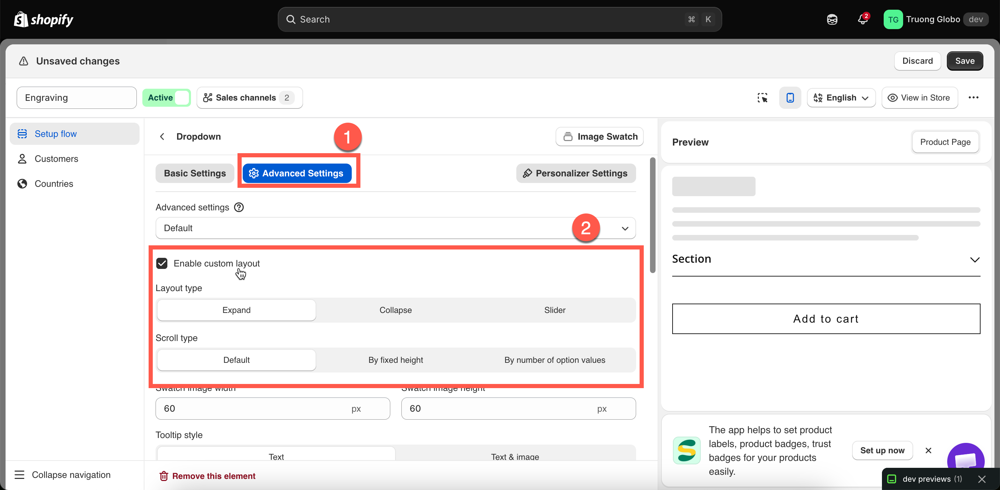

# Collapsible layouts and sliders

Use custom layouts to control how option values are displayed. You can collapse long lists, add scrolling, or display values in a slider.

These settings are available under **Advanced Settings**. Turn on **Enable custom layout** to access them.

## Enable custom layout

Off by default. When disabled, all option values are displayed in the default layout. When enabled, you can select a **Layout type**.

<figure><figcaption></figcaption></figure>

## Layout type

Sets how the option values are displayed.

<table><thead><tr><th width="230">Value</th><th>Description</th></tr></thead><tbody><tr><td><strong>Expand</strong> (default)</td><td>The values are displayed in an expanded list. Customers can collapse it.</td></tr><tr><td><strong>Collapse</strong></td><td>The values are hidden. Customers click to expand the list.</td></tr><tr><td><strong>Slider</strong></td><td>The values are displayed in a horizontal slider.</td></tr></tbody></table>

Use **Collapse** for optional or less frequently used options. Use **Slider** when an option has many visual values.


Avoid using **Collapse** for required options. Customers may not open the collapsed option and can miss a required selection.


## Scroll type

Limits the height of the option values. Available when **Layout type** is **Expand** or **Collapse**.

<table><thead><tr><th width="290">Value</th><th>Description</th></tr></thead><tbody><tr><td><strong>Default</strong></td><td>All values are displayed without scrolling.</td></tr><tr><td><strong>By fixed height</strong></td><td>Sets a fixed height in pixels. Displays the <strong>Scroll height</strong> setting.</td></tr><tr><td><strong>By number of option values</strong></td><td>Displays a set number of values before scrolling. Displays the <strong>Number of option values</strong> setting.</td></tr></tbody></table>

**By number of option values** is more reliable, because the height of a value can differ between devices and themes.

## Slider settings

Available when **Layout type** is **Slider**. Availability may depend on your plan.

<table><thead><tr><th width="250">Setting</th><th width="130">Default</th><th>Description</th></tr></thead><tbody><tr><td><strong>Number of rows</strong></td><td><code>1</code></td><td>Number of rows displayed in the slider.</td></tr><tr><td><strong>Swatches per row</strong></td><td><code>3</code></td><td>Number of swatches in each row. A decimal such as <code>4.5</code> displays part of the next swatch.</td></tr><tr><td><strong>Show navigation arrows</strong></td><td><strong>Hide</strong></td><td>Displays previous and next arrows.</td></tr><tr><td><strong>Show indicators</strong></td><td><strong>Hide</strong></td><td>Displays indicators below the slider.</td></tr><tr><td><strong>Slider style</strong></td><td><strong>Style 1</strong></td><td>Selects the arrow style. Available when <strong>Show navigation arrows</strong> is <strong>Show</strong>.</td></tr></tbody></table>


We recommend enabling **Show navigation arrows** or **Show indicators** so customers can see that more option values are available.

