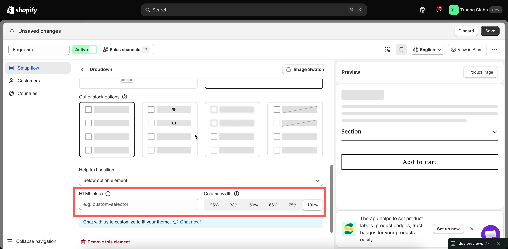

# Direction, width, and CSS

These three settings control the layout of an option. All of them are available under **Advanced Settings**.

## Direction style

Sets whether option values are listed vertically or horizontally.

<table><thead><tr><th width="230">Value</th><th>Description</th></tr></thead><tbody><tr><td><strong>Vertical</strong> (default)</td><td>Each value is displayed on its own line.</td></tr><tr><td><strong>Horizontal</strong></td><td>Values are displayed across the page and wrap to the next line.</td></tr></tbody></table>

Use **Vertical** for long value names or values with their own help text. Use **Horizontal** for short values such as sizes or small color chips.

On the Tabs option type, **Horizontal** displays the tab titles above the content and **Vertical** displays them beside it.


Check the mobile preview after selecting **Horizontal**. Values that fit on one row on desktop can wrap into several rows on a phone.


## Column width

Sets how much of the widget width the option uses. The values are **25%**, **33%**, **50%**, **66%**, **75%**, and **100%**. The default is **100%**.

Options set to less than 100% are displayed side by side on the same row, in the order they appear in the option list, until the row is full. On narrow screens, options are displayed at full width.

For example, two text options at **50%** display a first name and last name field on one row.


The percentages are not validated. Two options set to 75% cannot share a row, so the second option moves to the next row and leaves empty space.


## HTML class

Adds a CSS class to the option so you can apply your own styles. Empty by default.

Enter one class name, for example `engraving-field`. Do not include a leading dot. Only letters, numbers, hyphens, and underscores are accepted.

Add your rules to **Custom CSS for the widget** under **Settings > Settings > Design > Additional**:

```css
.engraving-field input {
  text-align: center;
}
```

Custom CSS applies to the widget on your storefront, not to the builder preview. Use **View in Store** to check the result.

Before using custom CSS, check whether a setting already covers your requirement: **Column width** for layout, [design settings](../../storefront/colors.md) for colors and fonts, or [Match your theme style](../../storefront/match-your-theme-style.md) to match your theme.

For more information, see [Custom CSS](../../storefront/custom-css.md).

<figure><figcaption><p>Direction style, Column width, and HTML class under Advanced Settings.</p></figcaption></figure>
