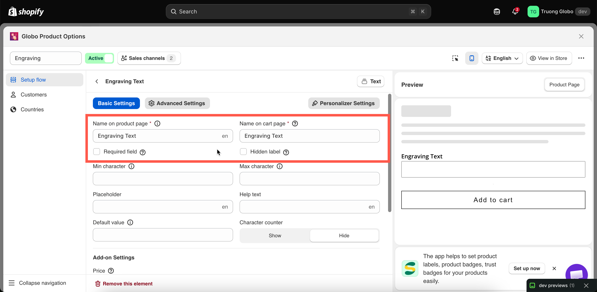

# Labels and visibility

Every option that collects customer input has a **Label** and a **Name**, and most also offer **Hidden label**. Together, these settings determine what shoppers see on the product page and what is stored with the order.

They are one of the most common sources of confusion in the app, so start with the key difference:

<table><thead><tr><th width="150"></th><th width="290">Label</th><th>Name</th></tr></thead><tbody><tr><td>Who reads it</td><td>The shopper, on the product page</td><td>You and your team — and the shopper, once the item is in their cart</td></tr><tr><td>Where it appears</td><td>Above the option field in the widget</td><td>Cart page, checkout, order details in Shopify admin, order emails, invoices, packing slips</td></tr><tr><td>Required</td><td>Yes</td><td>Yes</td></tr><tr><td>Must be unique</td><td>No</td><td><strong>Yes</strong>, within the option set</td></tr><tr><td>Restricted characters</td><td>No</td><td><strong>Yes</strong></td></tr><tr><td>Can be hidden</td><td>Yes, with <strong>Hidden label</strong></td><td>No — it always travels with the order</td></tr><tr><td>Translatable per language</td><td>Yes</td><td>No</td></tr></tbody></table>

## Label

The text shown above the option field on your product page.

<table><thead><tr><th width="180">Tab</th><th>Basic Settings</th></tr></thead><tbody><tr><td>Default</td><td>The option type's name — for example a new Text option starts with the label <code>Text</code></td></tr><tr><td>Available on</td><td>All types except the purely visual statics, which use their own content fields instead: Divider, Spacing, Heading, Paragraph, HTML, Pop-up modal, Size chart, Tabs</td></tr></tbody></table>

**How it behaves**

* Required. An option cannot be saved with an empty Label.
* No character restrictions. Punctuation, apostrophes, emoji, and non-Latin scripts are all fine.
* Not required to be unique. Two options may legitimately share a Label — for example a `Colour` dropdown in a "Front" section and another in a "Back" section.
* Translatable per storefront language. See [Translate option content](../../translations/translate-option-content.md).
* On a **Section**, the Label is the group heading rather than a field label.

**Writing good labels**

<table><thead><tr><th width="270">Instead of</th><th>Write</th></tr></thead><tbody><tr><td><code>Text</code></td><td><code>Engraving text</code></td></tr><tr><td><code>Options</code></td><td><code>Choose your frame colour</code></td></tr><tr><td><code>Upload</code></td><td><code>Upload your photo</code></td></tr><tr><td><code>Date</code></td><td><code>Delivery date</code></td></tr></tbody></table>

Say what you want, not what the field is. Put the constraint in [Help text](placeholder-and-help-text.md#help-text) rather than the Label — `Engraving text` with help text `Up to 20 characters` reads better than `Engraving text (max 20 characters)`.

## Name

The internal name of the option. It appears on the cart page, at checkout, on the order in your Shopify admin, and in order emails, invoices, and packing slips.

<table><thead><tr><th width="180">Tab</th><th>Basic Settings</th></tr></thead><tbody><tr><td>Default</td><td>The option type's internal identifier — <code>text</code>, <code>checkbox</code>, <code>select</code>, and so on</td></tr><tr><td>Available on</td><td>All types that collect input. Not on <strong>Section</strong> or the visual statics, which never reach the order</td></tr></tbody></table>


Name has three rules:

* It cannot be empty
* It must be **unique within the option set**. The uniqueness check ignores capitalization and leading or trailing spaces.
* It cannot contain `.` `:` `"` `'` `\` `|`


**How it behaves**

* **Not translatable, deliberately.** Your team sees the same consistent name regardless of the language the shopper uses.
* **Renamed automatically when needed.** If you duplicate an option or import options with duplicate names, the copy is automatically renamed using the option type and a number, such as `text-2`. Conditional logic rules that reference the renamed option are updated automatically.
* **Used by other features to identify the option.** This includes the dynamic order-tag workflow, order note templates, and the `option_name` column in CSV exports.

**Practical advice**

Change the default **Name** before you go live. An order line such as `text: Forever yours` tells you what was entered but not what the field means. `Engraving text: Forever yours` is much clearer for the person packing the order.

The simplest approach is to make **Name** the same as **Label**. Use a different name when:

* The **Label** is long or styled for the storefront, such as `Add an engraving ✨ (optional)`, but you want a clean order line such as `Engraving text`.
* The **Label** contains a character that **Name** does not allow, such as an apostrophe or colon.
* Two options have the same **Label** but need different names in the order, such as `Colour` in two sections named `Front colour` and `Back colour`.
* Your storefront supports multiple languages. The **Label** can be translated per language, while **Name** stays in one language so your team always sees the same name.

## Hidden label

**Hidden label** hides the option’s **Label** on the product page. The option still works, and its **Name** is still included with the order.

<table><thead><tr><th width="180">Tab</th><th>Basic Settings</th></tr></thead><tbody><tr><td>Default</td><td>Off</td></tr><tr><td>Available on</td><td>22 types — all input and selection types except <strong>Hidden field</strong>, which has no visible label.</td></tr></tbody></table>

**When to use it**

* The option is self-explanatory from its placeholder — a single `Search…` box, for example.
* A [Section](../static-types/section.md) heading or a [Heading](../static-types/heading.md) element already says what the group is, and the individual label would just repeat it.
* You are building a compact row of options and the labels waste vertical space.
* You are using an [image swatch](../selection-types/image-swatch.md) row where the images speak for themselves.

**When not to use it**

* On required fields. A shopper who cannot see what a field is for will not know they have to fill it in, and your error message will be the first explanation they get.
* On anything with a price attached. Shoppers should be able to see what they are paying for.
* As a way to fix a layout problem. If labels are crowding your page, use [Column width](direction-width-and-css.md#column-width) or a collapsible [Section](../static-types/section.md) instead.


Hiding the label does not hide the option. To take an option off the storefront while keeping it configured, use the **Hide** action on the option instead — see [Build your options](../../option-sets/build-options.md).


<figure><figcaption>
Label, Name, and Hidden label sit together at the top of Basic Settings.
</figcaption></figure>
