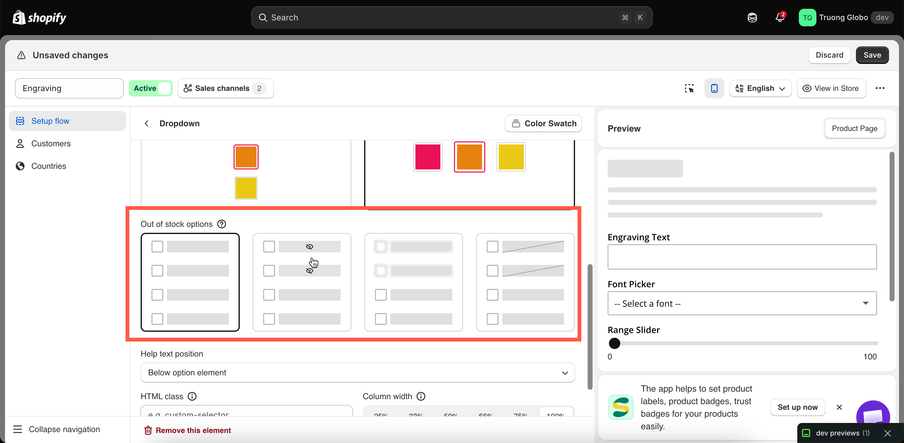

# Out of stock options

Sets how an option value is displayed when the add-on product linked to it is out of stock. Available under **Advanced Settings**.

<table><thead><tr><th width="230">Value</th><th>Description</th></tr></thead><tbody><tr><td><strong>Show</strong> (default)</td><td>The value is displayed normally and can still be selected.</td></tr><tr><td><strong>Hide</strong></td><td>The value is removed from the list.</td></tr><tr><td><strong>Blur</strong></td><td>The value is displayed faded and cannot be selected.</td></tr><tr><td><strong>Strike-through</strong></td><td>The value is displayed with a line through it and cannot be selected.</td></tr></tbody></table>

Use **Blur** for color and image swatches, so customers can still see the color or image. Use **Strike-through** for short text lists and **Hide** for long ones. Use **Show** for made-to-order products, where inventory is only a record.


This setting applies only to option values linked to an add-on product, either an existing product or a product generated by the app. Values that use **Add price** have no product and no inventory, so the setting has no effect. See [Add-on pricing](../../add-on-pricing/).


## How stock is determined

Stock is read from the linked product's inventory in Shopify. There is nothing to configure in the app. Set the inventory on the add-on product in Shopify admin as you would for any other product.

The availability check runs when the product page loads. If an option value is linked to a specific variant, the check applies to that variant only.

See [Stock and inventory](../../add-on-pricing/stock-and-inventory.md).

## Notes

* This setting may not be available on all plans. See [Compare plans](../../plans/compare-plans.md).
* The setting applies to the whole option. All option values use the same display.
* The setting controls display and selection only. It does not prevent the customer from buying the main product.

<figure><figcaption></figcaption></figure>
