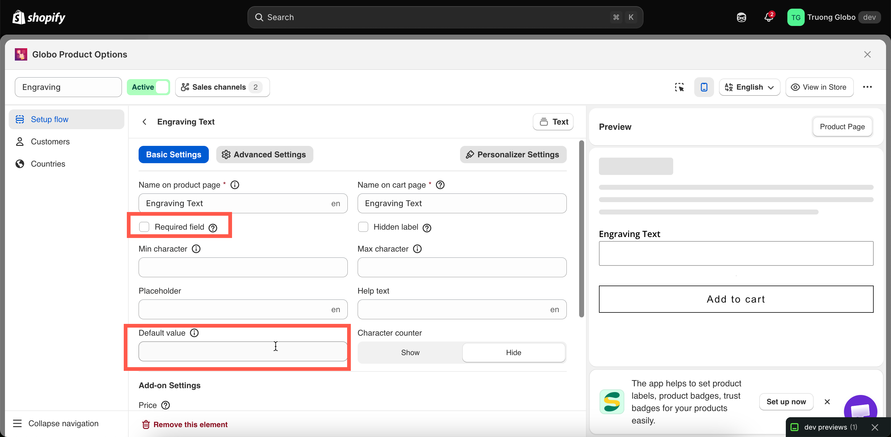

# Required field and default value

They answer the same question from opposite directions: what happens if the shopper ignores this option? **Required field** prevents them from continuing without making a choice or entering a value. **Default value** makes the choice for them automatically.

## Required field

Blocks **Add to cart** until the option is filled in.

<table><thead><tr><th width="180">Tab</th><th>Basic Settings</th></tr></thead><tbody><tr><td>Default</td><td>Off</td></tr><tr><td>Available on</td><td>21 types — every input and selection type except <strong>Hidden field</strong> and <strong>Product links</strong>, which do not have a customer-entered value that can be missing.</td></tr></tbody></table>

**How it behaves**

* On the storefront, the label is marked with the required-field color set in **Settings > Design**.
* If a shopper tries to add the product to the cart without completing the required field, the add-to-cart action is blocked and the validation message appears. The default message is `This field is required`, and you can edit it in **Settings > Translations**.
* The page automatically scrolls to the first error. This is controlled by **Auto-scroll to first error message** in **Settings > General**, which is enabled by default. See [Widget behavior](../../storefront/widget-behavior.md).
* On a **Checkbox**, required means at least one box must be selected. To require exactly two of five choices, use [Min and max selections](limits.md#min-and-max-selections) instead.
* On a **File upload**, required means that at least one file must be attached.

**What counts as filled in**

<table><thead><tr><th width="240">Type</th><th>Satisfied when</th></tr></thead><tbody><tr><td>Text, Textarea, Number, Phone, Email</td><td>Any character has been entered</td></tr><tr><td>Select, Dropdown, Radio, Button, swatches</td><td>A value is selected</td></tr><tr><td>Checkbox</td><td>At least one value is ticked</td></tr><tr><td>File upload</td><td>At least one file is attached</td></tr><tr><td>Date and time picker</td><td>A date, or a time, or both, depending on the format</td></tr><tr><td>Switch</td><td>The switch is on</td></tr><tr><td>Range slider</td><td>A value has been set</td></tr><tr><td>Color picker</td><td>A colour has been chosen</td></tr><tr><td>Dimension</td><td>Every axis row has a value</td></tr></tbody></table>


Be careful when combining **Required field** with conditional logic. A required option that is hidden by a rule is not enforced — this is intentional, so a hidden field cannot prevent a customer from completing the purchase.

In other words, **Required field** applies only while the option is visible. Test both branches of your conditional logic before going live.


**When to use it — and when not**

Use **Required field** when you genuinely cannot fulfil the order without the customer’s answer — for example, a size, an engraving spelling, or a photo to print.

Do not use it for anything that is optional but nice to have. A required gift message on every product turns a simple purchase into a form to fill in, which can lead to shoppers abandoning the purchase.

If you’re unsure, leave **Required field** off and see whether customers choose to fill it in anyway.

## Default value

Pre-fills the option so that a customer who makes no changes still submits a value.

<table><thead><tr><th width="180">Tab</th><th>Basic Settings</th></tr></thead><tbody><tr><td>Default</td><td>Empty</td></tr><tr><td>Available on</td><td>18 types. It takes four different shapes depending on the type — see below</td></tr></tbody></table>

<table><thead><tr><th width="230">Shape</th><th width="240">On these types</th><th>What you enter</th></tr></thead><tbody><tr><td>Free text</td><td>Text, Textarea, Email, Phone, Hidden field, Range slider</td><td>Any text, or a number for the slider</td></tr><tr><td>Number</td><td>Number</td><td>A number, which must fall inside <strong>Min value</strong> and <strong>Max value</strong></td></tr><tr><td>Value picker</td><td>Select, Dropdown, Color dropdown, Image dropdown, Radio, Checkbox, Button, Color swatch, Image swatch, Font picker</td><td>One of the option's own values, chosen from a list. Multi-select types accept several</td></tr><tr><td>Colour</td><td>Color picker</td><td>A colour</td></tr></tbody></table>

**How it behaves**

* The option appears pre-filled on the product page, and the default value is submitted unless the customer changes it.
* **A default value with an add-on price is charged immediately.** The shopper sees the higher price as soon as the page loads, without having to make a selection. This can be useful for a paid upgrade you expect most customers to choose, but it is also the most common reason for questions like, “Why is this product more expensive than the listed price?”
* On a value-picker type, the default must match one of the option’s current values. If you rename or delete that value, update the default as well.
* On a **Number** field, a default outside the minimum or maximum is rejected while editing, with the message `The value must be between min and max.`
* The **Personalizer** displays the default value in the live preview, so a text layer has content to show before the customer starts typing. See [Text layers](../../personalizer/layer-settings/text-layers.md).

**Good uses**

<table><thead><tr><th width="290">Situation</th><th>Default</th></tr></thead><tbody><tr><td>Most customers pick the standard size</td><td>Preselect it — fewer decisions, faster checkout</td></tr><tr><td>Quantity-style number field</td><td><code>1</code></td></tr><tr><td>Free option among paid ones</td><td>Preselect the free one, so nobody is charged by accident</td></tr><tr><td>Personalizer text layer</td><td><code>Your name</code>, so the preview is not blank</td></tr><tr><td>Hidden field carrying fixed information</td><td>The value itself — that is the whole purpose of the type</td></tr></tbody></table>

<figure><figcaption></figcaption></figure>

## Required or default?

<table><thead><tr><th width="290">You want</th><th>Use</th></tr></thead><tbody><tr><td>The shopper must actively decide</td><td><strong>Required field</strong>, no default</td></tr><tr><td>A sensible answer if they do not care</td><td><strong>Default value</strong>, not required</td></tr><tr><td>They must decide, but you want to nudge one option</td><td>Both — but make sure the default is the free or safest choice</td></tr><tr><td>Nothing at all should be submitted when they skip it</td><td>Neither</td></tr></tbody></table>

Setting both is usually unnecessary: an option with a default value is never empty, so **Required field** cannot fail. The exception is a value picker where the default value may be removed later.
