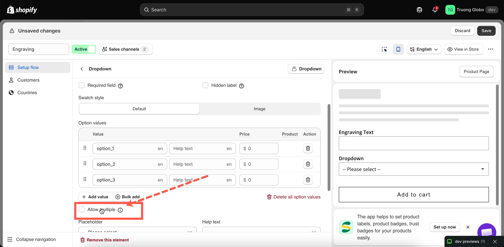
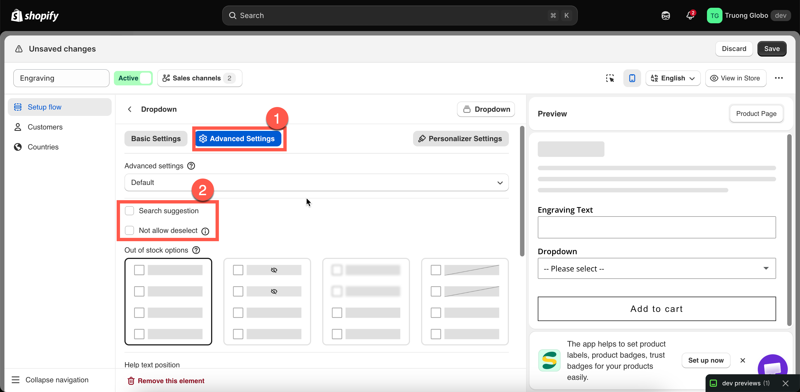

# Selection behaviour

Three settings that change how a selection option responds to shopper clicks. **Allow multiple** is the most important: it enables additional settings and changes how add-on pricing works.

## Allow multiple

Lets the shopper choose more than one value.

<table><thead><tr><th width="180">Tab</th><th>Basic Settings</th></tr></thead><tbody><tr><td>Default</td><td>Off</td></tr><tr><td>Available on</td><td>Select, Dropdown, Color dropdown, Image dropdown, Button, Color swatch, Image swatch. It is also available on <strong>File upload</strong>, where it allows customers to upload multiple files rather than select multiple values.</td></tr></tbody></table>


**Checkbox** is inherently multi-select, so it does not have this setting. **Radio button** is inherently single-select, so it does not have it either. The setting is available on option types that can support either single or multiple selections.


**What turning it on changes**

<table><thead><tr><th width="290">Effect</th><th>Detail</th></tr></thead><tbody><tr><td>The shopper can select several values</td><td>Selecting a second value no longer clears the first.</td></tr><tr><td><a href="limits.md#min-and-max-selections">Min selections</a> and <a href="limits.md#min-and-max-selections">Max selections</a> appear</td><td>They are meaningless on a single-select option, so they stay hidden until now.</td></tr><tr><td><a href="selection-behaviour.md#not-allow-deselect">Not allow deselect</a> disappears</td><td>It only applies to single-select options.</td></tr><tr><td><strong>Default value</strong> accepts several values</td><td>You can preselect more than one.</td></tr><tr><td>Add-on pricing adds up</td><td>Every selected value with a price contributes. A shopper picking three paid extras pays for three.</td></tr><tr><td><strong>Mixed quantity</strong> becomes available</td><td>An advanced add-on mode that gives each value its own quantity box. See <a href="../../add-on-pricing/advanced-add-on-modes.md">Advanced add-on modes</a>.</td></tr></tbody></table>

**On File upload**

The setting is labelled accordingly and allows customers to upload up to 20 files. Turning it on reveals **Min number of files** and **Max number of files**. See [File upload](../input-types/file-upload.md).

**Choosing between multi-select types**

<table><thead><tr><th width="260">You want</th><th>Use</th></tr></thead><tbody><tr><td>A plain list of extras to tick</td><td><strong>Checkbox</strong></td></tr><tr><td>Several choices without a long list on the page</td><td><strong>Dropdown</strong> with Allow multiple</td></tr><tr><td>Several colours or finishes, shown visually</td><td><strong>Color swatch</strong> or <strong>Image swatch</strong> with Allow multiple</td></tr><tr><td>Several choices as prominent buttons</td><td><strong>Button</strong> with Allow multiple</td></tr></tbody></table>

## Not allow deselect

Once a shopper makes a selection, they cannot clear it — they can only switch to another value.

<table><thead><tr><th width="180">Tab</th><th>Advanced Settings</th></tr></thead><tbody><tr><td>Default</td><td>Off</td></tr><tr><td>Available on</td><td>Dropdown, Color dropdown, Image dropdown, Button, Color swatch, Image swatch - only if <strong>Allow multiple</strong> is off</td></tr></tbody></table>

**Why it exists**

On these option types, clicking the currently selected value normally clears the selection, leaving nothing selected. That is useful for optional extras but can be problematic for mandatory choices — a shopper who accidentally clears their size selection has to notice and select it again.

Turning this on means that once the shopper has made a selection, they cannot return the option to an unselected state.

**When to use it**

* A mandatory choice such as size, finish, or material.
* Any option where “nothing selected” is not a valid answer.
* Together with a **Default value**, when you want the option to start with a selection and prevent it from being cleared.

**When not to use it**

* Optional paid extras. If a shopper selects a $20 upgrade and then changes their mind, they should be able to remove it. Preventing that can lead to complaints and refunds.


**Not allow deselect** is not the same as **Required field**. Required blocks **Add to cart** when nothing is selected; this setting prevents the shopper from clearing an existing selection. They work well together for mandatory choices.


## Search suggestion

Adds a search box to the top of a dropdown so the shopper can type to filter.

<table><thead><tr><th width="180">Tab</th><th>Advanced Settings</th></tr></thead><tbody><tr><td>Default</td><td>Off</td></tr><tr><td>Available on</td><td>Dropdown, Color dropdown, Image dropdown, Font picker</td></tr></tbody></table>

**How it behaves**

* The dropdown gains a search field, and typing narrows the list of values.
* The search prompt is store-wide and editable — `Search...` in **Settings > Translations**. See [Translate widget text](../../translations/translate-widget-text.md).
* It searches only the values you defined; it does not search your product catalog.

**When to use it**

Once a list grows beyond roughly fifteen values, scrolling can become the slowest part of the purchase. Turn it on for:

* Long color or finish lists.
* Country, region, or city lists.
* Font lists — the **Font picker** benefits especially, since shoppers often arrive knowing the font name.
* Long lists of compatible models or sizes.

For shorter lists, it adds a control shoppers may not need. Consider whether a [collapsible layout or slider](collapsible-layouts-and-sliders.md) would suit the list better instead.

<figure><figcaption></figcaption></figure>

<figure><figcaption>
Allow multiple is a Basic setting; the other two are Advanced.
</figcaption></figure>
