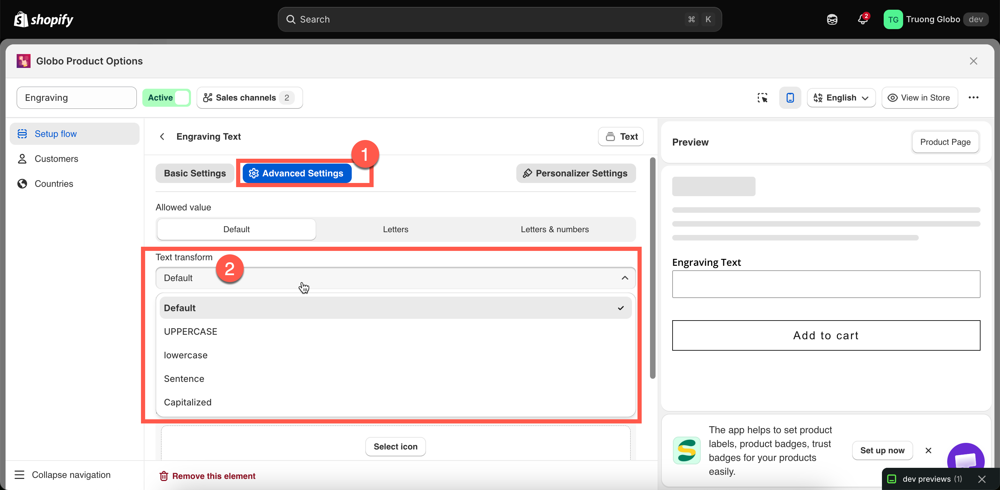

# Text input rules

Two settings, both available only on **Text** and **Textarea**. [Limits](limits.md) control _how much_ a shopper can enter; these settings control _what_ they can enter and how the submitted text is formatted.

They are especially useful for engraving, embroidery, and printing, where production may support only certain characters or where inconsistent capitalization can cause problems.

## Allowed value

Restricts which characters the field accepts.

<table><thead><tr><th width="180">Tab</th><th>Advanced Settings</th></tr></thead><tbody><tr><td>Default</td><td><strong>Default</strong> — anything is accepted</td></tr><tr><td>Available on</td><td>Text, Textarea</td></tr></tbody></table>

<table><thead><tr><th width="230">Choice</th><th>Accepts</th><th>Blocks</th></tr></thead><tbody><tr><td><strong>Default</strong></td><td>Anything the shopper can type</td><td>Nothing</td></tr><tr><td><strong>Letters</strong></td><td>Letters only</td><td>Digits, punctuation, symbols</td></tr><tr><td><strong>Letters &#x26; numbers</strong></td><td>Letters and digits</td><td>Punctuation and symbols</td></tr></tbody></table>

**How it behaves**

* The restriction is applied as the shopper types. Blocked characters simply do not appear in the field.
* Spaces are still allowed, so multi-word entries work with all three settings.
*   The setting controls character types, not language. **Letters** does not mean “English letters only.”

**When to use it**

<table><thead><tr><th width="300">Situation</th><th>Setting</th></tr></thead><tbody><tr><td>Engraving on a machine that cannot cut symbols</td><td><strong>Letters &#x26; numbers</strong></td></tr><tr><td>A name to embroider</td><td><strong>Letters</strong></td></tr><tr><td>A gift message</td><td><strong>Default</strong> — people want commas and full stops</td></tr><tr><td>A reference or order code</td><td><strong>Letters &#x26; numbers</strong></td></tr></tbody></table>


Explain the restriction in [Help text](placeholder-and-help-text.md#help-text). A shopper who types an apostrophe into a **Letters** field will see nothing happen, with no explanation. Something like `Letters only — no punctuation` makes the restriction clear.


Be conservative with **Letters**. It blocks digits, so entries such as `Flat 3B` and `Team 2024` cannot be entered. If your actual requirement is “no emoji or symbols,” **Letters & numbers** is usually the better choice.

## Text transform

Normalises the capitalisation of what the shopper typed.

<table><thead><tr><th width="180">Tab</th><th>Advanced Settings</th></tr></thead><tbody><tr><td>Default</td><td><strong>Default</strong> — submitted exactly as typed</td></tr><tr><td>Available on</td><td>Text, Textarea</td></tr></tbody></table>

<table><thead><tr><th width="200">Choice</th><th>Input</th><th>Result</th></tr></thead><tbody><tr><td><strong>Default</strong></td><td><code>john SMITH</code></td><td><code>john SMITH</code></td></tr><tr><td><strong>UPPERCASE</strong></td><td><code>john SMITH</code></td><td><code>JOHN SMITH</code></td></tr><tr><td><strong>lowercase</strong></td><td><code>john SMITH</code></td><td><code>john smith</code></td></tr><tr><td><strong>Sentence</strong></td><td><code>john SMITH</code></td><td><code>John smith</code></td></tr><tr><td><strong>Capitalized</strong></td><td><code>john SMITH</code></td><td><code>John Smith</code></td></tr></tbody></table>

**How it behaves**

* The transform is applied as the shopper enters their text, so the value saved to the order is already normalized. You do not need to tidy it up before production.
* **Sentence** capitalizes the first letter and converts the rest to lowercase, which works well for messages.
* **Capitalized** capitalizes the first letter of each word, which works well for names.

**When to use it**

<table><thead><tr><th width="300">Situation</th><th>Setting</th></tr></thead><tbody><tr><td>Names to engrave in one consistent style</td><td><strong>Capitalized</strong></td></tr><tr><td>Initials or a monogram</td><td><strong>UPPERCASE</strong></td></tr><tr><td>A stamped label in a lowercase typeface</td><td><strong>lowercase</strong></td></tr><tr><td>A gift message in the shopper's own words</td><td><strong>Default</strong></td></tr><tr><td>Team names on a jersey, printed in caps</td><td><strong>UPPERCASE</strong></td></tr></tbody></table>


**Capitalized** works by word boundaries, so unusual capitalization is flattened. For example, `McDonald` becomes `Mcdonald` and `iPhone` becomes `Iphone`. If your customers may enter names or terms with intentional capitalization like these, use **Default** and let a human review the order.


## Using both together

They are independent and combine cleanly. A typical engraving field:

<table><thead><tr><th width="240">Setting</th><th>Value</th><th>Why</th></tr></thead><tbody><tr><td><strong>Max character</strong></td><td><code>15</code></td><td>What physically fits</td></tr><tr><td><strong>Character counter</strong></td><td><strong>Show</strong></td><td>So they can see the limit closing in</td></tr><tr><td><strong>Allowed value</strong></td><td><strong>Letters &#x26; numbers</strong></td><td>The machine cannot cut symbols</td></tr><tr><td><strong>Text transform</strong></td><td><strong>Capitalized</strong></td><td>Every engraving looks the same</td></tr><tr><td><strong>Help text</strong></td><td><code>Up to 15 letters and numbers. Engraved items cannot be returned.</code></td><td>No surprises</td></tr></tbody></table>

<figure><figcaption></figcaption></figure>

## Notes

* The Personalizer live preview displays the transformed text, so what the customer sees on the product photo matches the value that will be produced. See [Text layers](../../personalizer/layer-settings/text-layers.md).
* Neither setting affects the option’s **Label**, **Name**, or **Help text** — they apply only to the shopper’s input.
* Neither setting applies to other option types. For example, a dropdown’s values are predefined by you, so there is nothing for the shopper to restrict or normalize.
