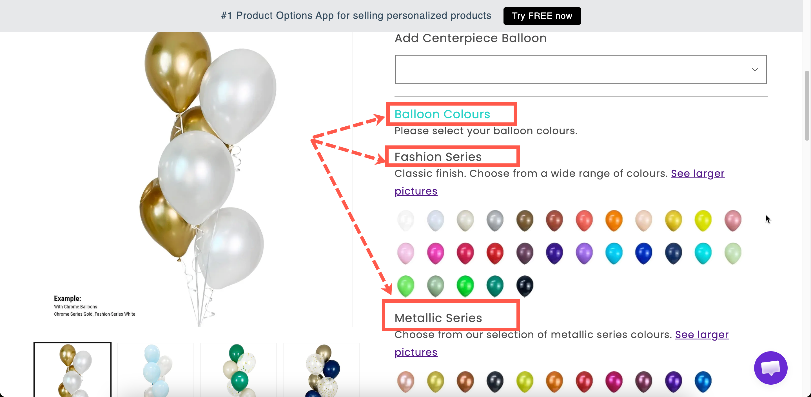

# Heading

A heading placed between options. Use it to label a group of fields when you do not need the container that a [Section](section.md) provides.

## What customers see

A line of heading text, at the size and color you set.

<figure><figcaption>
Headings give a form structure without adding a container.
</figcaption></figure>

## Settings

<table><thead><tr><th width="250">Setting</th><th>What it does</th></tr></thead><tbody><tr><td><strong>Content</strong></td><td>The heading text. Starts as <code>Heading</code>.</td></tr><tr><td><strong>Color</strong></td><td>The text color. Starts at black.</td></tr><tr><td><strong>Style</strong></td><td><strong>Heading 1</strong> to <strong>Heading 6</strong>. Starts at <strong>Heading 3</strong>.</td></tr><tr><td><a href="../shared-settings/conditional-logic-and-add-on-fields.md#conditional-logic">Conditional logic</a></td><td>Show or hide the heading.</td></tr><tr><td><a href="../shared-settings/direction-width-and-css.md#html-class">HTML class</a> / <a href="../shared-settings/direction-width-and-css.md#column-width">Column width</a></td><td>Styling hook and width.</td></tr></tbody></table>

Heading has no Label, Name, help text, add-on, or Personalizer settings.

### Choosing a style

The six styles are heading levels, so they set the structure as well as the size.

<table><thead><tr><th width="230">Style</th><th>Use for</th></tr></thead><tbody><tr><td><strong>Heading 1</strong>, <strong>Heading 2</strong></td><td>Rarely. Your theme already uses these for the product title, and repeating them competes with it.</td></tr><tr><td><strong>Heading 3</strong></td><td>The main groups in your form. This is the default and the right choice most of the time.</td></tr><tr><td><strong>Heading 4</strong>, <strong>Heading 5</strong></td><td>Sub-groups inside a larger group.</td></tr><tr><td><strong>Heading 6</strong></td><td>A small label above a couple of related fields.</td></tr></tbody></table>

Select one heading level for your main groups and use it consistently. A form where every heading is a different size looks unstructured.

## Heading or Section?

<table><thead><tr><th width="230"></th><th width="230">Heading</th><th>Section</th></tr></thead><tbody><tr><td>Groups options together</td><td>No — it is just text</td><td>Yes</td></tr><tr><td>Collapsible</td><td>No</td><td>Yes</td></tr><tr><td>One rule hides the whole group</td><td>No</td><td>Yes</td></tr><tr><td>Sizes and colors</td><td>Yes</td><td>Uses your design settings</td></tr></tbody></table>

Use a **Section** when you want the options grouped and optionally collapsible. Use a **Heading** when you only want a labeled break in the form, for example a sub-heading inside a section.

## Examples

**A sub-heading inside a section**

A Section labeled `Personalize your bracelet`, containing a **Heading 5** reading `Front engraving`, then those fields, then another **Heading 5** reading `Back engraving`.

**A warning heading in your brand color**

**Content** `Please check your spelling`, with **Color** set to your warning color and **Style** set to **Heading 5**, placed directly above an engraving field.

**A heading shown only when relevant**

**Content** `Gift options`, with conditional logic so it is displayed only when the customer is sending the item as a gift.

## Notes

* Available on all plans.
* Works in Shopify POS.
* The font comes from your typography settings. Only the color can be set here. See [Borders and typography](../../storefront/borders-and-typography.md).
* Plain text only. Use a [Paragraph](paragraph.md) for bold, links, or lists.
