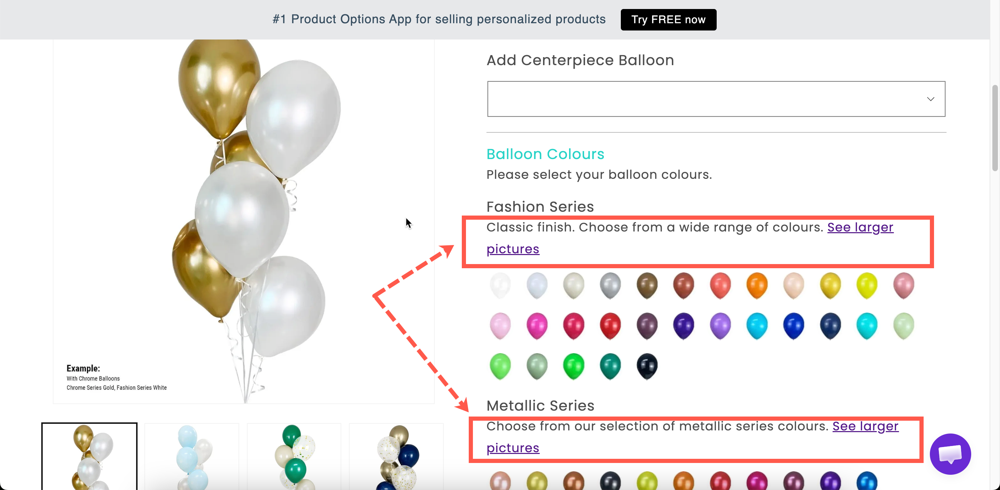

# Paragraph

A block of formatted text. Written in a rich-text editor, so you can use bold, italics, lists, and links.

Use it for anything the shopper needs to read before deciding: a returns caveat, a lead-time note, an explanation of what personalisation involves.

## What customers see

Your formatted text, in the flow of the form.

<figure><figcaption>
A paragraph is for what the shopper must read, not what they might want to.
</figcaption></figure>

## Settings

<table><thead><tr><th width="250">Setting</th><th>What it does</th></tr></thead><tbody><tr><td><strong>Content</strong></td><td>The text itself, written in a rich-text editor.</td></tr><tr><td><a href="../shared-settings/conditional-logic-and-add-on-fields.md#conditional-logic">Conditional logic</a></td><td>Show or hide the paragraph.</td></tr><tr><td><a href="../shared-settings/direction-width-and-css.md#html-class">HTML class</a> / <a href="../shared-settings/direction-width-and-css.md#column-width">Column width</a></td><td>Styling hook and width.</td></tr></tbody></table>

The editor gives you these formatting: bold, italics, lists, links, and alignment. It is the same editor used by [Pop-up modal](pop-up-modal.md) and [Tabs](tabs.md).

## Paragraph, help text, or modal?

This is the decision that matters, because all three can carry an explanation.

<table><thead><tr><th width="200">Use</th><th width="230">When the text is</th><th>Because</th></tr></thead><tbody><tr><td><a href="../shared-settings/placeholder-and-help-text.md#help-text">Help text</a></td><td>One line, about one field</td><td>It sits with the field it explains</td></tr><tr><td><strong>Paragraph</strong></td><td>One to three sentences, about a group</td><td>It reads as page content, and can be formatted</td></tr><tr><td><a href="pop-up-modal.md">Pop-up modal</a></td><td>Longer than that, and most shoppers will skip it</td><td>It keeps the page short</td></tr></tbody></table>


Keep paragraphs short. Every line you add pushes the **Add to cart** button further down the page. If your text runs past three or four sentences, you should use a pop-up modal or [Tabs](tabs.md).


## Examples

**A lead-time note above the personalisation fields**

> **Personalised items take 3–5 working days to make**, on top of delivery time. They cannot be returned unless faulty.

**A conditional warning**

A paragraph explaining that engraved items are non-returnable, shown by conditional logic only once the shopper has typed something into the engraving field.

**A short instruction with a link**

> Not sure of your size? See our **size guide** below.

Paired with a [Size chart](size-chart.md) in a collapsed [Section](section.md).

## Notes

* Available on all plans.
* Works in Shopify POS.
* Collects nothing, so it never reaches the cart or order.
* Translatable per storefront language, like other option content. See [Translate option content](../../translations/translate-option-content.md).
* Formatting comes from the editor. For anything the editor cannot support, use [HTML](html.md).
