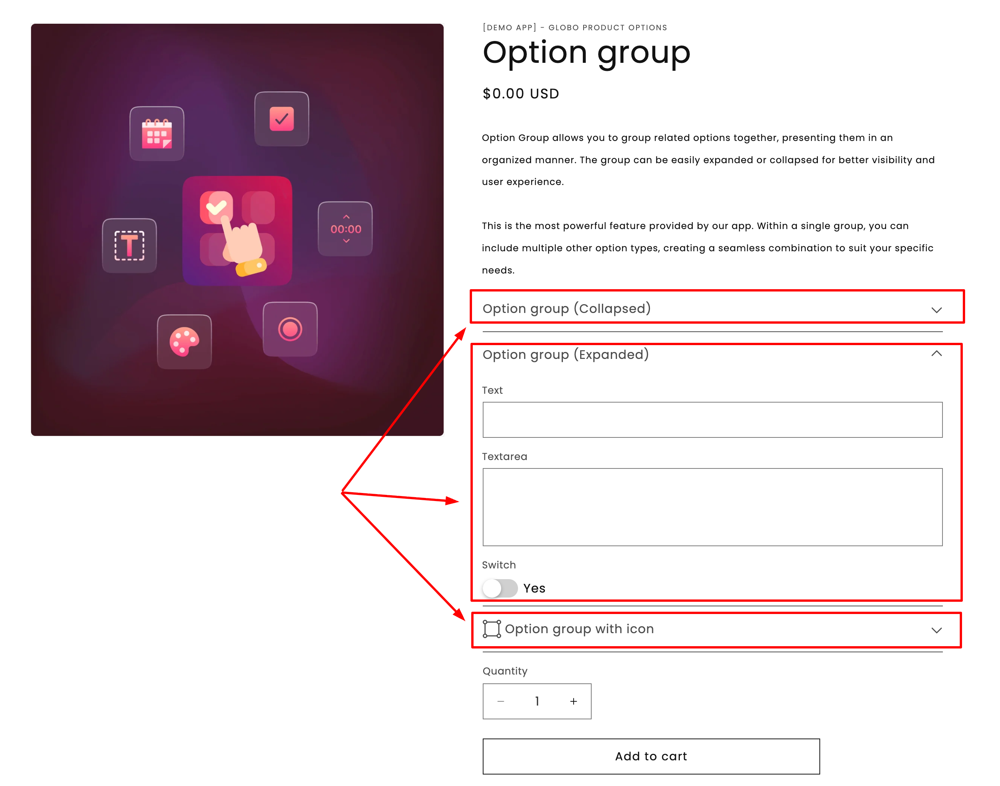

# Section

A container for options. It gives them a shared heading and, if you want, a single collapsible panel.

Every new option set starts with one empty Section.

## What customers see

A heading with your options below it. With a collapsible style, the heading becomes a control that opens and closes the group.

<figure><figcaption><p>Sections turn a long list of fields into a short list of groups.</p></figcaption></figure>

## Settings

<table><thead><tr><th width="250">Setting</th><th>What it does</th></tr></thead><tbody><tr><td><a href="../shared-settings/labels-and-visibility.md#label">Label</a></td><td>The heading customers read above the group. Required.</td></tr><tr><td><strong>Style</strong></td><td><strong>Default</strong>, <strong>Expand</strong>, or <strong>Collapse</strong>. See below.</td></tr><tr><td><strong>Prefix icon</strong></td><td>An icon beside the heading, from the app's icon picker.</td></tr><tr><td><a href="../shared-settings/direction-width-and-css.md#html-class">HTML class</a></td><td>A CSS class for your own styling.</td></tr><tr><td><a href="../shared-settings/conditional-logic-and-add-on-fields.md#conditional-logic">Conditional logic</a></td><td>Show or hide the whole section, and everything inside it.</td></tr></tbody></table>

Section has no **Name**, no **Column width**, and no add-on or Personalizer settings, because it is only a container.

### Style

<table><thead><tr><th width="180">Style</th><th>Behavior</th><th>Use when</th></tr></thead><tbody><tr><td><strong>Default</strong></td><td>Always open, no toggle</td><td>The options inside are needed by most customers</td></tr><tr><td><strong>Expand</strong></td><td>Collapsible, starts open</td><td>Most customers want it, but you are happy for them to fold it away</td></tr><tr><td><strong>Collapse</strong></td><td>Collapsible, starts closed</td><td>An optional or advanced group most customers skip</td></tr></tbody></table>


Do not put **required** options inside a **Collapse** section. Customers who do not open the group receive a validation error about a field they never saw. Keep required options in a **Default** or **Expand** section.


## Conditional logic on a section

**Conditional logic on a section applies to everything inside it.**

If six options should appear only when the customer selects "Personalize this item", you have two choices:

* Put the same rule on all six options, which is six rules to write and maintain.
* Put one rule on the section that contains them.

Use the second. It is faster to build, easier to read, and cannot be applied to only some of the options.

See [Conditional logic](../../conditional-logic/).

## Structuring a long form

A form with fifteen options is hard to read. The same fifteen options in four sections are much easier:

```
▸ Personalize your bracelet          (Expand)
    Engraving text
    Engraving font
    Engraving position

▸ Gift options                       (Collapse)
    Gift wrap
    Gift message
    Send directly to recipient

▸ Delivery                           (Default)
    Delivery date
    Delivery notes

▸ Size guide                         (Collapse)
    Size chart
```

The customer sees four decisions rather than fifteen fields, and opens only the ones they need.

## Working with sections in the builder

<table><thead><tr><th width="270">Action</th><th>How</th></tr></thead><tbody><tr><td>Add a section</td><td><strong>Add section</strong> in the add picker.</td></tr><tr><td>Move options into it</td><td>Drag them in. Options can be dragged between sections freely.</td></tr><tr><td>Move a whole section</td><td>Drag the section — everything inside comes with it.</td></tr><tr><td>Duplicate a section</td><td>Use the section's actions menu. Everything inside is copied, with names renumbered to stay unique.</td></tr><tr><td>Delete a section</td><td>Removes the section and everything inside it. You are asked to confirm.</td></tr></tbody></table>


Deleting a section deletes the options inside it. To remove only the grouping, drag the options out first.


See [Build your options](../../option-sets/build-options.md).

## Examples

**Optional personalization, hidden until asked for**

<table><thead><tr><th width="290">Setting</th><th>Value</th></tr></thead><tbody><tr><td>Label</td><td><code>Personalize your bracelet</code></td></tr><tr><td>Style</td><td><strong>Collapse</strong></td></tr><tr><td>Prefix icon</td><td>A paintbrush</td></tr><tr><td>Conditional logic</td><td>Show when <strong>Add personalization</strong> is enabled</td></tr><tr><td>Contains</td><td>Engraving text, font, position — none required</td></tr></tbody></table>

**A required group, always open**

Label `Choose your size`, with **Style** set to **Default**, containing a required size button row.

**A reference group at the bottom**

Label `Size guide and care`, with **Style** set to **Collapse**, containing a size chart and a paragraph.

## Notes

* Available on the Advanced plan.
* Works in Shopify POS.
* Sections cannot be nested inside each other.
* Every option belongs to a section. An option cannot exist outside one.
* An option set with sections but no options inside them cannot be saved.
* Sections collect nothing, so they never appear on the cart or the order.
